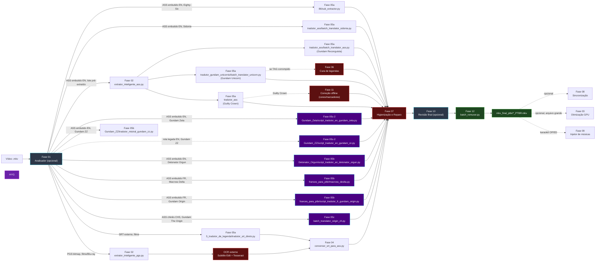

<div align="center">

  

  <h1>🌌 Tracker Animes — Pipeline de Tradução & Multiplexação</h1>

  <p><strong>Esteira industrial local (on-premises) para auditar mídia, higienizar, extrair, traduzir, sincronizar, curar, revisar e remuxar legendas de animes e filmes em PT-BR</strong></p>

  <p>
    
    
    
    
    
    
    
    
    
  </p>

  <p>
    
    
    
    
    
  </p>

</div>

> **Documentação completa:** [`docs/`](docs/README.md) — guias por fase, diagramas e troubleshooting.

---

## 🚀 Visão geral

O projeto é organizado em **fases numeradas de `01` a `12`** (algumas com variantes de motor de IA, sufixadas `a`/`b`/`c`). Cada **esteira** (fluxo de trabalho) usa um subconjunto dessas fases, conforme o formato de origem da legenda (ASS embutido, SRT externo, PGS bitmap, ASS chinês), o idioma de origem (inglês, francês, chinês simplificado) e o título específico — cada anime/filme tem script(s) próprio(s) de tradução e, em vários casos, um patch de higienização/revisão dedicado.

| Fase | Pasta | Função |
|:---:|:---|:---|
| 01 | [`01_analisador_midia/`](01_analisador_midia/) | Audita mídia: codecs, faixas, sincronia *(opcional)* |
| 02 | [`02_extrator_legenda/`](02_extrator_legenda/) | Extrai legenda original (ASS/SRT/PGS) do `.mkv` |
| 03 | [`03_decodificador_caracteres/`](03_decodificador_caracteres/) | Auxiliar: recomprime vídeo (HEVC/NVENC) |
| 04 | [`04_conversor_srt_ass/`](04_conversor_srt_ass/) | Converte `*_PTBR.srt` → `*_PTBR.ass` com sync de FPS |
| 05a | [`05a_tradutor_llm_gemma4/`](05a_tradutor_llm_gemma4/) | 🤖 Tradução via LM Studio + Gemma 4B (multi-título, inglês) |
| 05b | [`05b_tradutor_llm_mistral_nemo/`](05b_tradutor_llm_mistral_nemo/) | 🇫🇷 Tradução via LM Studio + Mistral Nemo 2407 (francês + inglês) |
| 05c | [`05c_tradutor_llm_qwen2/`](05c_tradutor_llm_qwen2/) | 🐉 Tradução via LM Studio + Qwen2.5-7B (chinês simplificado) |
| 05c-2 | [`05c_tradutor_llm_translategemma/`](05c_tradutor_llm_translategemma/) | 🌐 Tradução/revisão via LM Studio + TranslateGemma 12B (inglês) |
| 06 | [`06_cura_legendas/`](06_cura_legendas/) | 🩹 Auxiliar: cura offline de tags ASS corrompidas |
| 07 | [`07_higienizacao_e_reparo_de_traducao/`](07_higienizacao_e_reparo_de_traducao/) | 🧹 Higienização de lore/gramática por título + Reparo de falhas via IA |
| 08 | [`08_sincronizacao_legenda/`](08_sincronizacao_legenda/) | ⏱️ Auxiliar: audita/corrige dessincronia áudio×legenda |
| 09 | [`09_injetor_musicas/`](09_injetor_musicas/) | 🎵 Injeta karaokê OP/ED/Insert Songs de fansubs |
| 10 | [`10_auditoria_e_revisao/`](10_auditoria_e_revisao/) | 🔬 Revisão/correção final por título (lore, resíduos, remux) |
| 11 | [`11_correcao_projetos_legados/`](11_correcao_projetos_legados/) | 🎨 Correção offline de cores/marcadores em legendas antigas |
| 12 | [`12_remuxer_mkvmerge/`](12_remuxer_mkvmerge/) | 🎬 Remux: junta vídeo + legenda PT-BR (sem re-encode) |

> A fase **`07_higienizacao_e_reparo_de_traducao`** unifica a normalização ortográfica/lore de cada título com a correção automática de falhas de tradução `[ERRO_TRADUCAO:]` via IA (raciocínio passo a passo no LM Studio). Detalhes: [Fase 07](docs/modulo-fase-07.md).

### Diagrama geral



Diagramas detalhados de cada esteira: [docs/arquitetura.md](docs/arquitetura.md).

### Esteiras (fluxos completos por título)

| Esteira | Título | Fases | Motor de IA |
|:---:|:---|:---|:---|
| **A** | Eighty-Six | 05a → [07] → 12 → [10] | Gemma 4B |
| **B** | Filme/SRT externo (genérico, Macross) | 05a → 04 → 12 | Gemma 4B |
| **C** | Legenda PGS — Blu-ray (ex.: SAO Filme 2) | 02 → OCR externo → 04 → 12 | — |
| **D** | Macross Delta (TV, francês) | 05b → [07] → 12 → [10] | Mistral Nemo 2407 |
| **E** | Macross Delta Filme 2 (francês) | 05b → [07] → 12 → 10 | Mistral Nemo 2407 |
| **F** | Lote ASS pré-extraído (Gundam Reconguista) | 02 → 05a → [07] → 12 | Gemma 4B |
| **G** | Gundam Unicorn (especializada) | 02 → 05a → [06] → [07] → 12 → [10] | Gemma 4B |
| **H** | Guilty Crown (correção de nomes e cores) | 02 → 05a → [07] → 11 → 12 → [10] | Gemma 4B |
| **I** | Gundam The Origin, legenda chinesa (CHS) | 02 → 05c → [07] → 12 → [10] | Qwen2.5-7B |
| **J** | Gundam Origin, legenda francesa (SUBFRENCH) | 05b → [07] → 12 | Mistral Nemo 2407 |
| **K** | Gundam Zeta | 05c-2 → [07] → 12 | TranslateGemma 12B |
| **L** | Gundam ZZ | 05b ou 05c-2 → [07] → 12 | Mistral Nemo 2407 recomendado; TranslateGemma 12B legado |
| **M** | Detonator Orgun | 05b → [07] → 12 | Mistral Nemo 2407 |
| **N** | Knights of Sidonia | 05a → [07] → 12 | Gemma 4B |

`[10]`/`[06]`/`[07]` = passo opcional/condicional/higienização. Fases **01, 03, 06, 07, 08, 09, 10, 11** são auxiliares/transversais e podem ser usadas em qualquer esteira quando aplicável.

| ⚡ Remux ~1,5 s/ep. | 🔒 4 LLMs locais | 📺 PT-BR faixa padrão | 🎬 Sync FPS 25→23.976 | 🎮 Otimização NVENC | 🩹 Reparo `[ERRO_TRADUCAO:]` | 🔬 QA por título |
|:---:|:---:|:---:|:---:|:---:|:---:|:---:|

---

## ⚡ Início rápido

```powershell
cd D:\PROJETOS-OPEN\projeto-tracker-animes-traducao
python -m venv .venv
.\.venv\Scripts\Activate.ps1
pip install -r requirements.txt
# LM Studio na porta 1234 — troque o modelo conforme a fase:
#   Gemma 4B (Fases 05a, 07) | Mistral Nemo Instruct 2407 GGUF (Fase 05b) |
#   Qwen2.5-7B-Instruct (Fase 05c) | TranslateGemma 12B (Fase 05c-2)
```

**Esteira A — Eighty-Six, episódios MKV (ASS embutido EN):**

```powershell
python ".\01_analisador_midia\media_analyzer.py"   # opcional
python ".\05a_tradutor_llm_gemma4\86\sub_extractor.py"
python ".\12_remuxer_mkvmerge\batch_remuxer.py"
```

**Esteira B — Filme (SRT externo):**

```powershell
python ".\05a_tradutor_llm_gemma4\5_tradutor_de_legenda\tradutor_srt_direto.py"
python ".\04_conversor_srt_ass\conversor_srt_para_ass.py"
python ".\12_remuxer_mkvmerge\batch_remuxer.py"
```

**Esteira D — Macross Delta (legenda francesa, Mistral Nemo):**

```powershell
python ".\05b_tradutor_llm_mistral_nemo\frances_para_ptbr\macross_deslta.py"
python ".\12_remuxer_mkvmerge\batch_remuxer.py"
```

**Esteira I — Gundam The Origin, legenda chinesa (Qwen2.5):**

```powershell
python ".\02_extrator_legenda\extrator_inteligente_ass.py"
python ".\05c_tradutor_llm_qwen2\batch_translator_origin_zh.py" --entrada "<pasta_chs_ass>" --saida "<pasta_saida>"
python ".\12_remuxer_mkvmerge\batch_remuxer.py"
```

Demais esteiras (C, E, F, G, H, J, K, L, M, N) e fases auxiliares/reparos: [Guia de execução](docs/guia-de-execucao.md).

Pré-requisitos: **[docs/instalacao.md](docs/instalacao.md)** · Esteira B detalhada: **[docs/pipeline-srt.md](docs/pipeline-srt.md)**

---

## 📑 Índice da documentação

### Guias gerais

| Guia | Descrição |
|:---|:---|
| **[📖 Índice completo](docs/README.md)** | Hub da documentação |
| [Arquitetura](docs/arquitetura.md) | Fases 00–12 + diagramas de todas as esteiras (A–N) |
| [Estrutura do repositório](docs/estrutura-repositorio.md) | Árvore de pastas real do projeto |
| [Pipeline SRT (Esteira B)](docs/pipeline-srt.md) | Filmes e legendas externas |
| [Instalação](docs/instalacao.md) | Checklist SO, venv, LM Studio, MKVToolNix, FFmpeg |
| [Dependências Python](docs/dependencias-python.md) | `requirements.txt` por fase |
| [Guia de execução](docs/guia-de-execucao.md) | Comandos por esteira e layout de pastas |
| [Logs e auditoria](docs/logs-e-auditoria.md) | Artefatos de log por fase |
| [Solução de problemas](docs/solucao-de-problemas.md) | Troubleshooting por esteira |

### Módulos por fase

| Fase | Documento | Pasta / script principal |
|:---:|:---|:---|
| 01 | [Analisador de mídia](docs/modulo-fase-01.md) | `01_analisador_midia/media_analyzer.py` |
| 02 | [Extração de legendas](docs/modulo-fase-02.md) | `02_extrator_legenda/` (ASS, SRT, PGS) |
| 03 | [Otimização de vídeo (GPU)](docs/modulo-fase-03.md) | `03_decodificador_caracteres/gpu_video_optimizer.py` |
| 04 | [Conversor SRT → ASS](docs/modulo-fase-04.md) | `04_conversor_srt_ass/conversor_srt_para_ass.py` |
| 05a | [Tradução IA (Gemma 4B)](docs/modulo-fase-05a.md) | `05a_tradutor_llm_gemma4/` |
| 05b | [Tradução IA (Mistral Nemo)](docs/modulo-fase-05b.md) | `05b_tradutor_llm_mistral_nemo/` |
| 05c | [Tradução IA (Qwen2.5, chinês)](docs/modulo-fase-05c.md) | `05c_tradutor_llm_qwen2/` |
| 05c-2 | [Tradução/Revisão IA (TranslateGemma)](docs/modulo-fase-05c2.md) | `05c_tradutor_llm_translategemma/` |
| 06 | [Cura de legendas](docs/modulo-fase-06.md) | `06_cura_legendas/` |
| 07 | [Higienização e reparo](docs/modulo-fase-07.md) | `07_higienizacao_e_reparo_de_traducao/` |
| 08 | [Sincronização de legendas](docs/modulo-fase-08.md) | `08_sincronizacao_legenda/` |
| 09 | [Injetor de músicas](docs/modulo-fase-09.md) | `09_injetor_musicas/injetor_de_musicas.py` |
| 10 | [Auditoria e revisão final](docs/modulo-fase-10.md) | `10_auditoria_e_revisao/` |
| 11 | [Correção de projetos legados](docs/modulo-fase-11.md) | `11_correcao_projetos_legados/` |
| 12 | [Remuxer](docs/modulo-fase-12.md) | `12_remuxer_mkvmerge/batch_remuxer.py` |

### Esteiras (fluxos completos)

| Esteira | Fases | Cenário | Documento |
|:---:|:---|:---|:---|
| **A** | 05a → [07] → 12 → [10] | Eighty-Six, ASS embutido (inglês) | [Arquitetura](docs/arquitetura.md#esteira-a--eighty-six-ass-embutido-inglês) |
| **B** | 05a → 04 → 12 | Filme com SRT externo (inglês) | [Pipeline SRT](docs/pipeline-srt.md) |
| **C** | 02 → OCR externo → 04 → 12 | Legenda PGS (Blu-ray bitmap) | [Arquitetura](docs/arquitetura.md#esteira-c--legenda-pgs-bluray-bitmap) |
| **D** | 05b → [07] → 12 → [10] | Macross Delta, ASS embutido (francês) | [Arquitetura](docs/arquitetura.md#esteira-d--macross-delta-tv-tradução-francês--pt-br) |
| **E** | 05b → [07] → 12 → 10 | Macross Delta Filme 2 (francês) | [Arquitetura](docs/arquitetura.md#esteira-e--macross-delta-filme-2-francês) |
| **F** | 02 → 05a → [07] → 12 | Lote ASS pré-extraído (Gundam Reconguista) | [Arquitetura](docs/arquitetura.md#esteira-f--lote-ass-pré-extraído-gundam-reconguista) |
| **G** | 02 → 05a → [06] → [07] → 12 → [10] | Gundam Unicorn (especializada) | [Arquitetura](docs/arquitetura.md#esteira-g--gundam-unicorn-especializada) |
| **H** | 02 → 05a → [07] → 11 → 12 → [10] | Guilty Crown (correção de nomes e cores) | [Arquitetura](docs/arquitetura.md#esteira-h--guilty-crown-correção-de-nomes-e-cores-de-músicas) |
| **I** | 02 → 05c → [07] → 12 → [10] | Gundam The Origin, legenda chinesa (CHS) | [Arquitetura](docs/arquitetura.md#esteira-i--gundam-the-origin-legenda-chinesa-chs) |
| **J** | 05b → [07] → 12 | Gundam Origin, legenda francesa (SUBFRENCH) | [Arquitetura](docs/arquitetura.md#esteira-j--gundam-origin-legenda-francesa-subfrench) |
| **K** | 05c-2 → [07] → 12 | Gundam Zeta | [Arquitetura](docs/arquitetura.md#esteira-k--gundam-zeta) |
| **L** | 05b ou 05c-2 → [07] → 12 | Gundam ZZ | [Arquitetura](docs/arquitetura.md#esteira-l--gundam-zz) |
| **M** | 05b → [07] → 12 | Detonator Orgun | [Arquitetura](docs/arquitetura.md#esteira-m--detonator-orgun) |
| **N** | 05a → [07] → 12 | Knights of Sidonia | [Arquitetura](docs/arquitetura.md#esteira-n--knights-of-sidonia) |

---

## 📄 Licença

[LICENSE](LICENSE)

---

<div align="center">

  <p>
    <strong>Construído por</strong>
    <a href="https://github.com/carmipa"><strong>Paulo André Carminati</strong></a>
  </p>

  <p>
    
    
    
    
    
  </p>

  <p><sub>Pipeline industrial de tradução local · Junho 2026</sub></p>

</div>
