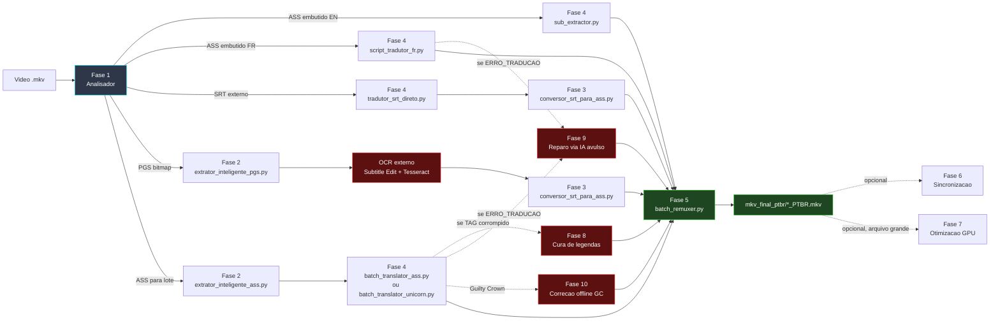

<div align="center">

  

  <h1>🌌 Tracker Animes — Pipeline de Tradução & Multiplexação</h1>

  <p><strong>Esteira industrial local (on-premises) para auditar mídia, extrair, traduzir, sincronizar, curar e remuxar legendas de animes e filmes em PT-BR</strong></p>

  <p>
    
    
    
    
    
    
  </p>

  <p>
    
    
    
    
    
  </p>

</div>

> **Documentação completa:** [`docs/`](docs/README.md) — guias por fase, diagramas e troubleshooting.

---

## 🚀 Visão geral

O projeto é organizado em **10 fases numeradas** (pastas `1_` a `10_`). Cada **esteira** (fluxo de trabalho) usa um subconjunto dessas fases, conforme o formato de origem da legenda (ASS embutido, SRT externo, PGS bitmap), o idioma de origem (inglês, francês) e eventuais reparos pós-tradução específicos da série.

| Fase | Pasta | Função |
|:---:|:---|:---|
| 1 | `1_analisador_de_midia/` | Audita mídia: codecs, faixas, sincronia *(opcional)* |
| 2 | `2_extrator_legenda/` | Extrai legenda original (ASS/SRT/PGS) do `.mkv` |
| 3 | `3-conversor_str_ass/` | Converte `*_PTBR.srt` → `*_PTBR.ass` com sync de FPS |
| 4 | `4_tradutor_ia_gemma4/` | Tradução via LM Studio + Gemma (5 variantes) |
| 5 | `5_juntar_legendas_filmes/` | Remux: junta vídeo + legenda PT-BR (sem re-encode) |
| 6 | `6_sincronizacao_legenda/` | Auxiliar: audita/corrige dessincronia |
| 7 | `7_decodificador/` | Auxiliar: recomprime vídeo (HEVC/NVENC) |
| 8 | `8_cura_legendas/` | Auxiliar: repara corrupção de tags PT-BR |
| 9 | `9_reparo_de_traducao/` | 🩹 Reparo: retraduz `[ERRO_TRADUCAO: ...]` via IA (batch=1) |
| 10 | `10_correcao_guilty_crown/` | 🎵 Correção offline de `[ERRO_TRADUCAO:]` e cores/tags de músicas OP/ED |

### Diagrama geral



Diagramas detalhados de cada esteira: [docs/arquitetura.md](docs/arquitetura.md).

### Esteiras (fluxos completos)

| Esteira | Fases | Cenário |
|:---:|:---|:---|
| **A** | 4 → 5 | Episódio MKV, ASS embutido (inglês) |
| **B** | 4 → 3 → 5 | Filme com SRT externo (inglês) |
| **C** | 2 → OCR externo → 3 → 5 | Legenda PGS (Blu-ray bitmap) |
| **D** | 4 → 5 | Episódio MKV, ASS embutido (francês), multi-thread |
| **E** | 2 → 4 → 5 | Lote ASS pré-extraído (Gundam Reconguista) |
| **F** | 2 → 4 → 8 → 5 | Gundam Unicorn (especializada, com cura de legendas) |
| **G** | 2 → 4 → 10 → 5 | Guilty Crown (correção de nomes e cores de músicas) |

| ⚡ Remux ~1,5 s/ep. | 🔒 LLM local | 📺 PT-BR faixa padrão | 🎬 Sync FPS 25→23.976 | 🎮 Otimização NVENC | 🩹 Reparo `[ERRO_TRADUCAO:]` |
|:---:|:---:|:---:|:---:|:---:|:---:|

---

## ⚡ Início rápido

```powershell
cd C:\TRACKER-ANIMES\projeto-tracker-animes-traducao
python -m venv .venv
.\.venv\Scripts\Activate.ps1
pip install -r requirements.txt
# LM Studio: Gemma 4B na porta 1234
```

**Esteira A — Episódios MKV (ASS embutido EN):**

```powershell
python ".\1_analisador_de_midia\media_analyzer.py"   # opcional
python ".\4_tradutor_ia_gemma4\sub_extractor.py"
python ".\5_juntar_legendas_filmes\batch_remuxer.py"
```

**Esteira B — Filme (SRT externo):**

```powershell
python ".\4_tradutor_ia_gemma4\5_tradutor_de_legenda\tradutor_srt_direto.py"
python ".\3-conversor_str_ass\conversor_srt_para_ass.py"
python ".\5_juntar_legendas_filmes\batch_remuxer.py"
```

**Esteira C — Legenda PGS (Blu-ray):**

```powershell
python ".\2_extrator_legenda\extrator_inteligente_pgs.py"
# OCR externo (Subtitle Edit + Tesseract) -> *_PTBR.srt
python ".\3-conversor_str_ass\conversor_srt_para_ass.py"
python ".\5_juntar_legendas_filmes\batch_remuxer.py"
```

Demais esteiras (D, E, F, G) e fases auxiliares/reparos (6, 7, 8, 9, 10): [Guia de execução](docs/guia-de-execucao.md).

Pré-requisitos: **[docs/instalacao.md](docs/instalacao.md)** · Esteira B detalhada: **[docs/pipeline-srt.md](docs/pipeline-srt.md)**

---

## 📑 Índice da documentação

### Guias gerais

| Guia | Descrição |
|:---|:---|
| **[📖 Índice completo](docs/README.md)** | Hub da documentação |
| [Arquitetura](docs/arquitetura.md) | 10 fases + diagramas de todas as esteiras (A–G) |
| [Estrutura do repositório](docs/estrutura-repositorio.md) | Árvore de pastas e pastas legadas |
| [Pipeline SRT (Esteira B)](docs/pipeline-srt.md) | Filmes e legendas externas |
| [Instalação](docs/instalacao.md) | Checklist SO, venv, LM Studio, MKVToolNix, FFmpeg |
| [Dependências Python](docs/dependencias-python.md) | `requirements.txt` por fase |
| [Guia de execução](docs/guia-de-execucao.md) | Comandos por esteira e layout de pastas |
| [Logs e auditoria](docs/logs-e-auditoria.md) | Artefatos de log por fase |
| [Solução de problemas](docs/solucao-de-problemas.md) | Troubleshooting por esteira |

### Módulos por fase

| Fase | Documento | Pasta / script principal |
|:---:|:---|:---|
| 1 | [Analisador de mídia](docs/modulo-fase-1.md) | `1_analisador_de_midia/media_analyzer.py` |
| 2 | [Extração de legendas](docs/modulo-fase-2.md) | `2_extrator_legenda/` (ASS, SRT, PGS) |
| 3 | [Conversor SRT → ASS](docs/modulo-fase-3.md) | `3-conversor_str_ass/conversor_srt_para_ass.py` |
| 4 | [Tradução IA (LM Studio/Gemma)](docs/modulo-fase-4.md) | `4_tradutor_ia_gemma4/` (5 variantes) |
| 5 | [Remuxer](docs/modulo-fase-5.md) | `5_juntar_legendas_filmes/batch_remuxer.py` |
| 6 | [Sincronização de legendas](docs/modulo-fase-6.md) | `6_sincronizacao_legenda/` |
| 7 | [Otimização de vídeo (GPU)](docs/modulo-fase-7.md) | `7_decodificador/gpu_video_optimizer.py` |
| 8 | [Cura de legendas](docs/modulo-fase-8.md) | `8_cura_legendas/` |
| 9 | [Reparo de tradução](docs/modulo-fase-9.md) | `9_reparo_de_traducao/` |
| 10 | [Correção Guilty Crown](docs/modulo-fase-10.md) | `10_correcao_guilty_crown/` |

### Esteiras (fluxos completos)

| Esteira | Fases | Cenário | Documento |
|:---:|:---|:---|:---|
| **A** | 4 → 5 | Episódio MKV, ASS embutido (inglês) | [Arquitetura](docs/arquitetura.md#esteira-a--episódio-mkv-com-ass-embutido-inglês) |
| **B** | 4 → 3 → 5 | Filme com SRT externo (inglês) | [Pipeline SRT](docs/pipeline-srt.md) |
| **C** | 2 → OCR externo → 3 → 5 | Legenda PGS (Blu-ray bitmap) | [Arquitetura](docs/arquitetura.md#esteira-c--legenda-pgs-bluray-bitmap) |
| **D** | 4 → 5 | Episódio MKV, ASS embutido (francês) | [Arquitetura](docs/arquitetura.md#esteira-d--tradução-francês--pt-br-multi-thread) |
| **E** | 2 → 4 → 5 | Lote ASS pré-extraído (Gundam Reconguista) | [Arquitetura](docs/arquitetura.md#esteira-e--lote-ass-pré-extraído-gundam-reconguista) |
| **F** | 2 → 4 → 8 → 5 | Gundam Unicorn (especializada) | [Arquitetura](docs/arquitetura.md#esteira-f--gundam-unicorn-especializada) |
| **G** | 2 → 4 → 10 → 5 | Guilty Crown (correção de nomes e cores) | [Arquitetura](docs/arquitetura.md#esteira-g--guilty-crown-correção-de-nomes-e-cores-de-músicas) |

---

## 📄 Licença

[LICENSE](LICENSE)

---

<div align="center">

  <p>
    <strong>Construído por</strong>
    <a href="https://github.com/carmipa"><strong>Paulo André Carminati</strong></a>
  </p>

  <p>
    
    
    
    
    
  </p>

  <p><sub>Pipeline industrial de tradução local · Junho 2026</sub></p>

</div>
