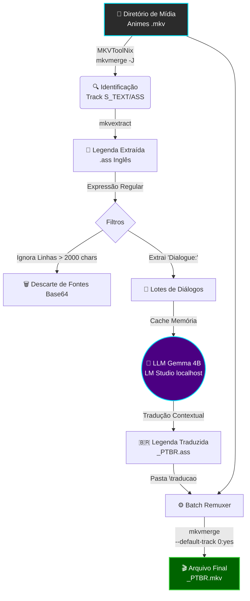

<div align="center">
  
  <h1>🌌 Sistema de analise, Tradução e Multiplexação de Animes</h1>
  <p><strong>Pipeline Industrial de Automação, Tradução de IA Local e Multiplexação de Mídia</strong></p>

  <p>
    
    
    
    
  </p>
</div>

<br/>

## 📋 Índice
- [🚀 Visão Geral](#-visão-geral)
- [🏗️ Arquitetura do Sistema](#-arquitetura-do-sistema)
- [⚙️ Tecnologias Utilizadas](#-tecnologias-utilizadas)
- [📦 Estrutura de Diretórios](#-estrutura-de-diretórios)
- [🛠️ Componentes Principais](#-componentes-principais)
- [🚀 Como Usar](#-como-usar)
- [📊 Auditoria e Logs](#-auditoria-e-logs)

---

## 🚀 Visão Geral
Este projeto é uma **esteira de produção local (On-Premises)** projetada para processar em lote (batch) temporadas completas de animes (foco inicial: *Macross Delta*). O pipeline realiza a extração inteligente de legendas em inglês, tradução técnica contextualizada usando **Inteligência Artificial Local (Gemma 4B rodando no LM Studio)**, e multiplexação automática dos novos arquivos, entregando episódios prontos com legendas nativas em Português Brasileiro (PT-BR).

<p align="center">
  <span style="color:#00E5FF"><strong>Velocidade:</strong></span> ~1.5 segundos por episódio no Remux<br/>
  <span style="color:#FF0055"><strong>Privacidade:</strong></span> 100% Offline (Local LLM)
</p>

---

## 🏗️ Arquitetura do Sistema

O fluxo de dados segue um modelo determinístico dividido em duas fases primárias: **Extração/Tradução** e **Multiplexação**.



---

## ⚙️ Tecnologias Utilizadas

| Ferramenta | Papel no Pipeline |
| :--- | :--- |
|  **Python 3** | Orquestração, Parseamento de ASS, Multi-Threading, I/O |
|  **MKVToolNix** | `mkvextract` e `mkvmerge` para manipulação de containers Matroska |
|  **LM Studio** | Servidor OpenAI-Compatible rodando em `localhost:1234` |
|  **Gemma 4B** | LLM otimizada para tradução de ficção científica/militar |
|  **Regex** | Expressões Regulares avançadas tolerantes a falhas no padrão ASS |

---

## 📦 Estrutura de Diretórios

A topologia do sistema de arquivos é rígida para garantir o funcionamento do pipeline em lote:

```text
C:\TRACKER-ANIMES\
├── animes\
│   └── Macross Delta\
│       ├── [Cleo]Macross_Delta_-_01.mkv          (Vídeos Originais)
│       ├── traducao\
│       │   └── [Cleo]Macross_Delta_-_01_PTBR.ass (Legendas Geradas)
│       └── mkv_final_ptbr\
│           └── [Cleo]Macross_Delta_-_01_PTBR.mkv (Output Multiplexado)
└── projeto-tracker-animes-traducao\
    ├── tradutor_ia_gemma4\
    │   ├── sub_extractor.py                      (Fase 1)
    │   └── logs\                                 (Auditoria Fase 1)
    └── jutar_legendas_filmes\
        ├── batch_remuxer.py                      (Fase 2)
        └── logs\                                 (Auditoria Fase 2)
```

---

## 🛠️ Componentes Principais

### 1. `sub_extractor.py` (Módulo de Inteligência & Tradução)
- **Autodetecção de Tracks:** Usa `mkvmerge -J` para descobrir dinamicamente qual ID de faixa contém o texto `S_TEXT/ASS`, evitando a extração acidental de imagens PGS.
- **Limpeza Binária:** Ignora blocos hexadecimais de fontes anexadas que causam *bloat* e lentidão.
- **Regex Industrial:** Padrão tolerante a colunas vazias `r"^(Dialogue:\s*[^,]*(?:,[^,]*){8},)(.*)$"`.
- **Tradução em Lotes:** Envia lotes de até 20 linhas para a GPU via API local.
- **Cache Inteligente:** Dicionário em memória que impede o processamento repetido de termos comuns da obra.

### 2. `batch_remuxer.py` (Módulo de Multiplexação)
- **Pareamento Determinístico:** Busca ativamente a legenda traduzida exata para cada `.mkv`.
- **Injeção de Metadados ISO:** 
  - `--language 0:por`
  - `--track-name "0:Português (Gemma 4B)"`
  - `--default-track 0:yes`
- **Operação Pura I/O:** Nenhum re-encode de vídeo. Demanda altíssima de I/O do SSD NVMe, permitindo tempos de processamento perto de ~1.5s por episódio.
- **Resiliência a Sinais:** Capta interrupções `Ctrl+C` e salva relatórios parciais.

---

## 🚀 Como Usar

### Pré-requisitos
1. **MKVToolNix** instalado em `C:\Program Files\MKVToolNix\`.
2. **LM Studio** aberto, rodando o servidor local na porta `1234` com o modelo de sua preferência (`google/gemma-4-e4b`) carregado.

### Executando a Fase 1: Extração e Tradução
```powershell
python .\tradutor_ia_gemma4\sub_extractor.py
```
*Forneça o caminho da pasta raiz quando solicitado (ex: `C:\TRACKER-ANIMES\animes\Macross Delta`). O processo fará as requisições à IA e depositará o resultado na subpasta `\traducao`.*

### Executando a Fase 2: Remuxing
```powershell
python .\jutar_legendas_filmes\batch_remuxer.py
```
*O script consumirá os `.mkv` originais e os `.ass` traduzidos, cuspindo os vídeos finalizados e formatados na subpasta `\mkv_final_ptbr`.*

---

## 📊 Auditoria e Logs (GRC)
A esteira foi desenvolvida focando na observabilidade total. Cada execução gera 4 relatórios independentes dentro das pastas `/logs` de cada módulo:
- 📄 `pipeline_TIMESTAMP.txt`: Auditoria completa do fluxo de chamadas.
- ⚙️ `config_TIMESTAMP.txt`: Fotografia de infraestrutura no momento do disparo.
- ⚠️ `erros_TIMESTAMP.txt`: Isolamento de dumps de Stack Trace para análise profunda.
- 📊 `stats_TIMESTAMP.json`: Telemetria final estruturada para dashboards de observabilidade.

<hr/>
<div align="center">
  <p>Construído por <strong>Paulo</strong> & <strong>Antigravity</strong> 🚀</p>
</div>