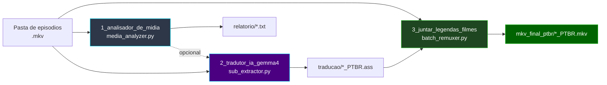
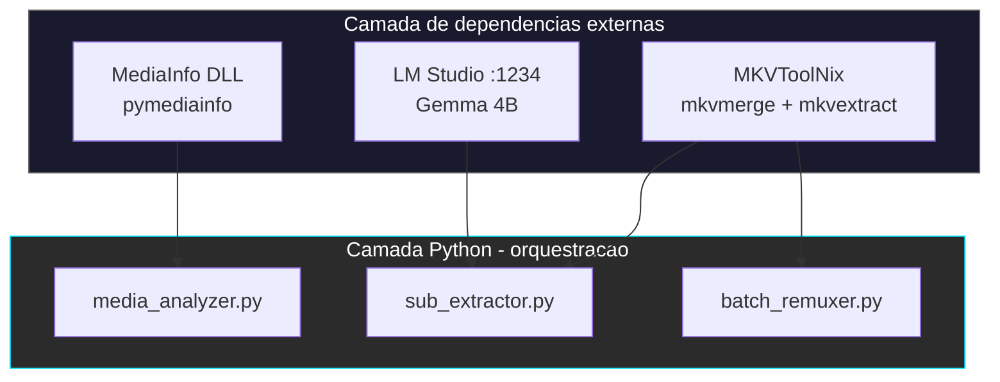
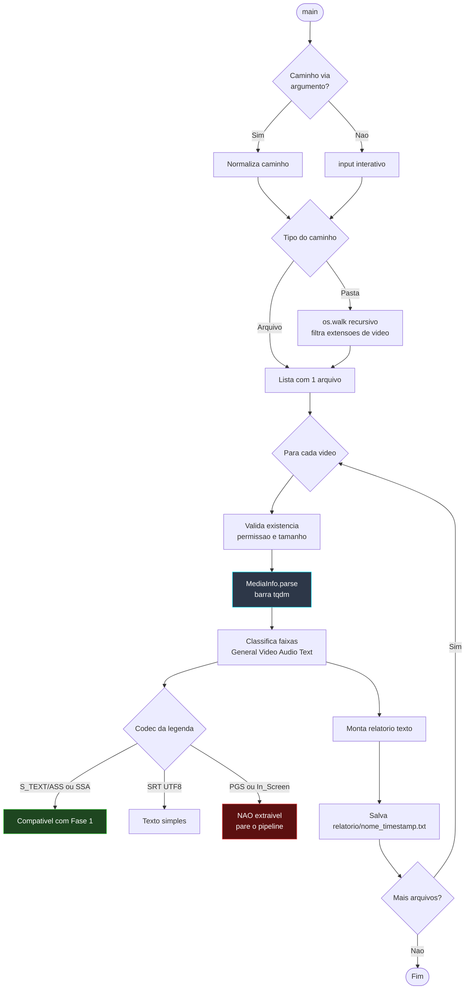
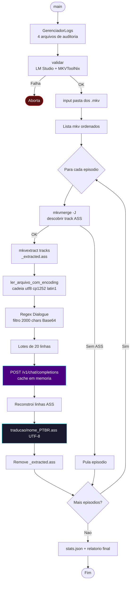
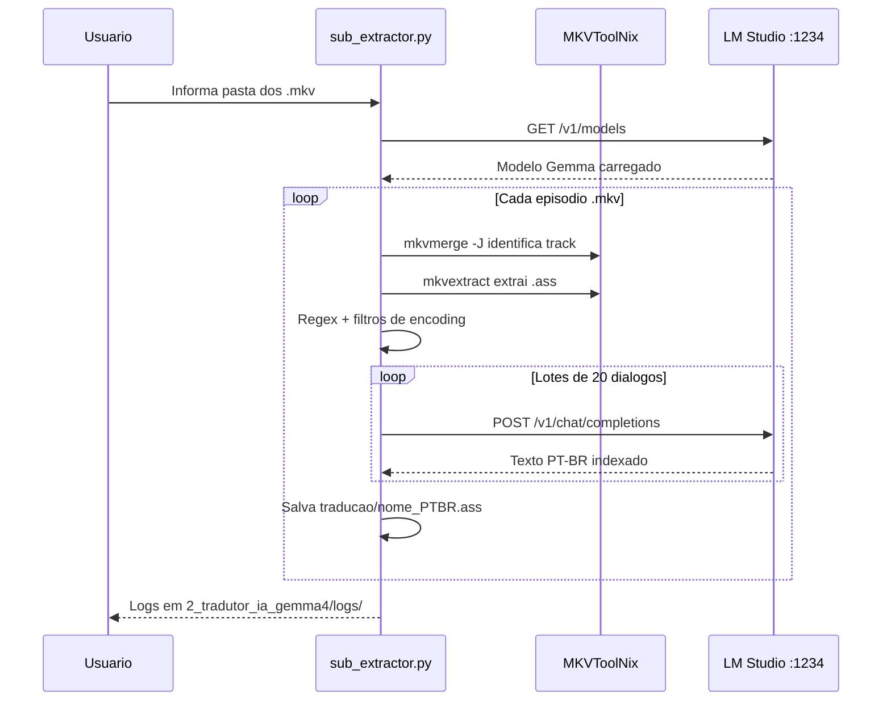
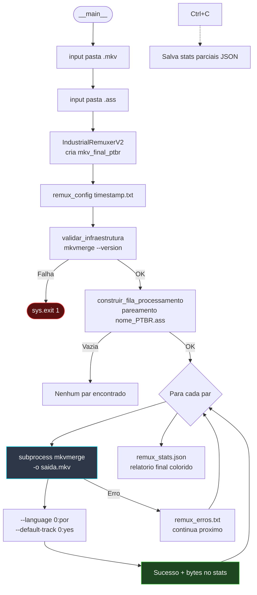
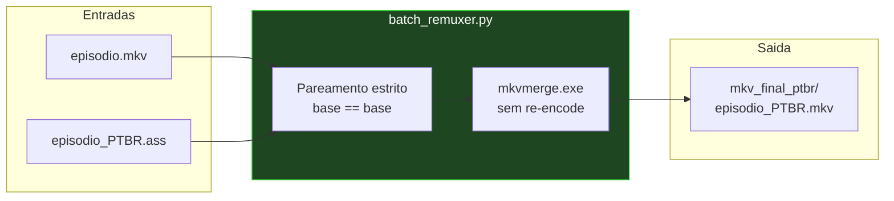
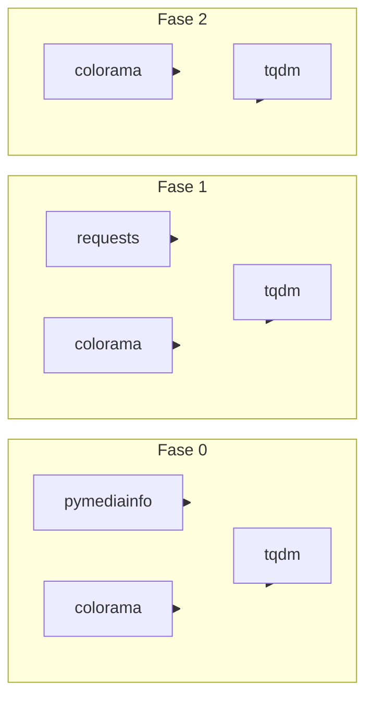

<div align="center">

  

  <h1>🌌 Tracker Animes — Pipeline de Tradução & Multiplexação</h1>

  <p><strong>Esteira industrial local (on-premises) para auditar mídia, traduzir legendas ASS com IA e remuxar episódios em PT-BR</strong></p>

  <p>
    
    
    
    
    
  </p>

  <p>
    
    
    
  </p>

</div>

> **Nota:** O pipeline foi desenhado para temporadas completas de anime em `.mkv` (caso de uso inicial: *Macross Delta*), mas funciona com qualquer pasta de episódios que siga a convenção de nomes descrita abaixo.

---

## 📋 Índice

| | |
|---|---|
| [🚀 Visão Geral](#-visão-geral) | [📦 Estrutura do Repositório](#-estrutura-do-repositório) |
| [🏗️ Arquitetura do Pipeline](#️-arquitetura-do-pipeline) | [🛠️ Módulos (1 → 2 → 3)](#️-módulos-1--2--3) |
| [📐 Diagrama — Fase 0](#-diagrama--fase-0-analisador) | [📐 Diagrama — Fase 1](#-diagrama--fase-1-tradutor) |
| [📐 Diagrama — Fase 2](#-diagrama--fase-2-remuxer) | |
| [✅ Pré-requisitos & Instalação](#-pré-requisitos--instalação) | [🐍 Dependências Python](#-dependências-python-requirementstxt) |
| [▶️ Como Executar](#️-como-executar) | |
| [📂 Layout de Pastas de Mídia](#-layout-de-pastas-de-mídia) | [📊 Auditoria e Logs](#-auditoria-e-logs) |
| [⚠️ Solução de Problemas](#️-solução-de-problemas) | [📄 Licença](#-licença) |

---

## 🚀 Visão Geral

Este repositório orquestra **três etapas sequenciais** em Python. O interpretador **não re-encoda vídeo** — ele delega operações de container ao **MKVToolNix** e a tradução ao **LM Studio** (API compatível com OpenAI em `localhost:1234`).

| Etapa | Pasta | Script | Função |
|:---:|:---|:---|:---|
| **0** | `1_analisador_de_midia/` | `media_analyzer.py` | Auditoria técnica de vídeo/áudio/legendas (opcional, recomendado antes do pipeline) |
| **1** | `2_tradutor_ia_gemma4/` | `sub_extractor.py` | Extrai `.ass` do `.mkv` → traduz via Gemma 4B → salva `*_PTBR.ass` |
| **2** | `3_juntar_legendas_filmes/` | `batch_remuxer.py` | Injeta a legenda PT-BR no container → gera `*_PTBR.mkv` |

<table>
  <tr>
    <td align="center">⚡ <b>Velocidade (remux)</b><br/>~1,5 s por episódio</td>
    <td align="center">🔒 <b>Privacidade</b><br/>LLM 100% local</td>
    <td align="center">📺 <b>Saída</b><br/>Legenda PT-BR como faixa padrão</td>
  </tr>
</table>

---

## 🏗️ Arquitetura do Pipeline

Fluxo determinístico: **análise (opcional) → extração/tradução → multiplexação**.

> **Diagrama geral** — visão macro das três pastas numeradas. Cada fase tem um diagrama detalhado na seção [Módulos](#️-módulos-1--2--3).





### Binários externos (Windows)

O Python **orquestra**; a manipulação de Matroska é feita pelos executáveis do MKVToolNix:

| Executável | Usado em | Caminho padrão |
|:---|:---|:---|
| `mkvmerge.exe` | Identificar tracks (`-J`) e remuxar | `C:\Program Files\MKVToolNix\` |
| `mkvextract.exe` | Extrair faixa de legenda `.ass` | `C:\Program Files\MKVToolNix\` |

> Instale o [MKVToolNix](https://mkvtoolnix.download/downloads.html) e confirme que ambos os `.exe` existem no diretório acima (ou em `Program Files (x86)` — o código tenta os dois caminhos na Fase 1).

### Servidor de IA

| Componente | Papel |
|:---|:---|
| **[LM Studio](https://lmstudio.ai/)** | Runtime on-premises: HTTP na porta **1234**, gerencia Prompt Cache e carrega o modelo na VRAM |
| **Gemma 4B** (`google/gemma-4-e4b`) | Modelo recomendado para ficção científica / mecha / termos militares |

Antes da Fase 1: abra o LM Studio → carregue o modelo → **Start Server** na porta `1234`.

---

## 📦 Estrutura do Repositório

```text
projeto-tracker-animes-traducao/
├── icone.png
├── requirements.txt
├── README.md
│
├── 1_analisador_de_midia/
│   └── media_analyzer.py          # Fase 0 — auditoria pymediainfo
│
├── 2_tradutor_ia_gemma4/
│   ├── sub_extractor.py           # Fase 1 — extração + tradução
│   └── logs/                      # pipeline, erros, stats, config
│
├── 3_juntar_legendas_filmes/
│   └── batch_remuxer.py           # Fase 2 — remux em lote
│
├── multiplexar/logs/              # logs do remuxer (sessões anteriores)
└── relatorio/                     # relatórios .txt da Fase 0
```

---

## 🛠️ Módulos (1 → 2 → 3)

### `1_analisador_de_midia/media_analyzer.py` — Fase 0 (opcional)

Varredura recursiva de `.mkv`, `.mp4`, `.avi`, etc. Gera relatório por arquivo em `relatorio/` com:

- Container, duração, bitrate geral  
- Fluxos de vídeo (codec, resolução, FPS)  
- Fluxos de áudio (idioma, canais)  
- **Legendas:** distingue `ASS/SSA`, `SRT` e **`PGS` (bitmap — não extraível)**

> Use esta fase para confirmar que o episódio tem legenda **texto** (`S_TEXT/ASS`) antes de gastar tempo na tradução.

#### 📐 Diagrama — Fase 0 (Analisador)



| Entrada | Saída | Dependências |
|:---|:---|:---|
| Pasta ou arquivo de vídeo | `relatorio/*.txt` | `pymediainfo`, `colorama`, `tqdm`, MediaInfo |

---

### `2_tradutor_ia_gemma4/sub_extractor.py` — Fase 1

| Recurso | Detalhe |
|:---|:---|
| **Autodetecção de track** | `mkvmerge -J` → primeira faixa `subtitles` com `S_TEXT/ASS` |
| **Encoding resiliente** | Cadeia: `utf-8` → `utf-8-sig` → `cp1252` → `latin-1` → `iso-8859-1` → bypass |
| **Regex industrial** | `^(Dialogue:\s*[^,]*(?:,[^,]*){8},)(.*)$` — ignora metadados ASS |
| **Filtro de bloat** | Linhas &gt; 2000 caracteres (fontes Base64 embutidas) |
| **Tradução em lote** | 20 diálogos por requisição HTTP |
| **Cache em memória** | Evita retraduzir lotes idênticos |
| **Saída** | `{pasta_episodios}/traducao/{nome}_PTBR.ass` |

#### 📐 Diagrama — Fase 1 (Tradutor)





| Entrada | Saída | Dependências |
|:---|:---|:---|
| Pasta com `.mkv` | `traducao/*_PTBR.ass` | MKVToolNix, LM Studio, `requests`, `colorama`, `tqdm` |

---

### `3_juntar_legendas_filmes/batch_remuxer.py` — Fase 2

| Recurso | Detalhe |
|:---|:---|
| **Pareamento estrito** | `{base}.mkv` ↔ `traducao/{base}_PTBR.ass` |
| **Sem re-encode** | Apenas remux — I/O intensivo em NVMe |
| **Metadados da faixa** | `--language 0:por`, `--track-name "0:Português (Gemma 4B)"`, `--default-track 0:yes` |
| **Resiliência** | `Ctrl+C` salva estatísticas parciais em JSON |
| **Saída** | `{pasta_videos}/mkv_final_ptbr/{base}_PTBR.mkv` |

#### 📐 Diagrama — Fase 2 (Remuxer)





| Entrada | Saída | Dependências |
|:---|:---|:---|
| Pasta `.mkv` + pasta `traducao/*.ass` | `mkv_final_ptbr/*_PTBR.mkv` | `mkvmerge.exe`, `colorama`, `tqdm` |

---

## ✅ Pré-requisitos & Instalação

### Checklist rápido

| # | Tipo | Item | Obrigatório para |
|:---:|:---|:---|:---|
| 1 | **SO** | [MKVToolNix](https://mkvtoolnix.download/downloads.html) (`mkvextract` + `mkvmerge`) | Fases 1 e 2 |
| 2 | **SO** | [MediaInfo](https://mediaarea.net/en/MediaInfo/Download) (DLL usada pelo `pymediainfo`) | Fase 0 |
| 3 | **SO** | [LM Studio](https://lmstudio.ai/) + modelo Gemma 4B na porta **1234** | Fase 1 |
| 4 | **Python** | 3.10+ | Todas |
| 5 | **pip** | Pacotes do `requirements.txt` | Todas |

### 1. Dependência de sistema — MKVToolNix

```text
C:\Program Files\MKVToolNix\
├── mkvextract.exe    ← extração de legendas (Fase 1)
└── mkvmerge.exe      ← identificação de tracks e remux (Fases 1 e 2)
```

### 2. Dependências Python — instalação rápida

Recomendado: ambiente virtual na raiz do projeto.

```powershell
cd C:\TRACKER-ANIMES\projeto-tracker-animes-traducao
python -m venv .venv
.\.venv\Scripts\Activate.ps1
pip install -r requirements.txt
```

Instalação mínima manual (apenas pacotes usados diretamente pelos scripts):

```powershell
pip install colorama tqdm requests pymediainfo
```

---

### 🐍 Dependências Python (`requirements.txt`)

Arquivo na raiz do repositório: [`requirements.txt`](requirements.txt). Versões fixadas para reprodutibilidade do ambiente no Windows.

#### Pacotes usados diretamente pelo código

Estes são importados pelos scripts das pastas `1_`, `2_` e `3_`:

| Pacote | Versão | Usado em | Fase | Função |
|:---|:---:|:---|:---:|:---|
| **`colorama`** | 0.4.6 | `media_analyzer.py`, `sub_extractor.py`, `batch_remuxer.py` | 0, 1, 2 | Traduz códigos ANSI para cores no PowerShell/CMD (`[SUCESSO]`, `[AVISO]`, `[ERRO]`) |
| **`tqdm`** | 4.67.3 | `media_analyzer.py`, `sub_extractor.py`, `batch_remuxer.py` | 0, 1, 2 | Barras de progresso no console (parsing, tradução, remux) |
| **`requests`** | 2.34.2 | `sub_extractor.py` | 1 | Cliente HTTP para LM Studio (`GET /v1/models`, `POST /v1/chat/completions`) |
| **`pymediainfo`** | 7.0.1 | `media_analyzer.py` | 0 | Wrapper Python sobre a DLL **MediaInfo** — metadados de vídeo/áudio/legendas |

> **MediaInfo (SO):** o `pymediainfo` exige a biblioteca nativa [MediaInfo](https://mediaarea.net/en/MediaInfo/Download) instalada no Windows. Sem ela, a Fase 0 falha na importação.

#### Pacotes de suporte (dependências transitivas)

Instalados automaticamente pelo `pip` ao resolver o `requirements.txt`. Não são importados diretamente nos scripts do projeto, mas fazem parte do ambiente fechado:

| Pacote | Versão | Puxado por | Função |
|:---|:---:|:---|:---|
| `urllib3` | 2.7.0 | `requests` | Pool de conexões HTTP |
| `certifi` | 2026.4.22 | `requests` | Certificados SSL/TLS |
| `charset-normalizer` | 3.4.7 | `requests` | Detecção de encoding em respostas HTTP |
| `idna` | 3.15 | `requests` | Suporte a domínios internacionais |
| `httpx` | 0.28.1 | `ollama` | Cliente HTTP assíncrono |
| `httpcore` | 1.0.9 | `httpx` | Camada baixa do `httpx` |
| `h11` | 0.16.0 | `httpcore` | Protocolo HTTP/1.1 |
| `anyio` | 4.13.0 | `httpx` | Abstração async para I/O |
| `pydantic` | 2.13.4 | `ollama` | Validação de modelos de dados |
| `pydantic_core` | 2.46.4 | `pydantic` | Núcleo Rust do Pydantic |
| `annotated-types` | 0.7.0 | `pydantic` | Tipos anotados para validação |
| `typing_extensions` | 4.15.0 | `pydantic` | Backport de tipos do Python |
| `typing-inspection` | 0.4.2 | `pydantic` | Inspeção de tipos em runtime |

#### Pacote listado sem uso atual no pipeline

| Pacote | Versão | Observação |
|:---|:---:|:---|
| **`ollama`** | 0.6.2 | Presente no `requirements.txt`, porém **nenhum script do repositório importa `ollama`**. A Fase 1 comunica-se com o **LM Studio** via `requests`. Mantido no arquivo para compatibilidade ou uso futuro; pode ser removido se o ambiente for enxugado. |

#### Mapa por fase do pipeline



#### Comandos úteis

```powershell
# Listar o que está instalado no venv
pip list

# Verificar dependências de um pacote
pip show requests

# Reinstalar tudo a partir do lock do projeto
pip install -r requirements.txt --force-reinstall
```

### 3. Servidor de IA — LM Studio

1. Baixe e instale o LM Studio.  
2. Carregue o modelo **`google/gemma-4-e4b`** (ou equivalente Gemma 4B).  
3. Inicie o servidor local em **`http://127.0.0.1:1234`**.  
4. O `sub_extractor.py` valida `GET /v1/models` antes de processar.

Com **MKVToolNix no caminho padrão**, **`colorama` + `tqdm` no venv** e **LM Studio ativo**, a esteira tem todos os pré-requisitos para rodar sem exceções de dependência.

---

## ▶️ Como Executar

Execute as fases **na ordem**. Cada script pede caminhos interativamente (aspas ao arrastar pastas no PowerShell são aceitas).

### Fase 0 — Auditoria (opcional)

```powershell
python .\1_analisador_de_midia\media_analyzer.py "C:\TRACKER-ANIMES\animes\Macross Delta"
```

Ou modo interativo (sem argumentos):

```powershell
python .\1_analisador_de_midia\media_analyzer.py
```

Relatórios em: `relatorio/{arquivo}_{timestamp}.txt`

---

### Fase 1 — Extração e tradução

```powershell
python .\2_tradutor_ia_gemma4\sub_extractor.py
```

Quando solicitado, informe a pasta dos `.mkv`, por exemplo:

```text
C:\TRACKER-ANIMES\animes\Macross Delta
```

**Resultado:** subpasta `traducao\` com arquivos `*_PTBR.ass`  
**Artefato temporário:** `*_extracted.ass` na pasta dos vídeos (removido ao fim de cada episódio)

---

### Fase 2 — Multiplexação (remux)

```powershell
python .\3_juntar_legendas_filmes\batch_remuxer.py
```

| Prompt | Exemplo |
|:---|:---|
| Pasta com vídeos `.mkv` | `C:\TRACKER-ANIMES\animes\Macross Delta` |
| Pasta com legendas `.ass` | `C:\TRACKER-ANIMES\animes\Macross Delta\traducao` |

**Resultado:** subpasta `mkv_final_ptbr\` com `*_PTBR.mkv`

---

## 📂 Layout de Pastas de Mídia

Convenção esperada pelo pipeline (crie as subpastas automaticamente ou manualmente):

```text
C:\TRACKER-ANIMES\
├── animes\
│   └── Macross Delta\
│       ├── [Cleo]Macross_Delta_-_01.mkv
│       ├── [Cleo]Macross_Delta_-_02.mkv
│       │
│       ├── traducao\                              ← gerado na Fase 1
│       │   ├── [Cleo]Macross_Delta_-_01_PTBR.ass
│       │   └── [Cleo]Macross_Delta_-_02_PTBR.ass
│       │
│       └── mkv_final_ptbr\                        ← gerado na Fase 2
│           ├── [Cleo]Macross_Delta_-_01_PTBR.mkv
│           └── [Cleo]Macross_Delta_-_02_PTBR.mkv
│
└── projeto-tracker-animes-traducao\             ← este repositório
```

---

## 📊 Auditoria e Logs

Cada execução das Fases 1 e 2 gera **quatro artefatos** com timestamp `YYYY-MM-DD_HH-MM-SS`:

| Arquivo | Conteúdo |
|:---|:---|
| `pipeline_*.txt` / `remux_pipeline_*.txt` | Fluxo completo da execução |
| `config_*.txt` / `remux_config_*.txt` | Snapshot de caminhos e infraestrutura |
| `erros_*.txt` / `remux_erros_*.txt` | Erros e stack traces isolados |
| `stats_*.json` / `remux_stats_*.json` | Telemetria estruturada (contagens, bytes, encodings) |

| Módulo | Pasta de logs |
|:---|:---|
| Fase 1 | `2_tradutor_ia_gemma4/logs/` |
| Fase 2 | `multiplexar/logs/` (configurado em `batch_remuxer.py`) |

### Níveis no console (colorama)

| Tag | Cor | Significado |
|:---:|:---:|:---|
| `[SUCESSO]` | 🟢 Verde | Operação concluída |
| `[INFO]` / `[DEBUG]` | ⚪ / 🔵 | Fluxo normal / detalhe |
| `[AVISO]` | 🟡 Amarelo | Situação recuperável |
| `[ERRO]` / `[CRÍTICO]` | 🔴 Vermelho | Falha ou aborto |

---

## ⚠️ Solução de Problemas

| Sintoma | Causa provável | Ação |
|:---|:---|:---|
| `mkvextract.exe não encontrados` | MKVToolNix ausente ou fora do caminho padrão | Reinstale em `C:\Program Files\MKVToolNix\` |
| `LM Studio não responde` | Servidor parado ou porta errada | Inicie o servidor na porta **1234** |
| `Nenhuma faixa S_TEXT/ASS` | Legenda PGS/hardsub | Use a Fase 0 — PGS não é extraível como texto |
| Episódio ignorado no remux | Legenda com nome diferente de `{base}_PTBR.ass` | Confira a pasta `traducao\` |
| Caracteres estranhos na legenda | Encoding legado | O tradutor já tenta múltiplos encodings; verifique `stats_*.json` → `encodings_detectados` |
| `pymediainfo nao esta instalado` | Pacote ou MediaInfo DLL ausente | `pip install pymediainfo` + instale o MediaInfo |

---

## ⚙️ Stack resumida

| Camada | Tecnologia |
|:---|:---|
| Orquestração | Python 3.10+ |
| Container Matroska | MKVToolNix (`mkvmerge`, `mkvextract`) |
| Metadados de mídia | pymediainfo + MediaInfo |
| Tradução | LM Studio + Gemma 4B (API OpenAI-compatible) |
| UX no terminal | colorama + tqdm |
| Formato de legenda | ASS (`S_TEXT/ASS`) |

---

## 📄 Licença

Consulte o arquivo [LICENSE](LICENSE) neste repositório.

---

<hr/>

<div align="center">

  <p>Construído por <strong>Paulo</strong> & <strong>Antigravity</strong> 🚀</p>
  <p><sub>Pipeline industrial de tradução local · Maio 2026</sub></p>

</div>
