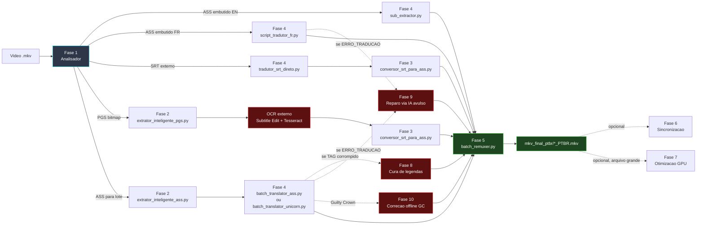
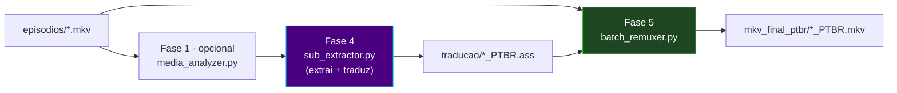
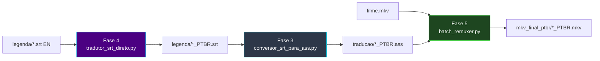
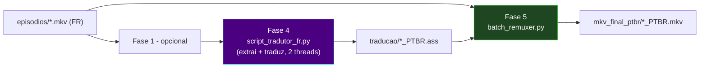
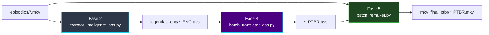
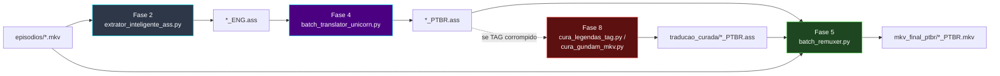
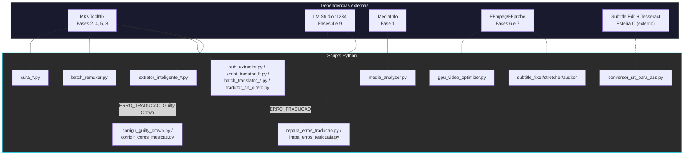

# 🏗️ Arquitetura do Pipeline

[← Índice da documentação](README.md) · [README principal](../README.md)

<p>
  
  
  
  
</p>

O projeto é organizado em **10 fases numeradas** (pastas `1_` a `10_`). Cada **esteira** (fluxo de trabalho) usa um subconjunto dessas fases, dependendo do formato de origem da legenda (ASS embutido, SRT externo, PGS bitmap), do idioma de origem (inglês, francês) e de eventuais reparos pós-tradução específicos da série.

---

## Mapa de fases

| Fase | Pasta | Função | Doc |
|:---:|:---|:---|:---|
| **1** | `1_analisador_de_midia/` | Audita mídia: codecs, faixas, sincronia | [Fase 1](modulo-fase-1.md) |
| **2** | `2_extrator_legenda/` | Extrai legenda original (ASS/SRT/PGS) do `.mkv` | [Fase 2](modulo-fase-2.md) |
| **3** | `3-conversor_str_ass/` | Converte `*_PTBR.srt` → `*_PTBR.ass` com sync de FPS | [Fase 3](modulo-fase-3.md) |
| **4** | `4_tradutor_ia_gemma4/` | Tradução via LM Studio + Gemma (5 variantes) | [Fase 4](modulo-fase-4.md) |
| **5** | `5_juntar_legendas_filmes/` | Remux: junta vídeo + legenda PT-BR | [Fase 5](modulo-fase-5.md) |
| **6** | `6_sincronizacao_legenda/` | Auxiliar: audita/corrige dessincronia | [Fase 6](modulo-fase-6.md) |
| **7** | `7_decodificador/` | Auxiliar: recomprime vídeo (HEVC/NVENC) | [Fase 7](modulo-fase-7.md) |
| **8** | `8_cura_legendas/` | Auxiliar: repara corrupção de tags PT-BR | [Fase 8](modulo-fase-8.md) |
| **9** | `9_reparo_de_traducao/` | 🩹 Reparo: retraduz linhas `[ERRO_TRADUCAO: ...]` via IA (batch=1) | [Fase 9](modulo-fase-9.md) |
| **10** | `10_correcao_guilty_crown/` | 🎵 Correção offline de `[ERRO_TRADUCAO:]` e cores/tags de músicas OP/ED | [Fase 10](modulo-fase-10.md) |

As fases **1, 6, 7 e 8** são **opcionais/auxiliares** e podem ser usadas em qualquer esteira, conforme necessário. As fases **2, 3, 4 e 5** formam o núcleo das esteiras abaixo. As fases **9 e 10** são **reparos pós-tradução**, aplicados sobre a saída da Fase 4 quando há marcadores `[ERRO_TRADUCAO:]` — a Fase 9 usa IA local (LM Studio), a Fase 10 é especializada para a série *Guilty Crown* e roda 100% offline.

---

## Visão geral — todas as esteiras



---

## Esteira A — Episódio MKV com ASS embutido (inglês)

Fluxo padrão para episódios de série com legenda `S_TEXT/ASS` em inglês embutida no `.mkv`.



```powershell
python ".\1_analisador_de_midia\media_analyzer.py"      # opcional
python ".\4_tradutor_ia_gemma4\sub_extractor.py"
python ".\5_juntar_legendas_filmes\batch_remuxer.py"
```

---

## Esteira B — Filme com SRT externo (inglês)

Para filmes/releases cuja legenda em inglês vem **separada** em um `.srt`. Detalhes: [Pipeline SRT](pipeline-srt.md).



```powershell
python ".\4_tradutor_ia_gemma4\5_tradutor_de_legenda\tradutor_srt_direto.py"
python ".\3-conversor_str_ass\conversor_srt_para_ass.py"
python ".\5_juntar_legendas_filmes\batch_remuxer.py"
```

---

## Esteira C — Legenda PGS (Blu-ray bitmap)

Para releases cuja única legenda embutida é **PGS** (`S_HDMV/PGS`, imagem). Requer **OCR externo** (não incluso no repositório).

```mermaid
flowchart LR
    MKV["filme.mkv (PGS)"] --> F2["Fase 2\nextrator_inteligente_pgs.py"]
    F2 --> SUP["extraidos_sup/*.sup"]
    SUP --> OCR["OCR externo\nSubtitle Edit + Tesseract"]
    OCR --> SRT["*_PTBR.srt"]
    SRT --> F3["Fase 3\nconversor_srt_para_ass.py"]
    F3 --> ASS["traducao/*_PTBR.ass"]

    MKV --> F5["Fase 5\nbatch_remuxer.py"]
    ASS --> F5
    F5 --> OUT["mkv_final_ptbr/*_PTBR.mkv"]

    style F2 fill:#2d3748,stroke:#00E5FF,color:#fff
    style OCR fill:#5c1010,stroke:#ff4444,color:#fff
    style F3 fill:#2d3748,stroke:#00E5FF,color:#fff
    style F5 fill:#1e4620,stroke:#32CD32,color:#fff
```



```powershell
python ".\2_extrator_legenda\extrator_inteligente_pgs.py"
# OCR externo (Subtitle Edit + Tesseract) -> *_PTBR.srt
python ".\3-conversor_str_ass\conversor_srt_para_ass.py"
python ".\5_juntar_legendas_filmes\batch_remuxer.py"
```

> O OCR `.sup → .srt` **não faz parte** deste repositório. A legenda traduzida deve ser gerada externamente antes da Fase 3.

---

## Esteira D — Tradução francês → PT-BR (multi-thread)

Mesmo formato da Esteira A, mas para legendas **ASS embutidas em francês**, com glossário e cache dedicados.



```powershell
python ".\4_tradutor_ia_gemma4\script_tradutor_fr.py"
python ".\5_juntar_legendas_filmes\batch_remuxer.py"
```

---

## Esteira E — Lote ASS pré-extraído (Gundam Reconguista)

Para quando a legenda já foi extraída (Fase 2) e a tradução é feita em **lote agrupado** (menos chamadas HTTP).



```powershell
python ".\2_extrator_legenda\extrator_inteligente_ass.py"
python ".\4_tradutor_ia_gemma4\tradutor_ass\batch_translator_ass.py"
python ".\5_juntar_legendas_filmes\batch_remuxer.py"
```

---

## Esteira F — Gundam Unicorn (especializada)

Igual à Esteira E, com glossário Universal Century e etapa de **cura de legendas** para corrigir corrupção de tags conhecida.



```powershell
python ".\2_extrator_legenda\extrator_inteligente_ass.py"
python ".\4_tradutor_ia_gemma4\tradutor_gundam_unicornio\batch_translator_unicorn.py"
python ".\8_cura_legendas\cura_legendas_tag.py"          # se necessario
python ".\5_juntar_legendas_filmes\batch_remuxer.py"
```

---

## Esteira G — Guilty Crown (correção de nomes e cores de músicas)

<p>
  
  
</p>

Igual à Esteira E, mas a saída da Fase 4 fica com marcadores `[ERRO_TRADUCAO: ...]` (nomes próprios) e cores de OP/ED ilegíveis. A **[Fase 10](modulo-fase-10.md)** corrige os dois problemas **sem precisar do LM Studio**.


```powershell
python ".\2_extrator_legenda\extrator_inteligente_ass.py"
python ".\4_tradutor_ia_gemma4\tradutor_ass\batch_translator_ass.py"   # ou variante adequada
python ".\10_correcao_guilty_crown\corrigir_guilty_crown.py"           # remove [ERRO_TRADUCAO:]
python ".\10_correcao_guilty_crown\corrigir_cores_musicas.py"          # cores/tags OP-ED
python ".\5_juntar_legendas_filmes\batch_remuxer.py"
```

> Se preferir retraduzir as falhas via IA em vez de manter o texto em inglês, use a **[Fase 9](modulo-fase-9.md)** (`repara_erros_traducao.py`, requer LM Studio) antes da Fase 10.

---

## Camadas de dependência (todas as fases)



---

## Binários externos (Windows)

| Executável | Fases | Caminho padrão |
|:---|:---|:---|
| `mkvmerge.exe` | 2, 4, 5, 8 | `C:\Program Files\MKVToolNix\` |
| `mkvextract.exe` | 2, 4, 8 | `C:\Program Files\MKVToolNix\` |
| `ffmpeg.exe` / `ffprobe.exe` | 6, 7 | PATH do sistema |

[Fase 3](modulo-fase-3.md) **não** usa MKVToolNix nem FFmpeg — conversão pura Python. As **[Fase 9](modulo-fase-9.md)** e **[Fase 10](modulo-fase-10.md)** também não dependem de nenhum binário externo (apenas leitura/escrita de `.ass`).

---

## Servidor de IA

| Componente | Fase | Observação |
|:---|:---|:---|
| **[LM Studio](https://lmstudio.ai/)** porta **1234** | 4, 9 | Servidor OpenAI-compatível local |
| **Gemma 4B** (`google/gemma-4-e4b`) | 4, 9 | Modelo carregado no LM Studio |

As **Fases 3, 6, 7, 8 e 10** **não** usam IA — apenas a **Fase 4** (tradução em lote) e a **Fase 9** (reparo avulso) dependem do LM Studio.

Instalação: [instalacao.md](instalacao.md)

---

[← Índice da documentação](README.md)
