# 🏗️ Arquitetura do Pipeline

[← Índice da documentação](file:///d:/PROJETOS-OPEN/projeto-tracker-animes-traducao/docs/README.md) · [README principal](../README.md)

<p>
  
  
  
  
</p>

O projeto é organizado em **fases prefixadas de `01` a `12`** (a Fase 05 tem três variantes de motor de IA: `05a`, `05b`, `05c`, mais uma irmã `05c-2` que compartilha o prefixo de pasta com `05c`). Cada **esteira** (fluxo de trabalho) usa um subconjunto dessas fases, dependendo do formato de origem da legenda (ASS embutido, SRT externo, PGS bitmap, ASS chinês), do idioma de origem (inglês, francês, chinês simplificado) e do título específico.

---

## Mapa de fases

| Fase | Pasta | Função | Doc |
|:---:|:---|:---|:---|
| **01** | `01_analisador_midia/` | Audita mídia: codecs, faixas, sincronia | [Fase 01](file:///d:/PROJETOS-OPEN/projeto-tracker-animes-traducao/docs/modulo-fase-01.md) |
| **02** | `02_extrator_legenda/` | Extrai legenda original (ASS/SRT/PGS) do `.mkv` | [Fase 02](file:///d:/PROJETOS-OPEN/projeto-tracker-animes-traducao/docs/modulo-fase-02.md) |
| **03** | `03_decodificador_caracteres/` | Auxiliar: recomprime vídeo (HEVC/NVENC) | [Fase 03](file:///d:/PROJETOS-OPEN/projeto-tracker-animes-traducao/docs/modulo-fase-03.md) |
| **04** | `04_conversor_srt_ass/` | Converte `*_PTBR.srt` → `*_PTBR.ass` com sync de FPS | [Fase 04](file:///d:/PROJETOS-OPEN/projeto-tracker-animes-traducao/docs/modulo-fase-04.md) |
| **05a** | `05a_tradutor_llm_gemma4/` | 🤖 Tradução via LM Studio + Gemma 4B (multi-título, inglês) | [Fase 05a](file:///d:/PROJETOS-OPEN/projeto-tracker-animes-traducao/docs/modulo-fase-05a.md) |
| **05b** | `05b_tradutor_llm_mistral_nemo/` | 🇫🇷 Tradução via LM Studio + Mistral Nemo 2407 (francês + inglês) | [Fase 05b](file:///d:/PROJETOS-OPEN/projeto-tracker-animes-traducao/docs/modulo-fase-05b.md) |
| **05c** | `05c_tradutor_llm_qwen2/` | 🐉 Tradução via LM Studio + Qwen2.5-7B (chinês simplificado) | [Fase 05c](file:///d:/PROJETOS-OPEN/projeto-tracker-animes-traducao/docs/modulo-fase-05c.md) |
| **05c-2** | `05c_tradutor_llm_translategemma/` | 🌐 Tradução/revisão via LM Studio + TranslateGemma 12B (inglês) | [Fase 05c-2](file:///d:/PROJETOS-OPEN/projeto-tracker-animes-traducao/docs/modulo-fase-05c2.md) |
| **06** | `06_cura_legendas/` | 🩹 Auxiliar: cura offline de tags ASS corrompidas | [Fase 06](file:///d:/PROJETOS-OPEN/projeto-tracker-animes-traducao/docs/modulo-fase-06.md) |
| **07** | `07_higienizacao_e_reparo_de_traducao/` | 🧹/🩹 Higienização de lore por título e reparo de falhas via IA | [Fase 07](file:///d:/PROJETOS-OPEN/projeto-tracker-animes-traducao/docs/modulo-fase-07.md) |
| **08** | `08_sincronizacao_legenda/` | ⏱️ Auxiliar: audita/corrige dessincronia áudio×legenda | [Fase 08](file:///d:/PROJETOS-OPEN/projeto-tracker-animes-traducao/docs/modulo-fase-08.md) |
| **09** | `09_injetor_musicas/` | 🎵 Injeta karaokê OP/ED/Insert Songs de fansubs | [Fase 09](file:///d:/PROJETOS-OPEN/projeto-tracker-animes-traducao/docs/modulo-fase-09.md) |
| **10** | `10_auditoria_e_revisao/` | 🔬 Revisão/correção final por título (lore, resíduos, remux) | [Fase 10](file:///d:/PROJETOS-OPEN/projeto-tracker-animes-traducao/docs/modulo-fase-10.md) |
| **11** | `11_correcao_projetos_legados/` | 🎨 Correção offline de cores/marcadores em legendas antigas | [Fase 11](file:///d:/PROJETOS-OPEN/projeto-tracker-animes-traducao/docs/modulo-fase-11.md) |
| **12** | `12_remuxer_mkvmerge/` | 🎬 Remux: junta vídeo + legenda PT-BR | [Fase 12](file:///d:/PROJETOS-OPEN/projeto-tracker-animes-traducao/docs/modulo-fase-12.md) |

As fases **01, 03, 06, 07, 08, 09, 11** são **auxiliares/transversais** — usadas conforme necessário, em qualquer esteira. As fases **02, 04, 05x e 12** formam o núcleo de extração/tradução/remux de cada esteira. As fases **05a, 05b, 05c e 05c-2** não são sequenciais entre si — são **variantes de motor de IA** do mesmo papel (extrai + traduz), escolhidas pelo idioma de origem e pelo título. As fases **06, 07 e 11** são **reparos e pós-processamento pós-tradução**. A **Fase 07** agora unifica tanto a higienização de lore/gramática por título (via scripts dedicados) quanto o reparo de falhas residuais via IA (com CoT). A **Fase 10** é o catálogo de **scripts de QA por título**, aplicado depois (ou antes, conforme o script) da higienização para corrigir erros complexos de lore e consolidar o `.mkv` final.

---

## Visão geral — todas as esteiras

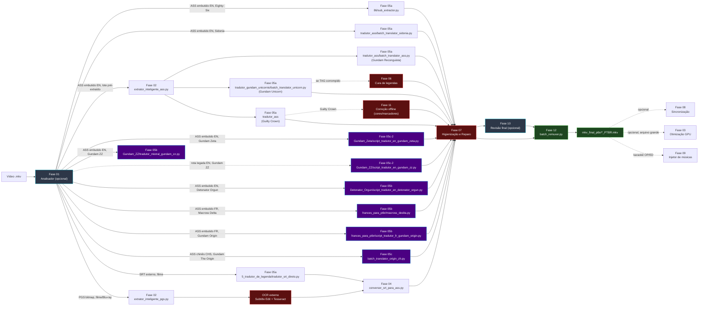

---

## Esteira A — Eighty-Six (ASS embutido, inglês)

Fluxo padrão para episódios de série com legenda `S_TEXT/ASS` em inglês embutida no `.mkv`. Implementação: **Eighty-Six (86)**, via `05a_tradutor_llm_gemma4/86/sub_extractor.py`.

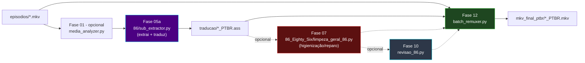

```powershell
python ".\01_analisador_midia\media_analyzer.py"          # opcional
python ".\05a_tradutor_llm_gemma4\86\sub_extractor.py"
python ".\07_higienizacao_e_reparo_de_traducao\86_Eighty_Six\limpeza_geral_86.py" # opcional, normaliza lore/patentes
python ".\12_remuxer_mkvmerge\batch_remuxer.py"
python ".\10_auditoria_e_revisao\revisao_86.py"           # opcional, corrige alucinações residuais + remux
```

---

## Esteira B — Filme com SRT externo (inglês)

Para filmes/releases cuja legenda em inglês vem **separada** em um `.srt`. Detalhes completos: [Pipeline SRT](file:///d:/PROJETOS-OPEN/projeto-tracker-animes-traducao/docs/pipeline-srt.md).

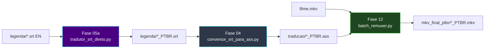

```powershell
python ".\05a_tradutor_llm_gemma4\5_tradutor_de_legenda\tradutor_srt_direto.py"
python ".\04_conversor_srt_ass\conversor_srt_para_ass.py"
python ".\12_remuxer_mkvmerge\batch_remuxer.py"
```

---

## Esteira C — Legenda PGS (Bluray bitmap)

Para releases Blu-ray cuja legenda é uma imagem (`S_HDMV/PGS`), sem texto extraível diretamente — exige OCR externo. Exemplo de título: **Sword Art Online — Filme 2**.

```mermaid
flowchart LR
    C_MKV["filme.mkv (PGS)"] --> C_F02["Fase 02<br/>extrator_inteligente_pgs.py"]
    C_F02 --> C_SUP["extraidos_sup/*.sup"]
    C_SUP --> C_OCR["OCR externo<br/>Subtitle Edit + Tesseract"]
    C_OCR --> C_SRTPT["legenda/*_PTBR.srt"]
    C_SRTPT --> C_F04["Fase 04<br/>conversor_srt_para_ass.py"]
    C_F04 --> C_ASS["traducao/*_PTBR.ass"]
    C_MKV --> C_F12["Fase 12<br/>batch_remuxer.py"]
    C_ASS --> C_F12
    C_F12 --> C_OUT["mkv_final_ptbr/*_PTBR.mkv"]

    style C_OCR fill:#5c1010,stroke:#ff4444,color:#fff
    style C_F04 fill:#2d3748,stroke:#00E5FF,color:#fff
    style C_F12 fill:#1e4620,stroke:#32CD32,color:#fff
```

```powershell
python ".\02_extrator_legenda\extrator_inteligente_pgs.py"
# OCR externo (Subtitle Edit + Tesseract) -> *_PTBR.srt
python ".\04_conversor_srt_ass\conversor_srt_para_ass.py"
python ".\12_remuxer_mkvmerge\batch_remuxer.py"
```

> O OCR `.sup → .srt` **não faz parte** deste repositório.

---

## Esteira D — Macross Delta TV (Tradução Francês → PT-BR)

ASS embutido em francês, multi-thread (2 threads), glossário e cache persistente próprios.

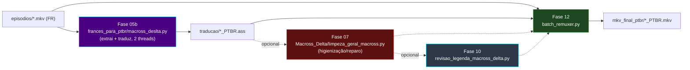

```powershell
# Pré-requisito: LM Studio na porta 1234 com Mistral Nemo Instruct 2407 (GGUF) carregado
python ".\05b_tradutor_llm_mistral_nemo\frances_para_ptbr\macross_deslta.py"
python ".\12_remuxer_mkvmerge\batch_remuxer.py"
python ".\10_auditoria_e_revisao\revisao_legenda_macross_delta.py"   # opcional, lore + tags ASS
```

---

## Esteira E — Macross Delta Filme 2 (Francês)

Mesmo motor da Esteira D, com revisão final dedicada ao filme.

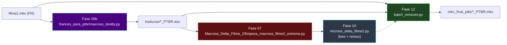

```powershell
python ".\05b_tradutor_llm_mistral_nemo\frances_para_ptbr\macross_deslta.py"
python ".\07_higienizacao_e_reparo_de_traducao\Macross_Delta_Filme_2\limpeza_macross_filme2_extrema.py"
python ".\10_auditoria_e_revisao\micross_delta_filme2.py"
python ".\12_remuxer_mkvmerge\batch_remuxer.py"
```

---

## Esteira F — Lote ASS pré-extraído (Gundam Reconguista)

Para releases que exigem extração explícita antes da tradução (sem script dedicado por título).

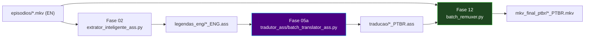

```powershell
python ".\02_extrator_legenda\extrator_inteligente_ass.py"
python ".\05a_tradutor_llm_gemma4\tradutor_ass\batch_translator_ass.py"
python ".\12_remuxer_mkvmerge\batch_remuxer.py"
```

---

## Esteira G — Gundam Unicorn (especializada)

Pipeline com cura de legendas (corrupção conhecida da palavra `TAG`) e revisão final por episódio.

```mermaid
flowchart LR
    G_MKV["episodios/*.mkv (EN)"] --> G_F02["Fase 02<br/>extrator_inteligente_ass.py"]
    G_F02 --> G_ENG["legendas_eng/*_ENG.ass"]
    G_ENG --> G_F05A["Fase 05a<br/>tradutor_gundam_unicornio/batch_translator_unicorn.py"]
    G_F05A --> G_ASS["traducao/*_PTBR.ass"]
    G_ASS -.->|"se TAG corrompido"| G_F06["Fase 06<br/>cura_legendas_tag.py"]
    G_F06 -.-> G_CURADA["traducao_curada/*_PTBR.ass"]
    G_ASS -.->|"opcional"| G_F07["Fase 07<br/>Gundam_Unicorn/limpeza_geral_unicorn.py"]
    G_F07 -.->|"opcional"| G_F10["Fase 10<br/>revisao_legenda_gundam_unicornio.py"]
    G_MKV --> G_F12["Fase 12<br/>batch_remuxer.py"]
    G_ASS --> G_F12
    G_CURADA -.-> G_F12
    G_F10 -.-> G_F12
    G_F12 --> G_OUT["mkv_final_ptbr/*_PTBR.mkv"]
    G_OUT -.->|"se TAG sobreviveu ao remux"| G_F06B["Fase 06<br/>cura_gundam_mkv.py"]

    style G_F05A fill:#4B0082,stroke:#00E5FF,color:#fff
    style G_F06 fill:#5c1010,stroke:#ff4444,color:#fff
    style G_F06B fill:#5c1010,stroke:#ff4444,color:#fff
    style G_F07 fill:#5c1010,stroke:#ff4444,color:#fff
    style G_F10 fill:#2d3748,stroke:#00E5FF,color:#fff
    style G_F12 fill:#1e4620,stroke:#32CD32,color:#fff
```

```powershell
python ".\02_extrator_legenda\extrator_inteligente_ass.py"
python ".\05a_tradutor_llm_gemma4\tradutor_gundam_unicornio\batch_translator_unicorn.py"
python ".\06_cura_legendas\cura_legendas_tag.py"           # se necessário (TAG corrompido)
python ".\07_higienizacao_e_reparo_de_traducao\Gundam_Unicorn\limpeza_geral_unicorn.py"
python ".\12_remuxer_mkvmerge\batch_remuxer.py"
python ".\10_auditoria_e_revisao\revisao_legenda_gundam_unicornio.py"   # opcional, ep.1 + letras OP/ED + remux
```

---

## Esteira H — Guilty Crown (correção de nomes e cores de músicas)

```mermaid
flowchart LR
    H_MKV["episodios/*.mkv (EN)"] --> H_F02["Fase 02<br/>extrator_inteligente_ass.py"]
    H_F02 --> H_ENG["legendas_eng/*_ENG.ass"]
    H_ENG --> H_F05A["Fase 05a<br/>tradutor_ass/batch_translator_ass.py"]
    H_F05A --> H_RAW["legendas_eng/*_PTBR.ass<br/>(com ERRO_TRADUCAO)"]
    H_RAW --> H_F11A["Fase 11<br/>corrigir_guilty_crown.py"]
    H_F11A --> H_PTBR["legendas_ptbr/*_PTBR.ass"]
    H_PTBR --> H_F11B["Fase 11<br/>corrigir_cores_musicas.py<br/>(cores/tags OP-ED)"]
    H_F11B -.->|"opcional"| H_F07["Fase 07<br/>Guilty_Crown/limpeza_geral_guilty.py"]
    H_F07 -.->|"opcional"| H_F10["Fase 10<br/>revisao_guild_crown.py"]
    H_MKV --> H_F12["Fase 12<br/>batch_remuxer.py"]
    H_F11B --> H_F12
    H_F10 -.-> H_F12
    H_F12 --> H_OUT["mkv_final_ptbr/*_PTBR.mkv"]

    style H_F05A fill:#4B0082,stroke:#00E5FF,color:#fff
    style H_F11A fill:#5c1010,stroke:#ff4444,color:#fff
    style H_F11B fill:#5c1010,stroke:#ff4444,color:#fff
    style H_F07 fill:#5c1010,stroke:#ff4444,color:#fff
    style H_F10 fill:#2d3748,stroke:#00E5FF,color:#fff
    style H_F12 fill:#1e4620,stroke:#32CD32,color:#fff
```

```powershell
python ".\02_extrator_legenda\extrator_inteligente_ass.py"
python ".\05a_tradutor_llm_gemma4\tradutor_ass\batch_translator_ass.py"
python ".\11_correcao_projetos_legados\corrigir_guilty_crown.py"          # remove [ERRO_TRADUCAO:]
python ".\11_correcao_projetos_legados\corrigir_cores_musicas.py"         # cores/tags OP-ED
python ".\07_higienizacao_e_reparo_de_traducao\Guilty_Crown\limpeza_geral_guilty.py"
python ".\12_remuxer_mkvmerge\batch_remuxer.py"
python ".\10_auditoria_e_revisao\revisao_guild_crown.py"                  # opcional, diálogos + letras OP/ED + remux
```

---

## Esteira I — Gundam The Origin, legenda chinesa (CHS)

```mermaid
flowchart LR
    I_MKV["episodios/*.mkv (CHS embutido)"] --> I_F02["Fase 02<br/>extrator_inteligente_ass.py"]
    I_F02 --> I_CHS["*.chs.ass"]
    I_CHS --> I_F05C["Fase 05c<br/>batch_translator_origin_zh.py"]
    I_F05C --> I_PTBR["legendas_ptbr/*_PTBR.ass"]
    I_PTBR -.->|"se ERRO_TRADUCAO"| I_REP["Fase 05c<br/>repara_erros_origin_zh.py"]
    I_REP -.-> I_PTBR
    I_PTBR -.->|"opcional"| I_F07["Fase 07<br/>Gundam_The_Origin/limpeza_geral_origin.py"]
    I_F07 -.->|"opcional"| I_F10["Fase 10<br/>revisao_legenda_origin.py"]
    I_MKV --> I_F12["Fase 12<br/>batch_remuxer.py"]
    I_PTBR --> I_F12
    I_F10 -.-> I_F12
    I_F12 --> I_OUT["mkv_final_ptbr/*_PTBR.mkv"]

    style I_F05C fill:#4B0082,stroke:#00E5FF,color:#fff
    style I_REP fill:#5c1010,stroke:#ff4444,color:#fff
    style I_F07 fill:#5c1010,stroke:#ff4444,color:#fff
    style I_F10 fill:#2d3748,stroke:#00E5FF,color:#fff
    style I_F12 fill:#1e4620,stroke:#32CD32,color:#fff
```

```powershell
python ".\02_extrator_legenda\extrator_inteligente_ass.py"
# Pré-requisito: LM Studio na porta 1234 com Qwen2.5-7B-Instruct carregado
python ".\05c_tradutor_llm_qwen2\batch_translator_origin_zh.py" --entrada "<pasta_chs_ass>" --saida "<pasta_saida>"
python ".\05c_tradutor_llm_qwen2\repara_erros_origin_zh.py" --originais "<pasta_chs_ass>" --traduzidas "<pasta_ptbr>"  # se necessário
python ".\07_higienizacao_e_reparo_de_traducao\Gundam_The_Origin\limpeza_geral_origin.py"
python ".\10_auditoria_e_revisao\revisao_legenda_origin.py"        # opcional, lore + cache + remux
python ".\12_remuxer_mkvmerge\batch_remuxer.py"
```

---

## Esteira J — Gundam Origin, legenda francesa (SUBFRENCH)

Rota alternativa para Gundam Origin quando o release disponível tem legenda francesa embutida em vez da chinesa (Esteira I).

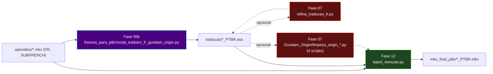

```powershell
# Pré-requisito: LM Studio na porta 1234 com Mistral Nemo Instruct 2407 (GGUF) carregado
python ".\05b_tradutor_llm_mistral_nemo\frances_para_ptbr\script_tradutor_fr_gundam_origin.py"
# Refino de concordância via cache francês
python ".\07_higienizacao_e_reparo_de_traducao\refino_frances_origin\refina_traducao_fr.py"
# Higienização de barras e termos franceses
python ".\07_higienizacao_e_reparo_de_traducao\Gundam_Origin\limpeza_origin_total.py"
python ".\12_remuxer_mkvmerge\batch_remuxer.py"
```

---

## Esteira K — Gundam Zeta

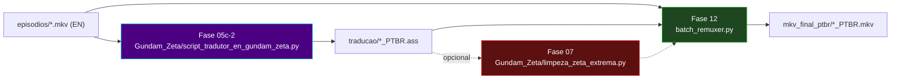

```powershell
# Pré-requisito: LM Studio na porta 1234 com TranslateGemma 12B carregado
python ".\05c_tradutor_llm_translategemma\Gundam_Zeta\script_tradutor_en_gundam_zeta.py"
python ".\07_higienizacao_e_reparo_de_traducao\Gundam_Zeta\limpeza_zeta_extrema.py"
python ".\12_remuxer_mkvmerge\batch_remuxer.py"
```

---

## Esteira L — Gundam ZZ

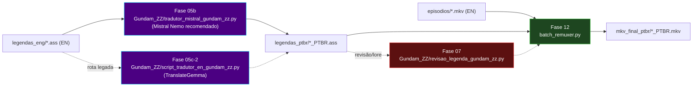

```powershell
# Pré-requisito recomendado: LM Studio na porta 1234 com Mistral Nemo Instruct 2407 (GGUF) carregado
python ".\05b_tradutor_llm_mistral_nemo\Gundam_ZZ\tradutor_mistral_gundam_zz.py" "C:\animes\Gundam_ZZ\legendas_eng" --saida "C:\animes\Gundam_ZZ\legendas_ptbr"

# Rota legada alternativa: TranslateGemma 12B
python ".\05c_tradutor_llm_translategemma\Gundam_ZZ\script_tradutor_en_gundam_zz.py"

python ".\07_higienizacao_e_reparo_de_traducao\Gundam_ZZ\revisao_legenda_gundam_zz.py" --dry-run
python ".\12_remuxer_mkvmerge\batch_remuxer.py"
```

---

## Esteira M — Detonator Orgun

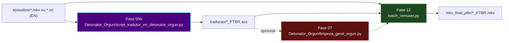

```powershell
# Pré-requisito: LM Studio na porta 1234 com Mistral Nemo Instruct 2407 (GGUF) carregado
python ".\05b_tradutor_llm_mistral_nemo\Detonator_Orgun\script_tradutor_en_detonator_orgun.py"
python ".\07_higienizacao_e_reparo_de_traducao\Detonator_Orgun\limpeza_geral_orgun.py"
python ".\12_remuxer_mkvmerge\batch_remuxer.py"
```

---

## Esteira N — Knights of Sidonia

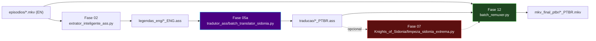

```powershell
python ".\02_extrator_legenda\extrator_inteligente_ass.py"
python ".\05a_tradutor_llm_gemma4\tradutor_ass\batch_translator_sidonia.py"
python ".\07_higienizacao_e_reparo_de_traducao\Knights_of_Sidonia\limpeza_sidonia_extrema.py"
python ".\12_remuxer_mkvmerge\batch_remuxer.py"
```

---

[← Índice da documentação](file:///d:/PROJETOS-OPEN/projeto-tracker-animes-traducao/docs/README.md) · [README principal](../README.md)
