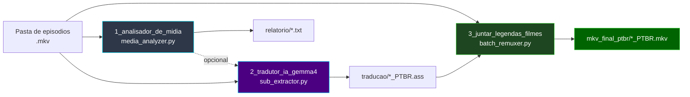
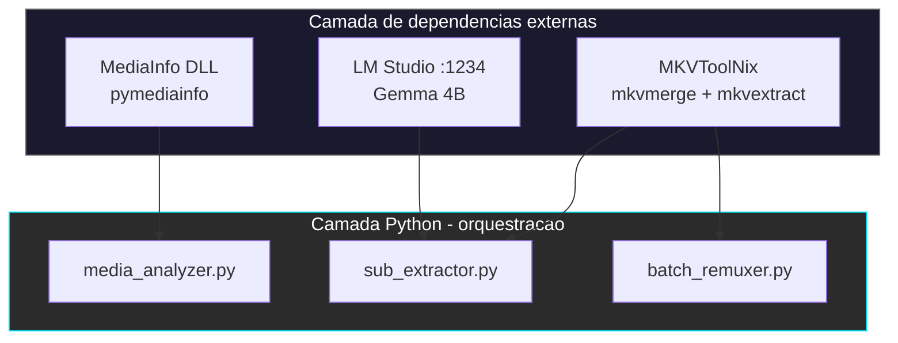

# 🏗️ Arquitetura do Pipeline

[← Índice da documentação](README.md) · [README principal](../README.md)

Fluxo determinístico: **análise (opcional) → extração/tradução → multiplexação**.

> Diagramas detalhados por script: [Fase 0](modulo-fase-0.md) · [Fase 1](modulo-fase-1.md) · [Fase 2](modulo-fase-2.md)

---

## Visão macro

---

## Camadas de dependência

---

## Binários externos (Windows)

O Python **orquestra**; a manipulação de Matroska é feita pelos executáveis do MKVToolNix:

| Executável | Usado em | Caminho padrão |
|:---|:---|:---|
| `mkvmerge.exe` | Identificar tracks (`-J`) e remuxar | `C:\Program Files\MKVToolNix\` |
| `mkvextract.exe` | Extrair faixa de legenda `.ass` | `C:\Program Files\MKVToolNix\` |

> Instale o [MKVToolNix](https://mkvtoolnix.download/downloads.html). O código da Fase 1 também tenta `Program Files (x86)`.

---

## Servidor de IA

| Componente | Papel |
|:---|:---|
| **[LM Studio](https://lmstudio.ai/)** | Runtime on-premises: HTTP na porta **1234**, Prompt Cache, modelo na VRAM |
| **Gemma 4B** (`google/gemma-4-e4b`) | Modelo recomendado para ficção científica / mecha |

Antes da Fase 1: carregue o modelo → **Start Server** na porta `1234`.

Detalhes de instalação: [Instalação](instalacao.md).

---

[← Índice da documentação](README.md)
