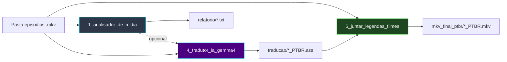
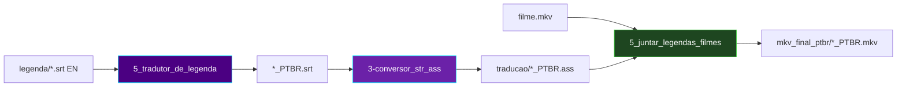
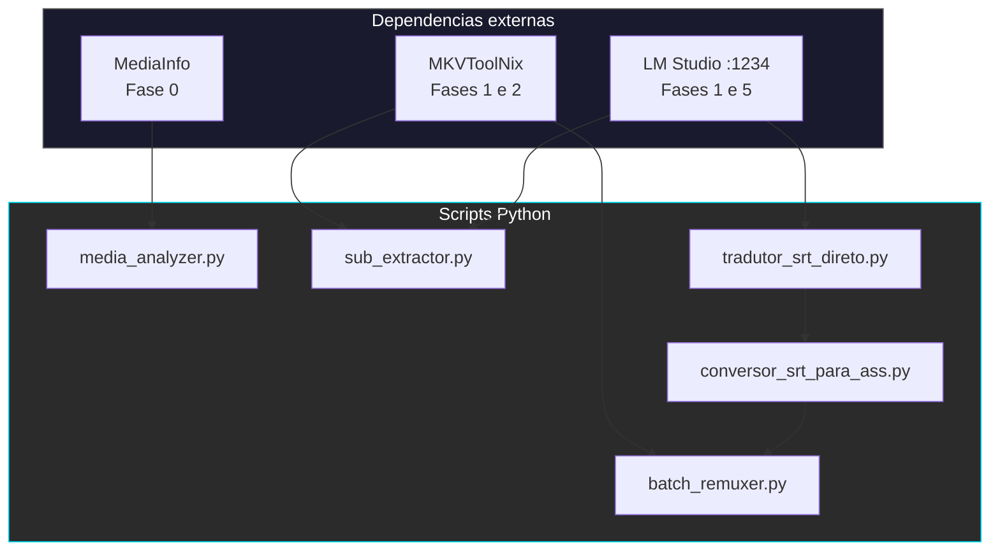

# 🏗️ Arquitetura do Pipeline

[← Índice da documentação](README.md) · [README principal](../README.md)

O projeto oferece **duas esteiras** independentes que convergem na **Fase 2 (remux)**:

| Esteira | Fases | Entrada típica |
|:---|:---|:---|
| **MKV (episódios)** | 0 → 1 → 2 | `.mkv` com legenda ASS embutida |
| **SRT (legendas externas)** | 5 → 6 → 2 | `.srt` separado + `.mkv` do filme |

> Detalhes da esteira SRT: [Pipeline SRT](pipeline-srt.md)

---

## Esteira MKV — visão macro

Diagramas por módulo: [Fase 0](modulo-fase-0.md) · [Fase 1](modulo-fase-1.md) · [Fase 2](modulo-fase-2.md)

---

## Esteira SRT — visão macro

Diagramas: [Fase 5](modulo-fase-5.md) · [Fase 6](modulo-fase-6.md)

---

## Camadas de dependência (todas as fases)

---

## Binários externos (Windows)

| Executável | Fases | Caminho padrão |
|:---|:---|:---|
| `mkvmerge.exe` | 1, 2 | `C:\Program Files\MKVToolNix\` |
| `mkvextract.exe` | 1 | `C:\Program Files\MKVToolNix\` |

[Fases 5 e 6](pipeline-srt.md) **não** usam MKVToolNix.

---

## Servidor de IA

| Componente | Fases |
|:---|:---|
| **[LM Studio](https://lmstudio.ai/)** porta **1234** | 1, 5 |
| **Gemma 4B** | Tradução ASS (Fase 1) e SRT (Fase 5) |

A **Fase 6** é conversão estrutural + sync FPS — sem IA.

Instalação: [instalacao.md](instalacao.md)

---

[← Índice da documentação](README.md)
