# 🏗️ Arquitetura do Pipeline

[← Índice da documentação](README.md) · [README principal](../README.md)

<p>
  
  
  
  
</p>

O projeto é organizado em **12 fases numeradas** (pastas `1_` a `12_`). Cada **esteira** (fluxo de trabalho) usa um subconjunto dessas fases, dependendo do formato de origem da legenda (ASS embutido, SRT externo, PGS bitmap, ASS chinês), do idioma de origem (inglês, francês, chinês simplificado) e de eventuais reparos/revisões pós-tradução específicos do título.

---

## Mapa de fases

| Fase | Pasta | Função | Doc |
|:---:|:---|:---|:---|
| **1** | `1_analisador_de_midia/` | Audita mídia: codecs, faixas, sincronia | [Fase 1](modulo-fase-1.md) |
| **2** | `2_extrator_legenda/` | Extrai legenda original (ASS/SRT/PGS) do `.mkv` | [Fase 2](modulo-fase-2.md) |
| **3** | `3-conversor_str_ass/` | Converte `*_PTBR.srt` → `*_PTBR.ass` com sync de FPS | [Fase 3](modulo-fase-3.md) |
| **4** | `4_tradutor_ia_gemma4/` | Tradução via LM Studio + Gemma 4B (4 variantes, inglês) | [Fase 4](modulo-fase-4.md) |
| **4-B** | `4_b_mistrall_nemo_instruct_2407_GGUF_tradutor/` | 🇫🇷 Tradução via LM Studio + Mistral Nemo 2407 (2 variantes, francês) | [Fase 4-B](modulo-fase-4b.md) |
| **5** | `5_juntar_legendas_filmes/` | Remux: junta vídeo + legenda PT-BR | [Fase 5](modulo-fase-5.md) |
| **6** | `6_sincronizacao_legenda/` | Auxiliar: audita/corrige dessincronia | [Fase 6](modulo-fase-6.md) |
| **7** | `7_decodificador/` | Auxiliar: recomprime vídeo (HEVC/NVENC) | [Fase 7](modulo-fase-7.md) |
| **8** | `8_cura_legendas/` | Auxiliar: repara corrupção de tags PT-BR | [Fase 8](modulo-fase-8.md) |
| **9** | `9_reparo_de_traducao/` | 🩹 Reparo: retraduz linhas `[ERRO_TRADUCAO: ...]` via IA (batch=1) | [Fase 9](modulo-fase-9.md) |
| **10** | `10_correcao_guilty_crown/` | 🎵 Correção offline de `[ERRO_TRADUCAO:]` e cores/tags de músicas OP/ED | [Fase 10](modulo-fase-10.md) |
| **11** | `11_chines_LLM_alibaba_qwen2/` | 🐉 Tradução chinês simplificado → PT-BR via Qwen2.5-7B-Instruct (Gundam Origin) | [Fase 11](modulo-fase-11.md) |
| **12** | `12_revisao_legenda/` | 🔬 Revisão/correção final por título (lore, resíduos, remux) | [Fase 12](modulo-fase-12.md) |

As fases **1, 6, 7 e 8** são **opcionais/auxiliares** e podem ser usadas em qualquer esteira, conforme necessário. As fases **2, 3, 4 e 5** formam o núcleo das esteiras abaixo. A **Fase 4-B** não é uma fase numerada sequencial — é uma **variante de modelo** da Fase 4 (mesmo papel: extrai + traduz), usada para as duas legendas em **francês** (Macross Delta, Gundam Origin) desde que migraram do Gemma 4B para o **Mistral Nemo Instruct 2407**. As fases **9 e 10** são **reparos pós-tradução**, aplicados sobre a saída da Fase 4/4-B quando há marcadores `[ERRO_TRADUCAO:]` — a Fase 9 usa IA local (LM Studio/Gemma), a Fase 10 é especializada para a série *Guilty Crown* e roda 100% offline. A **Fase 11** é uma variante completa da Fase 4 (extração + tradução) para a legenda **chinesa** de Gundam Origin, usando o modelo **Qwen2.5** em vez do Gemma. A **Fase 12** é o catálogo de **scripts de QA por título**, aplicado depois que a tradução/remux já rodou, para corrigir erros de lore e remultiplexar o `.mkv` final.

---

## Visão geral — todas as esteiras

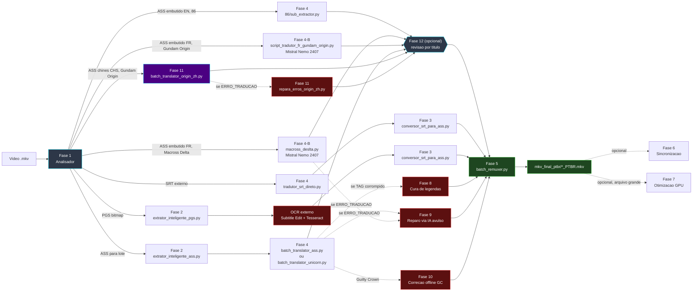

---

## Esteira A — Episódio MKV com ASS embutido (inglês)

Fluxo padrão para episódios de série com legenda `S_TEXT/ASS` em inglês embutida no `.mkv`. Implementação atual: **Eighty-Six (86)**, via `4_tradutor_ia_gemma4/86/sub_extractor.py`.

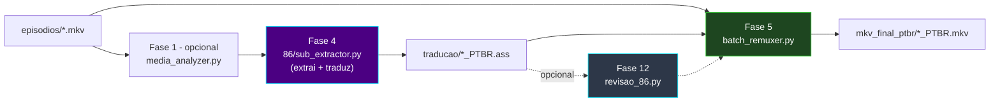

```powershell
python ".\1_analisador_de_midia\media_analyzer.py"      # opcional
python ".\4_tradutor_ia_gemma4\86\sub_extractor.py"
python ".\5_juntar_legendas_filmes\batch_remuxer.py"
python ".\12_revisao_legenda\revisao_86.py"             # opcional, corrige alucinações residuais + remux
```

---

## Esteira B — Filme com SRT externo (inglês)

Para filmes/releases cuja legenda em inglês vem **separada** em um `.srt`. Detalhes: [Pipeline SRT](pipeline-srt.md).

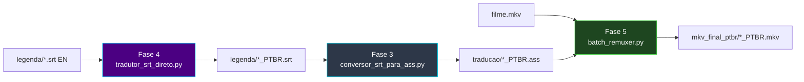

```powershell
python ".\4_tradutor_ia_gemma4\5_tradutor_de_legenda\tradutor_srt_direto.py"
python ".\3-conversor_str_ass\conversor_srt_para_ass.py"
python ".\5_juntar_legendas_filmes\batch_remuxer.py"
```

---

## Esteira C — Legenda PGS (Blu-ray bitmap)

Para releases cuja única legenda embutida é **PGS** (`S_HDMV/PGS`, imagem). Requer **OCR externo** (não incluso no repositório).

```mermaid
flowchart LR
    MKV["filme.mkv (PGS)"] --> F2["Fase 2\nextrator_inteligente_pgs.py"]
    F2 --> SUP["extraidos_sup/*.sup"]
    SUP --> OCR["OCR externo\nSubtitle Edit + Tesseract"]
    OCR --> SRT["*_PTBR.srt"]
    SRT --> F3["Fase 3\nconversor_srt_para_ass.py"]
    F3 --> ASS["traducao/*_PTBR.ass"]

    MKV --> F5["Fase 5\nbatch_remuxer.py"]
    ASS --> F5
    F5 --> OUT["mkv_final_ptbr/*_PTBR.mkv"]

    style F2 fill:#2d3748,stroke:#00E5FF,color:#fff
    style OCR fill:#5c1010,stroke:#ff4444,color:#fff
    style F3 fill:#2d3748,stroke:#00E5FF,color:#fff
    style F5 fill:#1e4620,stroke:#32CD32,color:#fff
```

```powershell
python ".\2_extrator_legenda\extrator_inteligente_pgs.py"
# OCR externo (Subtitle Edit + Tesseract) -> *_PTBR.srt
python ".\3-conversor_str_ass\conversor_srt_para_ass.py"
python ".\5_juntar_legendas_filmes\batch_remuxer.py"
```

> O OCR `.sup → .srt` **não faz parte** deste repositório. A legenda traduzida deve ser gerada externamente antes da Fase 3.

---

## Esteira D — Macross Delta, tradução francês → PT-BR (multi-thread)

Mesmo formato da Esteira A, mas para legendas **ASS embutidas em francês**, com glossário e cache dedicados. Implementação atual: **[Fase 4-B](modulo-fase-4b.md)** — `4_b_mistrall_nemo_instruct_2407_GGUF_tradutor/frances_para_ptbr/macross_deslta.py` (migrado do Gemma 4B para o **Mistral Nemo Instruct 2407 GGUF** em 2026-06-17).

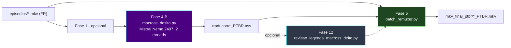

```powershell
# Pré-requisito: LM Studio na porta 1234 com Mistral Nemo Instruct 2407 (GGUF) carregado
python ".\4_b_mistrall_nemo_instruct_2407_GGUF_tradutor\frances_para_ptbr\macross_deslta.py"
python ".\5_juntar_legendas_filmes\batch_remuxer.py"
```

> Filme avulso da mesma série (Macross Delta — Filme 2): mesma esteira, revisão final com `12_revisao_legenda\micross_delta_filme2.py`.

---

## Esteira E — Lote ASS pré-extraído (Gundam Reconguista)

Para quando a legenda já foi extraída (Fase 2) e a tradução é feita em **lote agrupado** (menos chamadas HTTP).

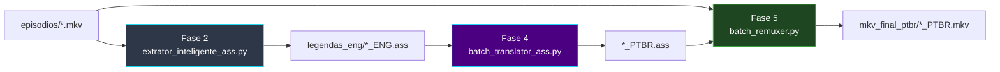

```powershell
python ".\2_extrator_legenda\extrator_inteligente_ass.py"
python ".\4_tradutor_ia_gemma4\tradutor_ass\batch_translator_ass.py"
python ".\5_juntar_legendas_filmes\batch_remuxer.py"
```

---

## Esteira F — Gundam Unicorn (especializada)

Igual à Esteira E, com glossário Universal Century e etapa de **cura de legendas** para corrigir corrupção de tags conhecida.

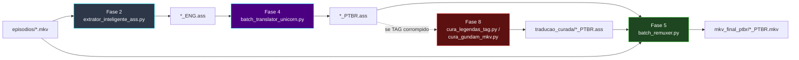

```powershell
python ".\2_extrator_legenda\extrator_inteligente_ass.py"
python ".\4_tradutor_ia_gemma4\tradutor_gundam_unicornio\batch_translator_unicorn.py"
python ".\8_cura_legendas\cura_legendas_tag.py"          # se necessario
python ".\5_juntar_legendas_filmes\batch_remuxer.py"
python ".\12_revisao_legenda\revisao_legenda_gundam_unicornio.py"   # opcional, corrige ep.1 + letras OP/ED + remux
```

---

## Esteira G — Guilty Crown (correção de nomes e cores de músicas)

<p>
  
  
</p>

Igual à Esteira E, mas a saída da Fase 4 fica com marcadores `[ERRO_TRADUCAO: ...]` (nomes próprios) e cores de OP/ED ilegíveis. A **[Fase 10](modulo-fase-10.md)** corrige os dois problemas **sem precisar do LM Studio**.

```mermaid
flowchart LR
    MKV["episodios/*.mkv\n(Guilty Crown)"] --> F2["Fase 2\nextrator_inteligente_ass.py"]
    F2 --> ENG["legendas_eng/*_ENG.ass"]
    ENG --> F4["Fase 4\nbatch_translator_ass.py\n(ou variante)"]
    F4 --> PTERR["legendas_eng/*_ENG.ass\ncom marcador ERRO_TRADUCAO"]
    PTERR --> F10A["Fase 10a\ncorrigir_guilty_crown.py"]
    F10A --> PT["legendas_ptbr/*_PTBR.ass"]
    PT --> F10B["Fase 10b\ncorrigir_cores_musicas.py"]
    F10B --> PTOK["legendas_ptbr/*_PTBR.ass\ncores OP/ED corrigidas"]
    MKV --> F5["Fase 5\nbatch_remuxer.py"]
    PTOK --> F5
    F5 --> OUT["mkv_final_ptbr/*_PTBR.mkv"]

    style F2 fill:#2d3748,stroke:#00E5FF,color:#fff
    style F4 fill:#4B0082,stroke:#00E5FF,color:#fff
    style F10A fill:#5c1010,stroke:#ff4444,color:#fff
    style F10B fill:#5c1010,stroke:#ff4444,color:#fff
    style F5 fill:#1e4620,stroke:#32CD32,color:#fff
    style OUT fill:#1e4620,stroke:#32CD32,color:#fff
```

```powershell
python ".\2_extrator_legenda\extrator_inteligente_ass.py"
python ".\4_tradutor_ia_gemma4\tradutor_ass\batch_translator_ass.py"   # ou variante adequada
python ".\10_correcao_guilty_crown\corrigir_guilty_crown.py"           # remove [ERRO_TRADUCAO:]
python ".\10_correcao_guilty_crown\corrigir_cores_musicas.py"          # cores/tags OP-ED
python ".\5_juntar_legendas_filmes\batch_remuxer.py"
python ".\12_revisao_legenda\revisao_guild_crown.py"                   # opcional, diálogos + letras OP/ED + remux
```

> Se preferir retraduzir as falhas via IA em vez de manter o texto em inglês, use a **[Fase 9](modulo-fase-9.md)** (`repara_erros_traducao.py`, requer LM Studio) antes da Fase 10.

---

## Esteira H — Gundam Origin, legenda chinesa (CHS, Qwen2.5)

<p>
  
  
</p>

Fansub **POPGO** com legenda chinesa simplificada embutida (`.chs.ass`). Usa o modelo **Qwen2.5-7B-Instruct** em vez do Gemma 4B — melhor desempenho para o par CHS→PT-BR. Ver **[Fase 11](modulo-fase-11.md)**.

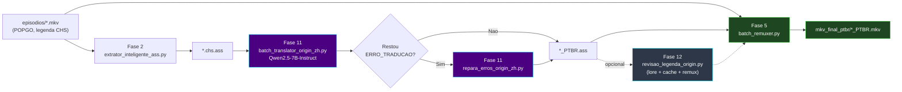

```powershell
python ".\2_extrator_legenda\extrator_inteligente_ass.py"
# Pré-requisito: LM Studio na porta 1234 com Qwen2.5-7B-Instruct carregado
python ".\11_chines_LLM_alibaba_qwen2\batch_translator_origin_zh.py" --entrada "<pasta_chs_ass>" --saida "<pasta_saida>"
python ".\11_chines_LLM_alibaba_qwen2\repara_erros_origin_zh.py" --originais "<pasta_chs_ass>" --traduzidas "<pasta_ptbr>"   # se necessario
python ".\12_revisao_legenda\revisao_legenda_origin.py"     # opcional, corrige lore + cache + remux
python ".\5_juntar_legendas_filmes\batch_remuxer.py"
```

---

## Esteira I — Gundam Origin, legenda francesa (SUBFRENCH)

Rota alternativa para o mesmo título, quando o release disponível é o `SUBFRENCH` (legenda francesa embutida) em vez do POPGO chinês. Ver **[Fase 4-B](modulo-fase-4b.md)**.

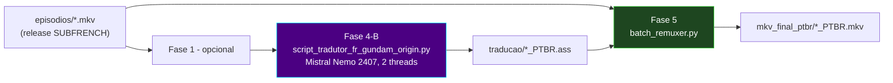

```powershell
# Pré-requisito: LM Studio na porta 1234 com Mistral Nemo Instruct 2407 (GGUF) carregado
python ".\4_b_mistrall_nemo_instruct_2407_GGUF_tradutor\frances_para_ptbr\script_tradutor_fr_gundam_origin.py"
python ".\5_juntar_legendas_filmes\batch_remuxer.py"
```

> Esteiras H e I traduzem o **mesmo título** a partir de releases/idiomas de origem diferentes — use a que tiver a legenda de melhor qualidade disponível para o release que você possui.

---

## Camadas de dependência (todas as fases)

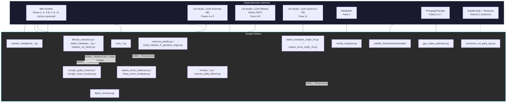

---

## Binários externos (Windows)

| Executável | Fases | Caminho padrão |
|:---|:---|:---|
| `mkvmerge.exe` | 2, 4, 4-B, 5, 8, 12 (remux opcional) | `C:\Program Files\MKVToolNix\` |
| `mkvextract.exe` | 2, 4, 4-B, 8 | `C:\Program Files\MKVToolNix\` |
| `ffmpeg.exe` / `ffprobe.exe` | 6, 7 | PATH do sistema |

[Fase 3](modulo-fase-3.md) **não** usa MKVToolNix nem FFmpeg — conversão pura Python. As **[Fase 9](modulo-fase-9.md)**, **[Fase 10](modulo-fase-10.md)** e **[Fase 11](modulo-fase-11.md)** também não dependem de nenhum binário externo (apenas leitura/escrita de `.ass`/HTTP para o LM Studio). A **[Fase 12](modulo-fase-12.md)** usa MKVToolNix **somente** se o usuário optar por remultiplexar (prompt `s/n`).

---

## Servidor de IA

| Componente | Fase | Observação |
|:---|:---|:---|
| **[LM Studio](https://lmstudio.ai/)** porta **1234** | 4, 4-B, 9, 11 | Servidor OpenAI-compatível local |
| **Gemma 4B** (`google/gemma-4-e4b`) | 4, 9 | Modelo carregado no LM Studio para tradução EN e reparo |
| **Mistral Nemo Instruct 2407** (GGUF) | 4-B | Modelo carregado no LM Studio para tradução FR (Macross Delta, Gundam Origin) — substituiu o Gemma 4B em 2026-06-17 por qualidade muito superior nesse par de idiomas |
| **Qwen2.5-7B-Instruct** (Alibaba) | 11 | Modelo carregado no LM Studio para tradução CHS (Gundam Origin) |

As **Fases 3, 6, 7, 8, 10 e 12** **não** usam IA. As Fases **4** e **9** dependem do LM Studio com **Gemma 4B** carregado; a Fase **4-B** depende do **Mistral Nemo Instruct 2407**; a Fase **11** depende do **Qwen2.5-7B-Instruct** — troque o modelo na interface do LM Studio antes de alternar entre essas fases (não é possível ter os três carregados simultaneamente na configuração padrão de VRAM do projeto). Todos os scripts dessas fases **detectam o modelo ativo dinamicamente** via `GET /v1/models` — não há um nome de modelo fixo no código (exceto um rótulo de log desatualizado em `script_tradutor_fr_gundam_origin.py`, ver [Solução de problemas](solucao-de-problemas.md#fase-4-b--mistral-nemo-francês)).

Instalação: [instalacao.md](instalacao.md)

---

[← Índice da documentação](README.md)
