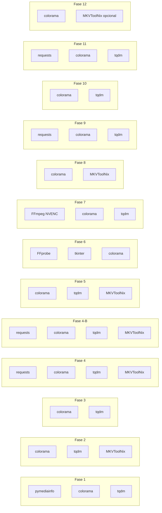

# 🐍 Dependências Python (`requirements.txt`)

[← Índice](README.md) · [Arquivo `requirements.txt`](../requirements.txt)

<p>
  
  
</p>

Versões fixadas para reprodutibilidade no Windows.

---

## Pacotes usados diretamente

| Pacote | Versão | Usado em | Fase | Função |
|:---|:---:|:---|:---:|:---|
| **`colorama`** | 0.4.6 | Praticamente todos os scripts | 1–12 | Cores ANSI no terminal |
| **`tqdm`** | 4.67.3 | Praticamente todos os scripts | 1–5, 7, 9, 10, 11 | Barras de progresso |
| **`requests`** | 2.34.2 | Scripts de tradução (`4_tradutor_ia_gemma4/`, `4_b_mistrall_nemo_instruct_2407_GGUF_tradutor/`) + reparos via IA | 4, 4-B, 9, 11 | HTTP para LM Studio |
| **`pymediainfo`** | 7.0.1 | `media_analyzer.py` | 1 | Metadados via DLL MediaInfo |

> **MediaInfo (SO):** necessário além do pacote pip. [Download MediaInfo](https://mediaarea.net/en/MediaInfo/Download).
> **Fases 6 e 7** dependem de **FFmpeg/FFprobe** (binário externo, não é pacote pip) e de `tkinter` (incluso no Python padrão do Windows).

---

## Pacotes transitivos

| Pacote | Versão | Puxado por | Função |
|:---|:---:|:---|:---|
| `urllib3` | 2.7.0 | `requests` | Pool HTTP |
| `certifi` | 2026.4.22 | `requests` | Certificados SSL |
| `charset-normalizer` | 3.4.7 | `requests` | Encoding HTTP |
| `idna` | 3.15 | `requests` | Domínios IDN |
| `httpx` | 0.28.1 | `ollama` | Cliente async |
| `httpcore` | 1.0.9 | `httpx` | Camada baixa |
| `h11` | 0.16.0 | `httpcore` | HTTP/1.1 |
| `anyio` | 4.13.0 | `httpx` | I/O async |
| `pydantic` | 2.13.4 | `ollama` | Validação |
| `pydantic_core` | 2.46.4 | `pydantic` | Núcleo |
| `annotated-types` | 0.7.0 | `pydantic` | Tipos |
| `typing_extensions` | 4.15.0 | `pydantic` | Backport |
| `typing-inspection` | 0.4.2 | `pydantic` | Inspeção runtime |

---

## `ollama` — sem uso no pipeline atual

| Pacote | Versão | Observação |
|:---|:---:|:---|
| **`ollama`** | 0.6.2 | Listado no `requirements.txt`, mas **nenhum script importa `ollama`**. A Fase 4 usa **LM Studio + `requests`**. |

---

## Mapa por fase



---

## Comandos úteis

```powershell
pip list
pip show requests
pip install -r requirements.txt --force-reinstall
```

---

[← Instalação](instalacao.md) · [Índice](README.md)
