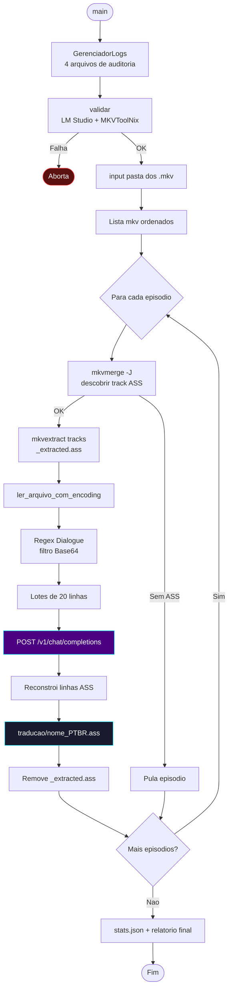
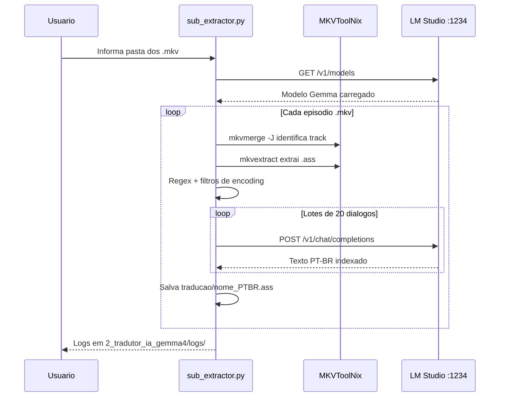

# 📐 Módulo — Fase 1 (Tradutor)

[← Índice](README.md) · [`2_tradutor_ia_gemma4/sub_extractor.py`](../2_tradutor_ia_gemma4/sub_extractor.py)

---

## Recursos

| Recurso | Detalhe |
|:---|:---|
| **Autodetecção de track** | `mkvmerge -J` → faixa `subtitles` com `S_TEXT/ASS` |
| **Encoding resiliente** | `utf-8` → `utf-8-sig` → `cp1252` → `latin-1` → `iso-8859-1` → bypass |
| **Regex industrial** | `^(Dialogue:\s*[^,]*(?:,[^,]*){8},)(.*)$` |
| **Filtro de bloat** | Linhas &gt; 2000 caracteres (fontes Base64) |
| **Tradução em lote** | 20 diálogos por requisição HTTP |
| **Cache em memória** | Evita retraduzir lotes idênticos |
| **Saída** | `{pasta}/traducao/{nome}_PTBR.ass` |

---

## Diagrama de fluxo

---

## Sequência (API local)

---

## Entradas e saídas

| Entrada | Saída | Dependências |
|:---|:---|:---|
| Pasta com `.mkv` | `traducao/*_PTBR.ass` | MKVToolNix, LM Studio, `requests`, `colorama`, `tqdm` |

Logs: [Logs e auditoria](logs-e-auditoria.md)

---

[← Fase 0](modulo-fase-0.md) · [Próximo: Fase 2 →](modulo-fase-2.md)
