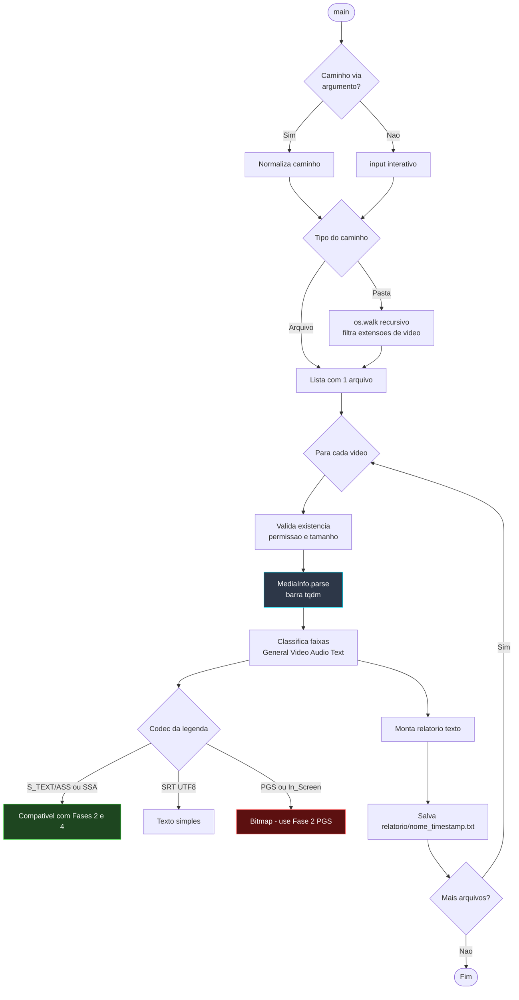

# 📐 Módulo — Fase 1 (Analisador de Mídia)

[← Índice](README.md) · [`1_analisador_de_midia/media_analyzer.py`](../1_analisador_de_midia/media_analyzer.py)

**Opcional**, mas recomendado antes de qualquer tradução.

---

## Função

Varredura recursiva de `.mkv`, `.mp4`, `.avi`, etc. Gera relatório por arquivo em `relatorio/` com:

- Container, duração, bitrate geral
- Fluxos de vídeo (codec, resolução, FPS)
- Fluxos de áudio (idioma, canais)
- **Legendas:** distingue `ASS/SSA`, `SRT` e **`PGS` (bitmap — não extraível diretamente)**
- **Auditoria de Sincronia de Legenda:** Compara a duração real das legendas embutidas com o vídeo, calculando a taxa de desvio (Drift Ratio em segundos por hora) e emitindo vereditos claros de compatibilidade de sincronia (Sincronizada, Atraso Constante - Simple Offset, ou Mismatch de FPS - Time Stretch).

> Confirme legenda **texto** (`S_TEXT/ASS` ou `S_TEXT/UTF8`) antes de iniciar a **Fase 2** ou **Fase 4**. Se o veredito indicar `PGS`, siga para a [Esteira C — PGS](arquitetura.md#esteira-c--legenda-pgs-bluray-bitmap).

---

## Diagrama de fluxo

---

## Entradas e saídas

| Entrada | Saída | Dependências |
|:---|:---|:---|
| Pasta ou arquivo de vídeo | `relatorio/*.txt` | `pymediainfo`, `colorama`, `tqdm`, MediaInfo |

Comando: [Guia de execução — Fase 1](guia-de-execucao.md#fase-1--analisador-de-mídia-opcional)

---

[Próximo: Fase 2 — Extração de Legendas →](modulo-fase-2.md)
