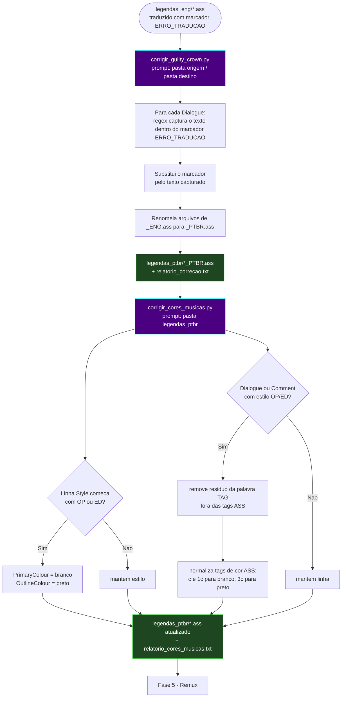

# 🎵 Módulo — Fase 10 (Correção Guilty Crown)

[← Índice](README.md) · [`10_correcao_guilty_crown/`](../10_correcao_guilty_crown/)

<p>
  
  
  
  
  
</p>

**Fases:** [1](modulo-fase-1.md) · [2](modulo-fase-2.md) · [3](modulo-fase-3.md) · [4](modulo-fase-4.md) · [5](modulo-fase-5.md) · [6](modulo-fase-6.md) · [7](modulo-fase-7.md) · [8](modulo-fase-8.md) · [9](modulo-fase-9.md) · **10**

**Especialização por série.** Pós-processamento **100% offline** (sem LM Studio) das legendas traduzidas de *Guilty Crown* (Esteira G): remove marcadores `[ERRO_TRADUCAO: ...]` residuais e ajusta cores/tags das músicas (OP/ED).

---

## Scripts

| Script | Atua sobre | Estratégia |
|:---|:---|:---|
| [`corrigir_guilty_crown.py`](../10_correcao_guilty_crown/corrigir_guilty_crown.py) | `.ass` traduzidos com `[ERRO_TRADUCAO: texto]` | Substitui o marcador pelo `texto` capturado via regex, instantâneo, sem IA |
| [`corrigir_cores_musicas.py`](../10_correcao_guilty_crown/corrigir_cores_musicas.py) | `.ass` corrigidos, linhas de estilo `OP*`/`ED*` | Normaliza cores (`\c`, `\1c`, `\3c`) para branco/preto e remove resíduos da palavra `TAG` |

---

## Diagrama de fluxo



---

## `corrigir_guilty_crown.py`

| Item | Detalhe |
|:---|:---|
| Entrada | Pasta com `.ass` traduzidos contendo `[ERRO_TRADUCAO: texto]` (padrão: `E:\animes\GUILTY CROWN\1080p\legendas_eng`) |
| Saída | Pasta de destino (padrão: `E:\animes\GUILTY CROWN\1080p\legendas_ptbr`), criada automaticamente |
| Processo | `regex_erro = r'\[ERRO_TRADUCAO:\s*(.*?)\s*\]'` — substitui cada ocorrência pelo grupo capturado (texto original, geralmente nomes próprios) |
| Renomeio | `*_ENG.ass` → `*_PTBR.ass`; outros nomes recebem sufixo `_PTBR` |
| Relatório | `relatorio_correcao.txt` — lista arquivos processados, correções por arquivo, total geral |
| Dependências | `colorama`, `tqdm` |

```powershell
python ".\10_correcao_guilty_crown\corrigir_guilty_crown.py"
# Prompts interativos:
#   Pasta com as legendas extraídas (com erros de tradução): [ENTER = padrão E:\animes\GUILTY CROWN\1080p\legendas_eng]
#   Pasta onde deseja salvar as legendas corrigidas:          [ENTER = padrão E:\animes\GUILTY CROWN\1080p\legendas_ptbr]
```

---

## `corrigir_cores_musicas.py`

| Item | Detalhe |
|:---|:---|
| Entrada | Pasta com `.ass` já corrigidos pela etapa anterior (padrão: `E:\animes\GUILTY CROWN\1080p\legendas_ptbr`) |
| Estilos `OP*`/`ED*` | Campo `PrimaryColour` → `&H00FFFFFF` (branco) e `OutlineColour` → `&H00000000` (preto) |
| Diálogos `OP*`/`ED*` | Remove resíduos da palavra `TAG`/`tag` fora de blocos `{...}`; normaliza `\c`/`\1c` → `\c&HFFFFFF&` e `\3c` → `\3c&H000000&` |
| Saída | Sobrescreve os `.ass` na mesma pasta + `relatorio_cores_musicas.txt` |
| Relatório | Estilos redefinidos, linhas com correção de cor, resíduos de `TAG` removidos, tempo total |
| Dependências | `colorama`, `tqdm` |

```powershell
python ".\10_correcao_guilty_crown\corrigir_cores_musicas.py"
# Prompt interativo:
#   Pasta com as legendas PT-BR corrigidas: [ENTER = padrão E:\animes\GUILTY CROWN\1080p\legendas_ptbr]
```

---

## Quando usar

- Série **Guilty Crown** (ou similar) cuja tradução em lote (Fase 4) deixou marcadores `[ERRO_TRADUCAO: ...]` que correspondem a **nomes próprios/termos que devem permanecer como no inglês** — não requer LM Studio, ao contrário da [Fase 9](modulo-fase-9.md).
- Músicas (OP/ED) com cores de fonte ilegíveis ou com a palavra `TAG` aparecendo na letra — rode `corrigir_cores_musicas.py` após `corrigir_guilty_crown.py`.
- Faz parte da **Esteira G**: ver [Arquitetura — Esteira G](arquitetura.md#esteira-g--guilty-crown-correção-de-nomes-e-cores-de-músicas).

---

[← Fase 9](modulo-fase-9.md) · [Arquitetura](arquitetura.md)
