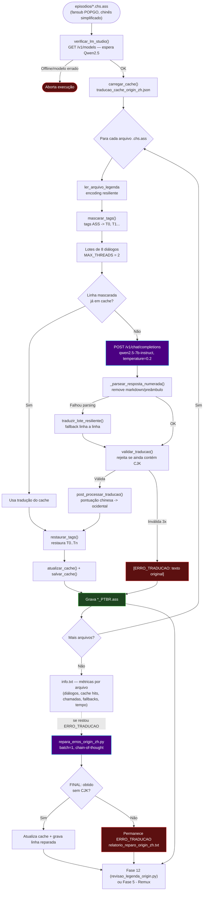

# 🐉 Módulo — Fase 11 (Tradução Chinês CHS → PT-BR, Qwen2.5)

[← Índice](README.md) · [`11_chines_LLM_alibaba_qwen2/`](../11_chines_LLM_alibaba_qwen2/)

<p>
  
  
  
  
  
</p>

**Fases:** [1](modulo-fase-1.md) · [2](modulo-fase-2.md) · [3](modulo-fase-3.md) · [4](modulo-fase-4.md) · [4-B](modulo-fase-4b.md) · [5](modulo-fase-5.md) · [6](modulo-fase-6.md) · [7](modulo-fase-7.md) · [8](modulo-fase-8.md) · [9](modulo-fase-9.md) · [10](modulo-fase-10.md) · **11** · [12](modulo-fase-12.md)

Variante de tradução em lote dedicada à legenda **chinesa simplificada (`.chs.ass`)** do fansub **POPGO** de *Mobile Suit Gundam: The Origin — Advent of the Red Comet*, usando o modelo **Qwen2.5-7B-Instruct** (Alibaba) via LM Studio — em vez do Gemma 4B usado na [Fase 4](modulo-fase-4.md). Compõe a **[Esteira H](arquitetura.md#esteira-h--gundam-origin-legenda-chinesa-chs-qwen25)**.

> Por que um modelo separado? O Qwen2.5 tem desempenho muito superior ao Gemma 4B para o par chinês→português (tokenizer e pré-treino com forte cobertura de CJK). Troque o modelo carregado no LM Studio antes de rodar esta fase — veja [Instalação](instalacao.md#lm-studio).

---

## Scripts

| Script | Função | Usa IA? |
|:---|:---|:---:|
| [`batch_translator_origin_zh.py`](../11_chines_LLM_alibaba_qwen2/batch_translator_origin_zh.py) | Tradução em lote (Batch Mode v5 — Resiliente) de `*.chs.ass` → `*_PTBR.ass` | ✅ Sim |
| [`repara_erros_origin_zh.py`](../11_chines_LLM_alibaba_qwen2/repara_erros_origin_zh.py) | Reparo avulso (lote = 1, chain-of-thought) de linhas `[ERRO_TRADUCAO: ...]` residuais | ✅ Sim |
| [`test_reparo.py`](../11_chines_LLM_alibaba_qwen2/test_reparo.py) | Utilitário de depuração manual — testa 3 linhas chinesas fixas contra o LM Studio e grava `debug_test.txt` | ✅ Sim (dev/debug, fora do pipeline) |

---

## Diagrama de fluxo



---

## `batch_translator_origin_zh.py`

| Item | Detalhe |
|:---|:---|
| Entrada | Pasta com `*.chs.ass` (`--entrada`) — legenda chinesa simplificada já extraída/fornecida pelo fansub |
| Modelo | `qwen2.5-7b-instruct` no LM Studio (`MODELO_ATIVO = "local-model"`, detectado via `/v1/models`) |
| Lote / threads | `BATCH_SIZE = 8` diálogos por chamada, `MAX_THREADS = 2` (`ThreadPoolExecutor`) |
| Cache persistente | `traducao_cache_origin_zh.json` (+ backup `.json.bak`) — chave por linha mascarada, evita retraduzir entre execuções |
| Mascaramento | Tags ASS e marcadores `[T0]`, `[T1]`... preservados; limite `MAX_TAGS_POR_LINHA = 24` |
| Glossário | Universal Century / Gundam Origin em chinês → PT-BR (Federação da Terra, Zeon, família Zabi, família Deikun, Minovsky, White Base, Cometa Vermelho, Guerra de Um Ano, etc.) |
| Pontuação | `MAPA_PONTUACAO_CHINESA` converte `，。！？：；“”''（）…` para os equivalentes ocidentais |
| Validação | `validar_traducao()` rejeita saída que ainda contenha ideogramas CJK (regex `PADRAO_CJK`) |
| Resiliência | `traduzir_lote_resiliente()` refaz **linha a linha** se o lote falhar; `_salvar_debug()` grava `debug_last_failure.txt` na primeira falha |
| Saída | `*_PTBR.ass` na pasta de saída (`--saida`) + `info.txt` (métricas por arquivo: diálogos, cache hits, chamadas, fallbacks, tempo) |
| Dependências | `requests`, `tqdm`, `colorama`, `argparse` |

```powershell
# Pré-requisito: LM Studio na porta 1234 com Qwen2.5-7B-Instruct carregado
python ".\11_chines_LLM_alibaba_qwen2\batch_translator_origin_zh.py" --entrada "<pasta_chs_ass>" --saida "<pasta_saida>"
# Parâmetros opcionais
python ".\11_chines_LLM_alibaba_qwen2\batch_translator_origin_zh.py" --threads 2 --batch-size 8 --modelo qwen2.5-7b-instruct
```

---

## `repara_erros_origin_zh.py`

| Item | Detalhe |
|:---|:---|
| Entrada | `--originais` (pasta com `*.chs.ass`) + `--traduzidas` (pasta com `*_PTBR.ass` contendo `[ERRO_TRADUCAO:]`) |
| Importa | `batch_translator_origin_zh.py` (mesma pasta) para reaproveitar `SYSTEM_PROMPT`, `PADRAO_CJK`, `post_processar_traducao()`, `validar_traducao()` |
| Estratégia | Adapta o prompt de lote para tradução de **uma linha por vez** (`adaptar_prompt_reparo()`), com raciocínio livre seguido de `FINAL: <tradução>` |
| Pós-processo | `extrair_traducao_final()` remove blocos `<think>`, prefere o último candidato `FINAL:` **sem** caracteres CJK |
| Saída | Atualiza o cache `traducao_cache_origin_zh.json` e sobrescreve a linha reparada em `*_PTBR.ass` + `relatorio_reparo_origin_zh.txt` |
| Dependências | `requests`, `tqdm`, `colorama` |

```powershell
python ".\11_chines_LLM_alibaba_qwen2\repara_erros_origin_zh.py" --originais "<pasta_chs_ass>" --traduzidas "<pasta_ptbr>" --padrao ".chs.ass"
```

---

## `test_reparo.py` (utilitário de depuração)

Script **avulso**, fora do pipeline regular: envia 3 linhas chinesas fixas (hardcoded) ao LM Studio usando o mesmo `SYSTEM_PROMPT` do tradutor, registra a resposta crua e a tradução processada em `debug_test.txt`, e valida com `validar_traducao()`. Útil para testar rapidamente se o modelo Qwen2.5 está respondendo bem a um glossário/prompt ajustado, sem precisar rodar o lote inteiro.

```powershell
python ".\11_chines_LLM_alibaba_qwen2\test_reparo.py"
# Resultado em 11_chines_LLM_alibaba_qwen2\debug_test.txt
```

---

## Quando usar

1. Release de *Gundam The Origin* cuja única legenda disponível/confiável é a faixa **chinesa simplificada** (`.chs.ass`) do fansub POPGO — alternativa à legenda francesa (`SUBFRENCH`) tratada na [Fase 4 — item 3](modulo-fase-4.md#3--frances_para_ptbrscript_tradutor_fr_gundam_originpy-gundam-the-origin-francês--pt-br).
2. Após a tradução em lote, se restarem marcadores `[ERRO_TRADUCAO:]`, rode `repara_erros_origin_zh.py` (requer LM Studio com Qwen2.5 carregado).
3. Para corrigir erros de lore específicos que sobrevivem à tradução (ex.: nomes de naves, termos políticos), siga para a **[Fase 12](modulo-fase-12.md)** (`revisao_legenda_origin.py`), que também corrige o cache `traducao_cache_origin_zh.json` para futuras execuções.
4. Depois de revisado, siga para a **[Fase 5](modulo-fase-5.md)** (remux).

---

[← Fase 10](modulo-fase-10.md) · [Fase 12 →](modulo-fase-12.md) · [Arquitetura](arquitetura.md) · [Esteira H](arquitetura.md#esteira-h--gundam-origin-legenda-chinesa-chs-qwen25)
