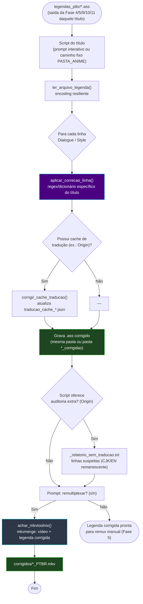

# 🔬 Módulo — Fase 12 (Revisão e Correção Final por Título)

[← Índice](README.md) · [`12_revisao_legenda/`](../12_revisao_legenda/)

<p>
  
  
  
  
</p>

**Fases:** [1](modulo-fase-1.md) · [2](modulo-fase-2.md) · [3](modulo-fase-3.md) · [4](modulo-fase-4.md) · [4-B](modulo-fase-4b.md) · [5](modulo-fase-5.md) · [6](modulo-fase-6.md) · [7](modulo-fase-7.md) · [8](modulo-fase-8.md) · [9](modulo-fase-9.md) · [10](modulo-fase-10.md) · [11](modulo-fase-11.md) · **12**

**QA final, 100% offline, um script por título.** Depois que uma série/filme passou pela esteira de tradução correspondente, os erros que **sobrevivem** (lore incorreto, resíduos do idioma de origem, alucinações da IA, tags corrompidas) são corrigidos por um script dedicado **por título**, que opera direto sobre a legenda `.ass` final e, opcionalmente, **remultiplexa** o `.mkv` corrigido para uma pasta `corrigidos/`.

> Diferença em relação às Fases 8 e 10: aquelas corrigem um defeito **genérico** (tag `TAG` corrompida, marcador `[ERRO_TRADUCAO:]`) reaproveitável entre séries. A Fase 12 é o **catálogo de patches específicos** — cada script conhece o vocabulário e os erros exatos de um título.

---

## Catálogo de scripts

| Script | Título / série | Corrige | Remux |
|:---|:---|:---|:---:|
| [`revisao_legenda_origin.py`](../12_revisao_legenda/revisao_legenda_origin.py) | Gundam The Origin (Esteira H, legenda ZH) | Erros de lore (ex.: "Guerra de cem anos" → "Guerra de Um Ano", gato "Lucifer" ↔ "Gólgota", nave "Grande Degwin"); corrige também o **cache** `traducao_cache_origin_zh.json` | Opcional |
| [`revisao_guild_crown.py`](../12_revisao_legenda/revisao_guild_crown.py) | Guilty Crown (Esteira G) | Diálogos (ex.: "Funerária" → "Sepolcro"), remove notas de tradutor `{...}`, padroniza letras de OP/ED dos 22 episódios | Opcional |
| [`revisao_legenda_gundam_unicornio.py`](../12_revisao_legenda/revisao_legenda_gundam_unicornio.py) | Gundam Unicorn RE:0096 (Esteira F) | Diálogos do episódio 1 + letras de "Into the Sky" e "RE:I AM" (OP/ED) dos 22 episódios | Opcional |
| [`revisao_legenda_macross_delta.py`](../12_revisao_legenda/revisao_legenda_macross_delta.py) | Macross Delta (TV, Esteira D) | Erros de lore, falhas de tradução em inglês remanescentes, tags ASS corrompidas | Não (salva em pasta separada) |
| [`micross_delta_filme2.py`](../12_revisao_legenda/micross_delta_filme2.py) | Macross Delta — Filme 2 | Erros de lore, resíduos de francês não traduzidos, formatação | Opcional |
| [`revisao_86.py`](../12_revisao_legenda/revisao_86.py) | Eighty-Six — Parts 1 & 2 (Esteira A) | Alucinações residuais (ex.: `[T0]` não restaurado), padronização de termos | Sim (sempre) |

Todos compartilham a mesma arquitetura: `achar_mkvtoolnix()` (autodetecção de `mkvextract.exe`/`mkvmerge.exe`), leitura do `.ass` com fallback de encoding, uma função `aplicar_correcao*_linha()` com a lista de patches **regex/dicionário hardcoded** daquele título, e — quando aplicável — `remuxar_videos()`/`remuxar_mkv()` que chama `mkvmerge` para gerar o `.mkv` final em uma pasta `corrigidos/`.

---

## Diagrama de fluxo (genérico, comum aos 6 scripts)



---

## `revisao_legenda_origin.py` (Gundam The Origin)

| Item | Detalhe |
|:---|:---|
| Entrada | Pasta `legendas_ptbr/*.ass` (prompt interativo, sem padrão fixo) + cache `traducao_cache_origin_zh.json` (Fase 11) |
| Correções | Dicionário/regex de lore: "Guerra de cem anos/100 anos" → "Guerra de Um Ano"; gato "Lucifer"/"Lucifero" mal grafado → "Lucifer"; "Leve a família Ral para Gólgota" → "Eliminem a família Ral"; nave "大德金号" traduzida errado como "Gólgota" → "Grande Degwin" |
| Cache | `corrigir_cache_traducao()` aplica as mesmas correções às entradas já cacheadas, evitando que o erro reapareça em retraduções futuras |
| Auditoria opcional | `detectar_linhas_sem_traducao()` localiza resíduos em chinês/inglês/erro e grava `_relatorio_sem_traducao.txt` na pasta de legendas |
| Remux opcional | `remuxar_legendas_mkv()` — prompt para pasta de MKVs originais e pasta de saída (padrão `corrigidos/`) |
| Dependências | `colorama` |

```powershell
python ".\12_revisao_legenda\revisao_legenda_origin.py"
# Prompts interativos: pasta de legendas, caminho do cache JSON, pasta dos MKVs (opcional), auditoria (s/n)
```

---

## `revisao_guild_crown.py` (Guilty Crown)

| Item | Detalhe |
|:---|:---|
| Caminhos padrão | `E:\animes\GUILTY CROWN\1080p\legendas_ptbr` → saída `corrigidos\` |
| Correções | Diálogos (ex.: "Funerária" → "Sepolcro"), remoção de notas de tradutor entre `{...}`, padronização das letras de abertura/encerramento dos 22 episódios via `corrigir_musica()` |
| Remux opcional | Prompt `s/n` → `mkvmerge` gera `corrigidos\{episodio}_PTBR.mkv` |
| Dependências | `colorama` |

```powershell
python ".\12_revisao_legenda\revisao_guild_crown.py"
```

---

## `revisao_legenda_gundam_unicornio.py` (Gundam Unicorn RE:0096)

| Item | Detalhe |
|:---|:---|
| Caminhos padrão | `E:\animes\GUNDAM\GUNDAM UC\UC 0096 - UNICORN\Mobile Suit Gundam Unicorn Re0096\legendas_ptbr` → saída `corrigidos\` |
| Correções | Diálogos do episódio 1 (`corrigir_abertura`) + letras de "Into the Sky" (`corrigir_encerramento_next2u`), "RE:I AM" (`corrigir_encerramento_re_i_am`) e encerramento em inglês (`corrigir_encerramento_ed_en`) nos 22 episódios |
| Remux opcional | Prompt `s/n` → `mkvmerge` |
| Dependências | `colorama` |

```powershell
python ".\12_revisao_legenda\revisao_legenda_gundam_unicornio.py"
```

---

## `revisao_legenda_macross_delta.py` (Macross Delta — TV)

| Item | Detalhe |
|:---|:---|
| Caminhos padrão | Entrada `E:\animes\MACROSS\Macross-Delta-br\legendas_eng` → saída `legendas_ptbr_corrigidas\` |
| Correções | Erros de lore, traduções em inglês que ficaram sem versão PT-BR, tags ASS corrompidas (`aplicar_correcao_linha`, por episódio via `extrair_numero_episodio`) |
| Saída | Pasta separada (não sobrescreve a legenda original); inclui remux opcional para `corrigidos\` |
| Dependências | `colorama` |

```powershell
python ".\12_revisao_legenda\revisao_legenda_macross_delta.py"
```

---

## `micross_delta_filme2.py` (Macross Delta — Filme 2)

| Item | Detalhe |
|:---|:---|
| Caminhos padrão | `D:\PROJETOS-OPEN\animes\Macross-Delta-Filme-2\legendas_ptbr` → saída `corrigidos\` |
| Correções | Erros de lore, resíduos de **francês** não traduzidos (release de origem `VOSTFR`), formatação geral |
| Remux opcional | Prompt `s/n`, gera um único `.mkv` corrigido |
| Dependências | `colorama` |

```powershell
python ".\12_revisao_legenda\micross_delta_filme2.py"
```

---

## `revisao_86.py` (Eighty-Six — Parts 1 & 2)

| Item | Detalhe |
|:---|:---|
| Caminhos padrão | Dicionário com 2 entradas fixas: `C:\animes\86\86 Part1\anime\corrigidos` e `C:\animes\86\86 Part 2\anime\corrigidos` |
| Correções | Alucinações residuais da IA (ex.: placeholder `[T0]` que não foi restaurado), padronização de termos da série |
| Remux | **Sempre** executado ao final (`mkvmerge`), gera `*_PTBR.mkv` limpo |
| Dependências | `colorama` |

```powershell
python ".\12_revisao_legenda\revisao_86.py"
```

---

## Quando usar

1. Depois que a esteira de tradução do título (A, D, F, G ou H) já passou pela Fase 4/5 (ou 9/10/11) e o resultado foi **assistido/revisado manualmente**, encontrando erros de lore ou resíduos pontuais.
2. Cada script só serve para o título a que foi escrito — para uma nova série, copie o script mais próximo (mesmo idioma/Esteira) e adapte a lista de correções e os caminhos padrão.
3. Se o script oferece remux, prefira deixá-lo remultiplexar diretamente (evita rodar a [Fase 5](modulo-fase-5.md) manualmente depois).
4. Ajuste sempre os caminhos `PASTA_ANIME`/`PASTA_LEGENDA` no topo do script antes de rodar — são fixos por padrão e apontam para a árvore de mídia local do autor (`E:\animes\...`, `D:\PROJETOS-OPEN\...`, `C:\animes\...`).

---

[← Fase 11](modulo-fase-11.md) · [Arquitetura](arquitetura.md)
