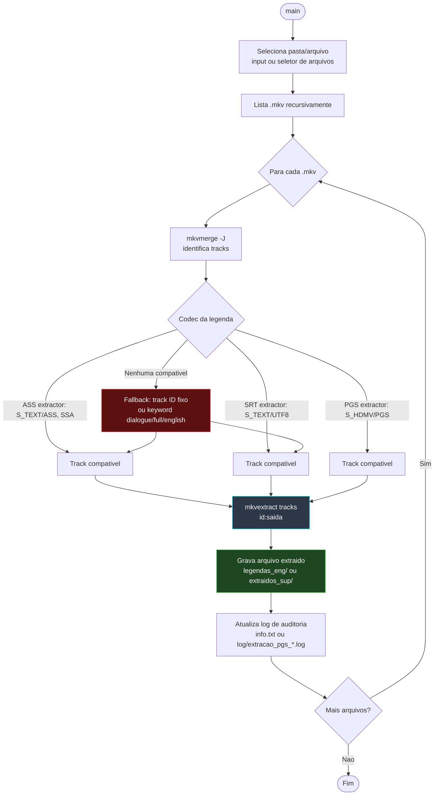

# 📐 Módulo — Fase 2 (Extração de Legendas)

[← Índice](README.md) · [`2_extrator_legenda/`](../2_extrator_legenda/)

**Fases:** [1](modulo-fase-1.md) · **2** · [3](modulo-fase-3.md) · [4](modulo-fase-4.md) · [4-B](modulo-fase-4b.md) · [5](modulo-fase-5.md) · [6](modulo-fase-6.md) · [7](modulo-fase-7.md) · [8](modulo-fase-8.md) · [9](modulo-fase-9.md) · [10](modulo-fase-10.md) · [11](modulo-fase-11.md) · [12](modulo-fase-12.md)

Extrai a faixa de legenda original de um `.mkv` **sem traduzir** — útil para revisar a legenda antes de enviar para a IA (Fase 4), para a esteira de legendas **PGS/Blu-ray** ou para alimentar tradutores em lote (`tradutor_ass`, `tradutor_gundam_unicornio`).

> Se a legenda for **ASS/SRT** e você quiser ir direto para a tradução, a **[Fase 4](modulo-fase-4.md)** (`86/sub_extractor.py`) ou a **[Fase 4-B](modulo-fase-4b.md)** (`macross_deslta.py`, `script_tradutor_fr_gundam_origin.py`) já fazem extração + tradução em um único passo — esta fase é opcional para esses casos.

---

## Scripts

| Script | Faixa extraída | Saída | Uso típico |
|:---|:---|:---|:---|
| [`extrator_inteligente_ass.py`](../2_extrator_legenda/extrator_inteligente_ass.py) | `S_TEXT/ASS` (texto) | `legendas_eng/{nome}_ENG.ass` | Pré-extração para tradutores em lote (Fase 4) |
| [`extrator_inteligente_srt.py`](../2_extrator_legenda/extrator_inteligente_srt.py) | `S_TEXT/UTF8` (SRT) | `legendas_eng/{nome}_ENG.srt` | Extrai legenda SRT embutida no MKV |
| [`extrator_inteligente_pgs.py`](../2_extrator_legenda/extrator_inteligente_pgs.py) | `S_HDMV/PGS` (bitmap) | `extraidos_sup/{nome}_Track{id}_{lang}.sup` | Extrai legenda gráfica para OCR externo (Esteira PGS) |

Todos os três usam **MKVToolNix** (`mkvmerge -J` para identificar a track + `mkvextract tracks` para extrair) e gravam um log de auditoria por execução.

---

## Diagrama de fluxo (comum aos três extratores)



---

## `extrator_inteligente_ass.py`

| Item | Detalhe |
|:---|:---|
| Entrada | Pasta com `.mkv` (prompt interativo) |
| Detecção | `mkvmerge -J` → track `S_TEXT/ASS`/`SSA`; fallback para IDs fixos `4`/`5` (séries Gundam Unicorn) ou palavras-chave `dialogue`, `full`, `english` |
| Saída | `legendas_eng/{nome}_ENG.ass` |
| Log | `info.txt` (episódio, Track ID, nome da track, formato detectado, arquivo gerado) |
| Dependências | MKVToolNix, `colorama`, `tqdm` |

---

## `extrator_inteligente_srt.py`

| Item | Detalhe |
|:---|:---|
| Entrada | Pasta com `.mkv` (prompt interativo) |
| Detecção | `mkvmerge -J` → track `S_TEXT/UTF8`; fallback ID `2` |
| Saída | `legendas_eng/{nome}_ENG.srt` |
| Log | `info.txt` (mesmo formato do extrator ASS) |
| Dependências | MKVToolNix, `colorama`, `tqdm` |

---

## `extrator_inteligente_pgs.py`

| Item | Detalhe |
|:---|:---|
| Entrada | Caminho manual, seletor de arquivo ou seletor de pasta (3 opções no menu); aceita arrastar-e-soltar como argumento |
| Detecção | `mkvmerge -J` → track `S_HDMV/PGS` |
| Saída | `extraidos_sup/{nome}_Track{id}_{idioma}.sup` |
| Log | `log/extracao_pgs_AAAAMMDD_HHMMSS.log` (timestamp, nível, mensagem) |
| Dependências | MKVToolNix, `colorama`, `tqdm`, `winreg` (Windows) |

> O `.sup` gerado é um **bitmap** — não há texto extraível diretamente. Use uma ferramenta de OCR externa (ex.: **Subtitle Edit** com **Tesseract**) para gerar um `.srt`, depois siga para a **[Fase 3 — Conversor SRT → ASS](modulo-fase-3.md)**. Veja [Esteira C](arquitetura.md#esteira-c--legenda-pgs-bluray-bitmap).

---

## Comandos

```powershell
python ".\2_extrator_legenda\extrator_inteligente_ass.py"
python ".\2_extrator_legenda\extrator_inteligente_srt.py"
python ".\2_extrator_legenda\extrator_inteligente_pgs.py"
```

---

## Utilitário — `extrator_texto_bruto/extrator_texto_bruto.py`

Ferramenta auxiliar (fora do fluxo principal) que percorre uma pasta de `.mkv`, lê a legenda já gerada pelo `extrator_inteligente_ass.py` e salva, na mesma pasta do vídeo, um `texto_bruto_extraido_{nome}.txt` com cada linha de diálogo **numerada**. Útil para revisar rapidamente todo o roteiro de um episódio/filme (ex.: para montar os glossários e correções de lore usados nas Fases 4, 11 e 12) sem abrir o `.ass` em um editor de legendas.

```powershell
python ".\2_extrator_legenda\extrator_texto_bruto\extrator_texto_bruto.py" -p "<pasta_videos>"
```

---

## Próximo passo

| Legenda extraída | Próxima fase |
|:---|:---|
| `legendas_eng/*_ENG.ass` | [Fase 4 — Tradução em lote (`tradutor_ass`, `tradutor_gundam_unicornio`)](modulo-fase-4.md) |
| `legendas_eng/*_ENG.srt` | Traduza com [Fase 4 — `tradutor_srt_direto.py`](modulo-fase-4.md#4--tradutor_srt_diretopy-srt-externo) e depois [Fase 3](modulo-fase-3.md) |
| `extraidos_sup/*.sup` | OCR externo → `.srt` → [Fase 4](modulo-fase-4.md) → [Fase 3](modulo-fase-3.md) |

---

[← Fase 1](modulo-fase-1.md) · [Próximo: Fase 4 →](modulo-fase-4.md)
