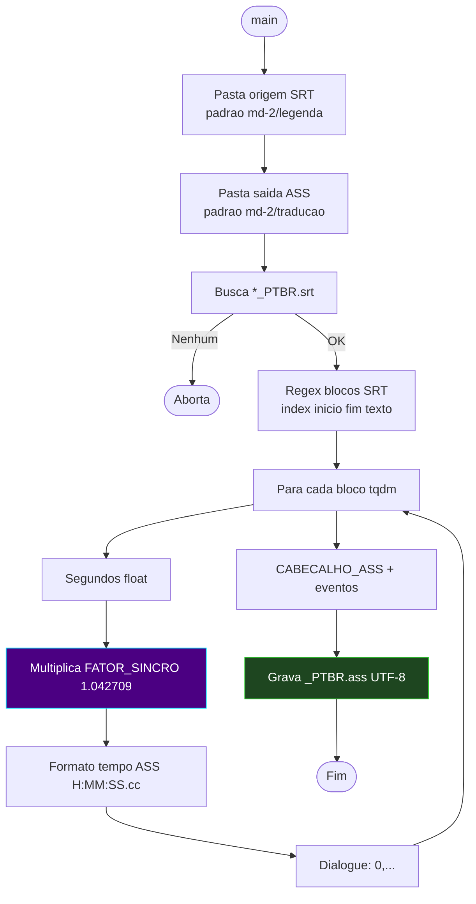

# 📐 Módulo — Fase 3 (Conversor SRT → ASS)

[← Índice](README.md) · [`3-conversor_str_ass/conversor_srt_para_ass.py`](../3-conversor_str_ass/conversor_srt_para_ass.py)

**Fases:** [1](modulo-fase-1.md) · [2](modulo-fase-2.md) · **3** · [4](modulo-fase-4.md) · [5](modulo-fase-5.md) · [6](modulo-fase-6.md) · [7](modulo-fase-7.md) · [8](modulo-fase-8.md) · [9](modulo-fase-9.md) · [10](modulo-fase-10.md) · [11](modulo-fase-11.md) · [12](modulo-fase-12.md)

Converte legendas **SRT traduzidas** (`*_PTBR.srt`) para o formato **ASS** estruturado, com **correção matemática de sincronismo** de frame rate.

> A pasta no repositório chama-se `3-conversor_str_ass` (grafia do projeto, com hífen). O script é `conversor_srt_para_ass.py`.

---

## Função

| Entrada | Processamento | Saída |
|:---|:---|:---|
| `*_PTBR.srt` na pasta de origem | Parse SRT → recálculo de timestamps → cabeçalho ASS | `{nome_filme}_PTBR.ass` na pasta de saída |

**Não usa LM Studio nem MKVToolNix** — conversão pura Python (`regex`, `tqdm`, `colorama`).

---

## Correção de FPS (sincronismo)

| Parâmetro | Valor | Motivo |
|:---|:---:|:---|
| **FATOR_SINCRO** | `1.042709` | Compensa diferença **25 fps → 23.976 fps** (Blu-ray) |
| Efeito | Multiplica início/fim de cada cue | "Freia" a legenda progressivamente para alinhar ao vídeo |

Fórmula aplicada a cada bloco:

```text
segundos_corrigido = segundos_original × 1.042709
```

> Se o desvio detectado na **Fase 1** (auditoria) for diferente, ajuste `FATOR_SINCRO` no script ou use a **[Fase 6 — Sincronização](modulo-fase-6.md)** após o remux.

---

## Recursos

| Recurso | Detalhe |
|:---|:---|
| **Filtro de entrada** | Apenas `.srt` com `_ptbr` no nome |
| **Cabeçalho ASS** | `Script Info` + `V4+ Styles` (Arial 45, 1920×1080) |
| **Tags HTML** | `<i>` → `{\i1}` / `</i>` → `{\i0}` |
| **Quebras de linha** | `\n` → `\N` (padrão ASS) |
| **Pastas interativas** | Origem e saída com caminhos padrão editáveis no script |

---

## Diagrama de fluxo



---

## Comando

```powershell
python ".\3-conversor_str_ass\conversor_srt_para_ass.py"
```

| Prompt | Padrão no script (editável) |
|:---|:---|
| Pasta SRT de origem | `C:\TRACKER-ANIMES\animes\md-2\legenda` |
| Pasta ASS de saída | `C:\TRACKER-ANIMES\animes\md-2\traducao` |

---

## Personalização do nome do filme

O script define o nome base do `.ass` de saída em uma variável interna (`nome_base_filme`). **Ajuste essa string** no código para coincidir com o nome do seu `.mkv` antes do remux na Fase 5 — o `batch_remuxer.py` faz pareamento estrito por nome.

---

## Próximo passo

Com o `*_PTBR.ass` gerado, execute a **[Fase 5 — Remuxer](modulo-fase-5.md)** apontando o `.mkv` e a pasta `traducao/`.

---

[← Fase 4](modulo-fase-4.md) · [Próximo: Fase 5 →](modulo-fase-5.md) · [Pipeline SRT](pipeline-srt.md)
