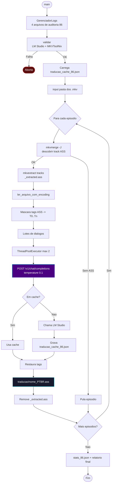
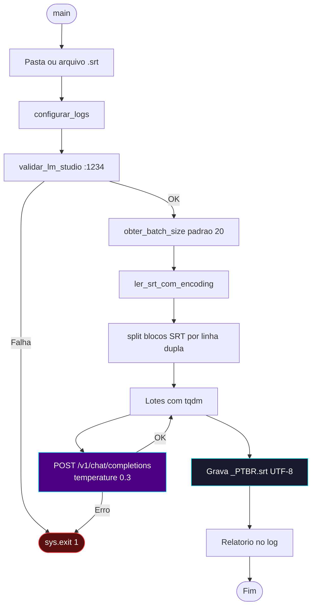
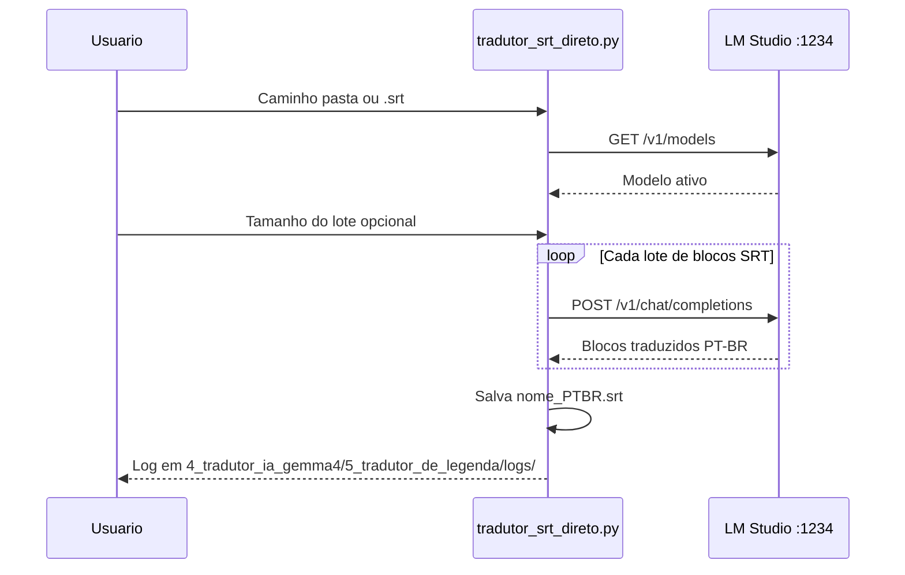

# 🤖 Módulo — Fase 4 (Tradução IA — LM Studio / Gemma)

[← Índice](README.md) · [`4_tradutor_ia_gemma4/`](../4_tradutor_ia_gemma4/)

**Fases:** [1](modulo-fase-1.md) · [2](modulo-fase-2.md) · [3](modulo-fase-3.md) · **4** · [4-B](modulo-fase-4b.md) · [5](modulo-fase-5.md) · [6](modulo-fase-6.md) · [7](modulo-fase-7.md) · [8](modulo-fase-8.md) · [9](modulo-fase-9.md) · [10](modulo-fase-10.md) · [11](modulo-fase-11.md) · [12](modulo-fase-12.md)

Núcleo do projeto: traduz legendas para **PT-BR** usando um LLM local servido pelo **LM Studio** (`http://127.0.0.1:1234`, modelo Gemma 4B). A pasta concentra **4 variantes**, cada uma um pipeline "tudo em um" (extrai do `.mkv` **e** traduz) ou um tradutor de lote especializado em um título/cenário específico.

> ⚠️ **Correção de documentação:** os nomes genéricos `sub_extractor.py` e `script_tradutor_fr.py` (citados em versões antigas desta documentação e em alguns guias) **não existem mais na raiz** de `4_tradutor_ia_gemma4/`. O projeto evoluiu para **um script dedicado por título**, cada um em sua própria subpasta, com glossário, cache e caminhos padrão próprios. A tabela abaixo reflete a estrutura real.
>
> Em 2026-06-17, os dois tradutores de **francês** (Macross Delta e Gundam The Origin) foram **movidos para fora desta pasta**, para `4_b_mistrall_nemo_instruct_2407_GGUF_tradutor/frances_para_ptbr/` — ver **[Fase 4-B](modulo-fase-4b.md)**. A pasta `frances_para_ptbr/` aqui dentro de `4_tradutor_ia_gemma4/` ficou como resíduo (`__pycache__` apenas), igual às demais pastas legadas.

---

## Visão geral dos scripts

| # | Script | Entrada | Saída | Idioma origem | Glossário/série |
|:---:|:---|:---|:---|:---|:---|
| 1 | [`86/sub_extractor.py`](../4_tradutor_ia_gemma4/86/sub_extractor.py) | Pasta `.mkv` (extrai ASS) | `traducao/{nome}_PTBR.ass` | Inglês | Eighty-Six (86) |
| 2 | [`tradutor_ass/batch_translator_ass.py`](../4_tradutor_ia_gemma4/tradutor_ass/batch_translator_ass.py) | `legendas_eng/*_ENG.ass` (Fase 2) | `{nome}_PTBR.ass` + `info_traducao_ass.txt` | Inglês | Gundam Reconguista |
| 3 | [`tradutor_gundam_unicornio/batch_translator_unicorn.py`](../4_tradutor_ia_gemma4/tradutor_gundam_unicornio/batch_translator_unicorn.py) | `*_ENG.ass` (Fase 2) | `{nome}_PTBR.ass` + `info.txt` | Inglês | Gundam Unicorn (UC) |
| 4 | [`5_tradutor_de_legenda/tradutor_srt_direto.py`](../4_tradutor_ia_gemma4/5_tradutor_de_legenda/tradutor_srt_direto.py) | `.srt` externo (arquivo/pasta) | `*_PTBR.srt` | Inglês | Macross (filmes) |

Todos compartilham: validação `GET /v1/models` no LM Studio antes de iniciar, encoding resiliente (`utf-8` → `utf-8-sig` → `cp1252` → `latin-1` → `iso-8859-1`), `colorama` + `tqdm` para feedback, e tradução em **lotes** via `POST /v1/chat/completions`.

> Para as variantes em **francês** (Macross Delta, Gundam Origin), veja a **[Fase 4-B](modulo-fase-4b.md)** — migradas para o modelo **Mistral Nemo Instruct 2407 (GGUF)**. Para a variante **chinesa** (CHS, Qwen2.5) de Gundam Origin, veja a **[Fase 11](modulo-fase-11.md)** — pasta separada (`11_chines_LLM_alibaba_qwen2/`) por usar outro modelo/LM Studio.

---

## 1 — `86/sub_extractor.py` (Eighty-Six, inglês → PT-BR)

Pipeline "tudo em um": extrai a faixa ASS do `.mkv` via MKVToolNix **e** traduz, sem passar pela Fase 2. Especializado para a série **Eighty-Six (86)** — cache, logs e glossário próprios.

| Recurso | Detalhe |
|:---|:---|
| Autodetecção de track | `mkvmerge -J` → faixa `subtitles` com `S_TEXT/ASS` |
| Glossário | "Eighty-Six"/"86", "Eighty-Sixers", codinomes (ex.: "Undertaker" = codinome do Shin) mantidos como no original |
| Paralelismo | `ThreadPoolExecutor`, `max_workers = 2` |
| Tradução em lote | `temperature = 0.1` |
| Cache persistente | `traducao_cache_86.json` (na pasta `86/`) |
| Logs | `pipeline_86_*.txt`, `erros_86_*.txt`, `stats_86_*.json`, `config_86_*.txt` em `4_tradutor_ia_gemma4/86/logs/` |
| Saída | `{pasta}/traducao/{nome}_PTBR.ass` |



**Comando:**

```powershell
python ".\4_tradutor_ia_gemma4\86\sub_extractor.py"
```

> Falhas residuais (ex.: placeholder `[T0]` não restaurado) são tratadas posteriormente pela **[Fase 12](modulo-fase-12.md)** (`revisao_86.py`), que também remultiplexa o `.mkv` final.

---

## 2 — `tradutor_ass/batch_translator_ass.py` (lote para ASS já extraído)

Traduz arquivos `*_ENG.ass` **já extraídos** (Fase 2), agrupando diálogos para reduzir drasticamente o número de chamadas HTTP (~400 → ~40 por episódio).

| Recurso | Detalhe |
|:---|:---|
| Entrada | `legendas_eng/*_ENG.ass` (pasta padrão configurável no script) |
| Paralelismo | `ThreadPoolExecutor`, máx. 2 threads (RTX 5600 8GB) |
| Lote | 8 diálogos por requisição |
| Glossário | Gundam Reconguista (Regild Century, Capital Territory, nomes de Mobile Suit mantidos em inglês) |
| Preservação de tags | Máscaras `[T0]`/`[T1]` + fallback por regex |
| Retry | 3 tentativas por lote, backoff `tentativa * 5s` |
| Fallback de parsing | Tenta formato numerado `1. tradução`, depois extração de linha crua |
| Saída | `{pasta_saida}/{nome}_PTBR.ass` + `info_traducao_ass.txt` |
| Debug | `debug_last_failure_ass.txt` (primeira falha de lote) |


**Comando:**

```powershell
python ".\4_tradutor_ia_gemma4\tradutor_ass\batch_translator_ass.py"
```

---

## 3 — `tradutor_gundam_unicornio/batch_translator_unicorn.py` (Gundam Unicorn)

Variante especializada para a série **Gundam Unicorn**, mesma arquitetura do item 4 com glossário próprio.

| Recurso | Detalhe |
|:---|:---|
| Entrada | `*_ENG.ass` (pasta padrão `anime/unicornio`, editável no script) |
| Paralelismo | `ThreadPoolExecutor`, máx. 2 threads (Ryzen 7 5800X3D + RX 7800 XT + 64GB RAM) |
| Lote | 8 diálogos por requisição |
| Glossário | Universal Century: *Psychoframe*, *Mobile Suit*, *Newtype*, *Zeon*, *Neo Zeon*, *Londo Bell*, *Vist Foundation*, *Anaheim Electronics* |
| Preservação de tags | Placeholder `___TAG___` restaurado após tradução |
| Fallback | Retradução linha a linha se a resposta vier incompleta |
| Saída | `{pasta_saida}/{nome}_PTBR.ass` + `info.txt` (estatísticas: diálogos, chamadas, fallbacks) |

> Fluxo idêntico ao diagrama do item 4 (lote → API → parse → restauração de tags), trocando apenas o glossário e os caminhos padrão.

**Comando:**

```powershell
python ".\4_tradutor_ia_gemma4\tradutor_gundam_unicornio\batch_translator_unicorn.py"
```

> Se a saída apresentar a string `TAG` corrompendo o texto traduzido, use a **[Fase 8 — Cura de Legendas](modulo-fase-8.md)** (`cura_gundam_mkv.py`) antes do remux. Diálogos/letras com erro de lore residual: **[Fase 12](modulo-fase-12.md)** (`revisao_legenda_gundam_unicornio.py`).

---

## 4 — `tradutor_srt_direto.py` (SRT externo)

Tradução **direta SRT → SRT**, sem MKVToolNix — usada na **[Esteira B (Pipeline SRT)](pipeline-srt.md)** para filmes/legendas externas.

| Recurso | Detalhe |
|:---|:---|
| Entrada | Arquivo ou pasta com `.srt`; 1 arquivo → seleciona automático, vários → menu numérico |
| Lote | Padrão 20 blocos SRT por requisição (ENTER mantém; ou digite outro valor) |
| Prompt especializado | Termos Macross (Fold, Valkyrie, etc.) + letras de música com `♪` traduzidas poeticamente |
| Nome de saída | Substitui sufixos `-en`/`english` por `_PTBR.srt` |
| Logs | `4_tradutor_ia_gemma4/5_tradutor_de_legenda/logs/pipeline_direct_srt_*.txt` |





**Comando:**

```powershell
python ".\4_tradutor_ia_gemma4\5_tradutor_de_legenda\tradutor_srt_direto.py"
```

| Prompt interativo | Exemplo |
|:---|:---|
| Caminho da pasta ou arquivo | `C:\TRACKER-ANIMES\animes\md-2\legenda` |
| Tamanho do lote | ENTER = 20 |

---

## Próximo passo

| Saída gerada | Próxima fase |
|:---|:---|
| `traducao/*_PTBR.ass` (item 1) | [Fase 5 — Remuxer](modulo-fase-5.md) (ou [Fase 12](modulo-fase-12.md) antes, se houver erro de lore conhecido) |
| `{nome}_PTBR.ass` (itens 2–3) | [Fase 8](modulo-fase-8.md) se houver `TAG` corrompido, senão [Fase 5](modulo-fase-5.md) |
| `*_PTBR.srt` (item 4) | [Fase 3 — Conversor SRT → ASS](modulo-fase-3.md) → [Fase 5](modulo-fase-5.md) |

Logs detalhados: [Logs e auditoria](logs-e-auditoria.md)

---

[← Fase 2](modulo-fase-2.md) · [Próximo: Fase 5 →](modulo-fase-5.md) · [Pipeline SRT](pipeline-srt.md) · [Fase 11 (chinês)](modulo-fase-11.md)
