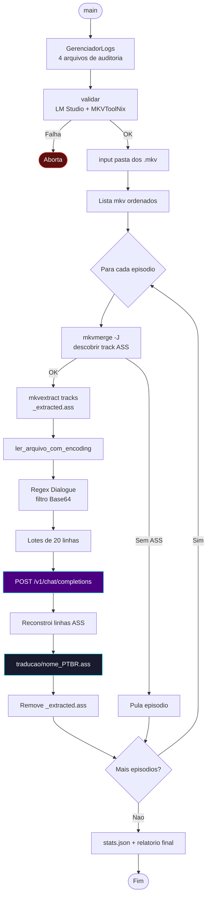
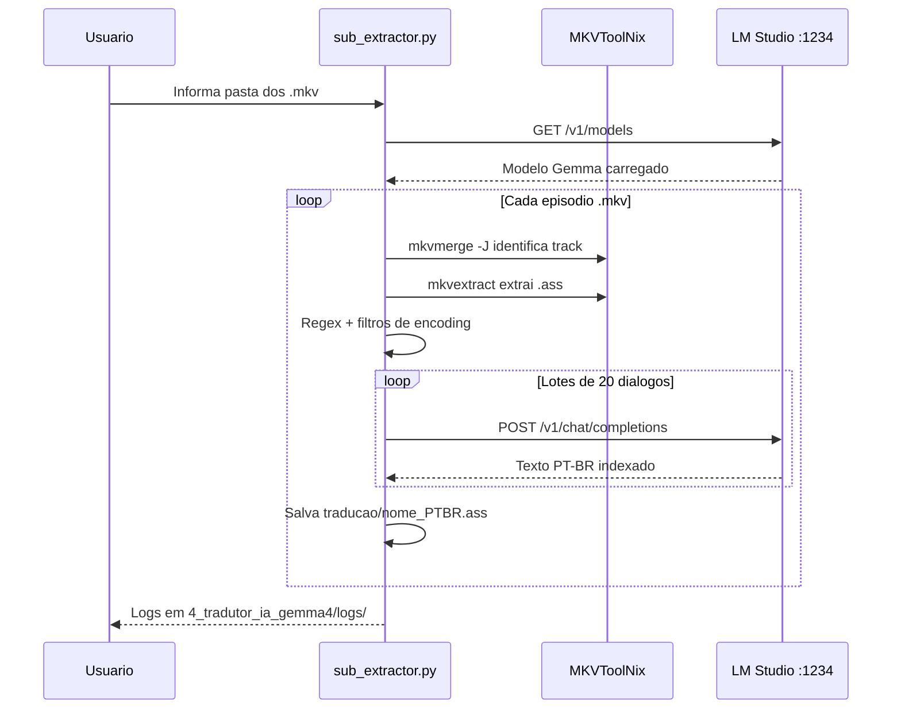
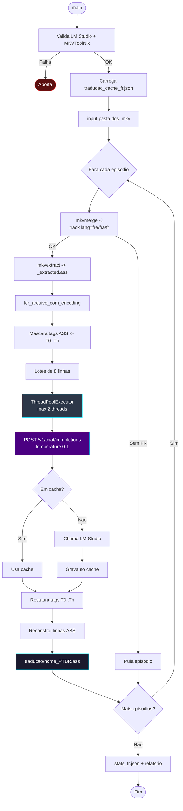
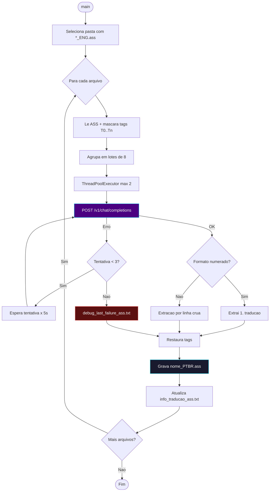
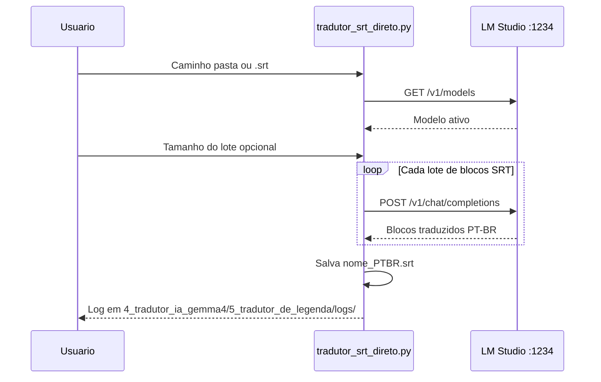

# 📐 Módulo — Fase 4 (Tradução IA — LM Studio / Gemma)

[← Índice](README.md) · [`4_tradutor_ia_gemma4/`](../4_tradutor_ia_gemma4/)

Núcleo do projeto: traduz legendas para **PT-BR** usando um LLM local servido pelo **LM Studio** (`http://127.0.0.1:1234`). A pasta concentra **5 variantes**, cada uma especializada em um cenário (idioma de origem, formato, glossário de anime).

---

## Visão geral dos scripts

| # | Script | Entrada | Saída | Idioma origem | Glossário/série |
|:---:|:---|:---|:---|:---|:---|
| 1 | [`sub_extractor.py`](../4_tradutor_ia_gemma4/sub_extractor.py) | Pasta `.mkv` (extrai ASS) | `traducao/{nome}_PTBR.ass` | Inglês | Genérico |
| 2 | [`script_tradutor_fr.py`](../4_tradutor_ia_gemma4/script_tradutor_fr.py) | Pasta `.mkv` (extrai ASS) | `traducao/{nome}_PTBR.ass` | Francês | Macross Delta |
| 3 | [`tradutor_ass/batch_translator_ass.py`](../4_tradutor_ia_gemma4/tradutor_ass/batch_translator_ass.py) | `legendas_eng/*_ENG.ass` (Fase 2) | `{nome}_PTBR.ass` + `info_traducao_ass.txt` | Inglês | Gundam Reconguista |
| 4 | [`tradutor_gundam_unicornio/batch_translator_unicorn.py`](../4_tradutor_ia_gemma4/tradutor_gundam_unicornio/batch_translator_unicorn.py) | `*_ENG.ass` (Fase 2) | `{nome}_PTBR.ass` + `info.txt` | Inglês | Gundam Unicorn (UC) |
| 5 | [`5_tradutor_de_legenda/tradutor_srt_direto.py`](../4_tradutor_ia_gemma4/5_tradutor_de_legenda/tradutor_srt_direto.py) | `.srt` externo (arquivo/pasta) | `*_PTBR.srt` | Inglês | Macross |

Todos compartilham: validação `GET /v1/models` no LM Studio antes de iniciar, encoding resiliente (`utf-8` → `utf-8-sig` → `cp1252` → `latin-1` → `iso-8859-1`), `colorama` + `tqdm` para feedback, e tradução em **lotes** via `POST /v1/chat/completions`.

---

## 1 — `sub_extractor.py` (pipeline completo MKV → PT-BR ASS)

Pipeline "tudo em um": extrai a faixa ASS do `.mkv` via MKVToolNix **e** traduz, sem passar pela Fase 2.

| Recurso | Detalhe |
|:---|:---|
| Autodetecção de track | `mkvmerge -J` → faixa `subtitles` com `S_TEXT/ASS` |
| Regex industrial | `^(Dialogue:\s*[^,]*(?:,[^,]*){8},)(.*)$` |
| Filtro de bloat | Linhas > 2000 caracteres (fontes Base64) |
| Tradução em lote | 20 diálogos por requisição HTTP, `temperature=0.7`, `max_tokens=2000` |
| Cache em memória | Evita retraduzir lotes idênticos |
| Saída | `{pasta}/traducao/{nome}_PTBR.ass` |





**Comando:**

```powershell
python ".\4_tradutor_ia_gemma4\sub_extractor.py"
```

---

## 2 — `script_tradutor_fr.py` (Francês → PT-BR, multi-thread)

Mesma base do `sub_extractor.py`, mas otimizado para legendas em **francês**, com cache persistente em disco e processamento paralelo.

| Recurso | Detalhe |
|:---|:---|
| Detecção de track | Prioriza faixa com `lang` = `fre`/`fra`/`fr` |
| Glossário | Termos de Macross Delta (ex.: *Chanteuse des Étoiles* → "Cantora das Estrelas", *Chevalier Aérien* → "Cavaleiro Aéreo") |
| Paralelismo | `ThreadPoolExecutor`, máx. 2 threads (RTX 5600 8GB, contexto 8000 tokens) |
| Lote | 8 diálogos por requisição, `temperature=0.1` (alta fidelidade) |
| Cache persistente | `traducao_cache_fr.json` — evita retraduzir entre execuções |
| Preservação de tags | Máscaras `[T0]`, `[T1]`... restauradas após tradução |
| Saída | `{pasta}/traducao/{nome}_PTBR.ass` |



**Comando:**

```powershell
python ".\4_tradutor_ia_gemma4\script_tradutor_fr.py"
```

Logs: `pipeline_fr_*.txt`, `erros_fr_*.txt`, `config_fr_*.txt`, `stats_fr_*.json` em `4_tradutor_ia_gemma4/logs/`.

---

## 3 — `tradutor_ass/batch_translator_ass.py` (lote para ASS já extraído)

Traduz arquivos `*_ENG.ass` **já extraídos** (Fase 2), agrupando diálogos para reduzir drasticamente o número de chamadas HTTP (~400 → ~40 por episódio).

| Recurso | Detalhe |
|:---|:---|
| Entrada | `legendas_eng/*_ENG.ass` (pasta padrão configurável no script) |
| Paralelismo | `ThreadPoolExecutor`, máx. 2 threads (RTX 5600 8GB) |
| Lote | 8 diálogos por requisição |
| Glossário | Gundam Reconguista (Regild Century, Capital Territory, nomes de Mobile Suit mantidos em inglês) |
| Preservação de tags | Máscaras `[T0]`/`[T1]` + fallback por regex |
| Retry | 3 tentativas por lote, backoff `tentativa * 5s` |
| Fallback de parsing | Tenta formato numerado `1. tradução`, depois extração de linha crua |
| Saída | `{pasta_saida}/{nome}_PTBR.ass` + `info_traducao_ass.txt` |
| Debug | `debug_last_failure_ass.txt` (primeira falha de lote) |



**Comando:**

```powershell
python ".\4_tradutor_ia_gemma4\tradutor_ass\batch_translator_ass.py"
```

---

## 4 — `tradutor_gundam_unicornio/batch_translator_unicorn.py` (Gundam Unicorn)

Variante especializada para a série **Gundam Unicorn**, mesma arquitetura do item 3 com glossário próprio.

| Recurso | Detalhe |
|:---|:---|
| Entrada | `*_ENG.ass` (pasta padrão `anime/unicornio`, editável no script) |
| Paralelismo | `ThreadPoolExecutor`, máx. 2 threads (Ryzen 7 5800X3D + RX 7800 XT + 64GB RAM) |
| Lote | 8 diálogos por requisição |
| Glossário | Universal Century: *Psychoframe*, *Mobile Suit*, *Newtype*, *Zeon*, *Neo Zeon*, *Londo Bell*, *Vist Foundation*, *Anaheim Electronics* |
| Preservação de tags | Placeholder `___TAG___` restaurado após tradução |
| Fallback | Retradução linha a linha se a resposta vier incompleta |
| Saída | `{pasta_saida}/{nome}_PTBR.ass` + `info.txt` (estatísticas: diálogos, chamadas, fallbacks) |

> Fluxo idêntico ao diagrama do item 3 (lote → API → parse → restauração de tags), trocando apenas o glossário e os caminhos padrão.

**Comando:**

```powershell
python ".\4_tradutor_ia_gemma4\tradutor_gundam_unicornio\batch_translator_unicorn.py"
```

> Se a saída apresentar a string `TAG` corrompendo o texto traduzido, use a **[Fase 8 — Cura de Legendas](modulo-fase-8.md)** (`cura_gundam_mkv.py`) antes do remux.

---

## 5 — `tradutor_srt_direto.py` (SRT externo)

Tradução **direta SRT → SRT**, sem MKVToolNix — usada na **[Esteira B (Pipeline SRT)](pipeline-srt.md)** para filmes/legendas externas.

| Recurso | Detalhe |
|:---|:---|
| Entrada | Arquivo ou pasta com `.srt`; 1 arquivo → seleciona automático, vários → menu numérico |
| Lote | Padrão 20 blocos SRT por requisição (ENTER mantém; ou digite outro valor) |
| Prompt especializado | Termos Macross (Fold, Valkyrie, etc.) + letras de música com `♪` traduzidas poeticamente |
| Nome de saída | Substitui sufixos `-en`/`english` por `_PTBR.srt` |
| Logs | `4_tradutor_ia_gemma4/5_tradutor_de_legenda/logs/pipeline_direct_srt_*.txt` |




**Comando:**

```powershell
python ".\4_tradutor_ia_gemma4\5_tradutor_de_legenda\tradutor_srt_direto.py"
```

| Prompt interativo | Exemplo |
|:---|:---|
| Caminho da pasta ou arquivo | `C:\TRACKER-ANIMES\animes\md-2\legenda` |
| Tamanho do lote | ENTER = 20 |

---

## Próximo passo

| Saída gerada | Próxima fase |
|:---|:---|
| `traducao/*_PTBR.ass` (itens 1–4) | [Fase 5 — Remuxer](modulo-fase-5.md) |
| `*_PTBR.srt` (item 5) | [Fase 3 — Conversor SRT → ASS](modulo-fase-3.md) → [Fase 5](modulo-fase-5.md) |

Logs detalhados: [Logs e auditoria](logs-e-auditoria.md)

---

[← Fase 2](modulo-fase-2.md) · [Próximo: Fase 5 →](modulo-fase-5.md) · [Pipeline SRT](pipeline-srt.md)
