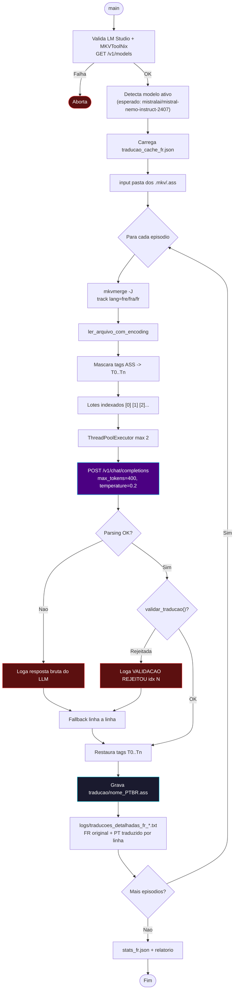

# 🇫🇷 Módulo — Fase 4-B (Tradução IA — Mistral Nemo Instruct 2407 GGUF)

[← Índice](README.md) · [`4_b_mistrall_nemo_instruct_2407_GGUF_tradutor/`](../4_b_mistrall_nemo_instruct_2407_GGUF_tradutor/)

<p>
  
  
  
  
  
</p>

**Fases:** [1](modulo-fase-1.md) · [2](modulo-fase-2.md) · [3](modulo-fase-3.md) · [4](modulo-fase-4.md) · **4-B** · [5](modulo-fase-5.md) · [6](modulo-fase-6.md) · [7](modulo-fase-7.md) · [8](modulo-fase-8.md) · [9](modulo-fase-9.md) · [10](modulo-fase-10.md) · [11](modulo-fase-11.md) · [12](modulo-fase-12.md)

**Variante de modelo da [Fase 4](modulo-fase-4.md), não uma fase nova na esteira numerada.** Em 2026-06-17 os dois tradutores de **francês → PT-BR** (Macross Delta e Gundam The Origin) foram migrados do Gemma 4B para o **Mistral Nemo Instruct 2407 (GGUF)**, por qualidade de tradução muito superior nesse par de idiomas. Os scripts foram **movidos** (não copiados) de `4_tradutor_ia_gemma4/frances_para_ptbr/` para esta pasta dedicada — a pasta de origem ficou apenas com resíduo de `__pycache__`, igual às demais [pastas legadas](estrutura-repositorio.md#pastas-legadas-não-usadas-pelo-pipeline-atual).

> Mesma observação da [Fase 11](modulo-fase-11.md): o modelo carregado no LM Studio é **detectado dinamicamente** via `GET /v1/models` — o script funciona com qualquer modelo, mas o nome da pasta documenta o modelo **validado e recomendado** para este par de idiomas. Troque o modelo carregado no LM Studio antes de alternar entre Fases 4/9 (Gemma), 4-B (Mistral Nemo) e 11 (Qwen2.5).

---

## Scripts

| Script | Entrada | Saída | Glossário/série | Alterado na migração? |
|:---|:---|:---|:---|:---:|
| [`frances_para_ptbr/macross_deslta.py`](../4_b_mistrall_nemo_instruct_2407_GGUF_tradutor/frances_para_ptbr/macross_deslta.py) | Pasta `.mkv` (extrai ASS) | `traducao/{nome}_PTBR.ass` | Macross Delta | Não — movido sem alterações (100% idêntico ao código anterior) |
| [`frances_para_ptbr/script_tradutor_fr_gundam_origin.py`](../4_b_mistrall_nemo_instruct_2407_GGUF_tradutor/frances_para_ptbr/script_tradutor_fr_gundam_origin.py) | Pasta `.mkv`/`.ass` (release `SUBFRENCH`) | `traducao/{nome}_PTBR.ass` | Gundam The Origin / Universal Century | Sim — ver ajustes abaixo |

---

## Ajustes feitos em `script_tradutor_fr_gundam_origin.py` durante a migração

O script de Gundam Origin recebeu ajustes de prompt/parsing pensados para o estilo de resposta do Mistral Nemo (diferente do Gemma):

| Item | Antes (Gemma 4B) | Depois (Mistral Nemo 2407) |
|:---|:---|:---|
| Formato do prompt de lote | Instrução curta única, sem índices explícitos no texto da instrução | Instrução detalhada listando a regra de manter `N` linhas e os índices `[0]`, `[1]`, `[2]`... explicitamente no prompt |
| `max_tokens` por lote | 800 | 400 |
| Regex de preâmbulo conversacional | `^(aqui está\|esta é\|segue\|abaixo\|claro,? vou\|espero que\|voilà)` | Adicionado `abaixo está\|abaixo seguem` |
| Validação rejeitada | Apenas marcava como não traduzida | Loga `VALIDAÇÃO REJEITOU idx N` com original e tradução, para depuração |
| Falha de extração total | `RuntimeError` direto | Loga a **resposta bruta do LLM** antes de levantar o erro |
| Falha de lote | Nível `aviso` | Nível `erro` (mais visível no log) |
| Auditoria lado a lado | Não existia | Novo arquivo `logs/traducoes_detalhadas_fr_{timestamp}.txt` — grava FR original + PT-BR traduzido (ou "MANTIDO ORIGINAL") por diálogo, por episódio |

`macross_deslta.py` **não** recebeu nenhum desses ajustes (permanece com o prompt original) — se notar qualidade inferior nesse script específico com o Mistral Nemo, os mesmos ajustes podem ser replicados manualmente.

---

## Diagrama de fluxo



---

## Comandos

```powershell
# Pré-requisito: LM Studio na porta 1234 com Mistral Nemo Instruct 2407 (GGUF) carregado
python ".\4_b_mistrall_nemo_instruct_2407_GGUF_tradutor\frances_para_ptbr\macross_deslta.py"
python ".\4_b_mistrall_nemo_instruct_2407_GGUF_tradutor\frances_para_ptbr\script_tradutor_fr_gundam_origin.py"
```

Logs: `pipeline_fr_*.txt`, `erros_fr_*.txt`, `config_fr_*.txt`, `stats_fr_*.json`, `traducoes_detalhadas_fr_*.txt` em `4_b_mistrall_nemo_instruct_2407_GGUF_tradutor/frances_para_ptbr/logs/`.

> ⚠️ **Bug cosmético conhecido:** o método que grava `config_fr_*.txt` ainda tem a string `"Modelo : Gemma 4B (google/gemma-4-e4b)"` hardcoded no rótulo do relatório — isso é apenas um rótulo desatualizado no arquivo de log, não afeta a tradução em si (a chamada à API usa corretamente o modelo detectado em `GET /v1/models`, registrado no `pipeline_fr_*.txt` como `Usando modelo: mistralai/mistral-nemo-instruct-2407`). Veja [Solução de problemas](solucao-de-problemas.md#fase-4-b--mistral-nemo-francês).

---

## Quando usar

1. Sempre que for traduzir **Macross Delta** ([Esteira D](arquitetura.md#esteira-d--macross-delta-tradução-francês--pt-br-multi-thread)) ou **Gundam The Origin a partir da legenda francesa SUBFRENCH** ([Esteira I](arquitetura.md#esteira-i--gundam-origin-legenda-francesa-subfrench)).
2. Carregue **Mistral Nemo Instruct 2407 (GGUF)** no LM Studio antes de rodar — não o Gemma 4B usado nas Fases 4/9, nem o Qwen2.5 da Fase 11.
3. Saída segue o mesmo destino de sempre (`traducao/*_PTBR.ass`) → siga para a **[Fase 5](modulo-fase-5.md)** (remux) ou, se necessário, **[Fase 12](modulo-fase-12.md)** (revisão final por título).

---

[← Fase 4](modulo-fase-4.md) · [Fase 5 →](modulo-fase-5.md) · [Arquitetura](arquitetura.md)
