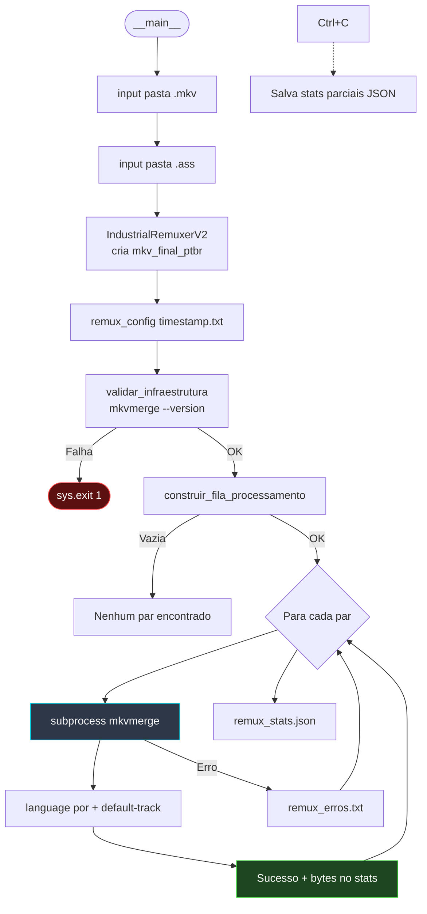
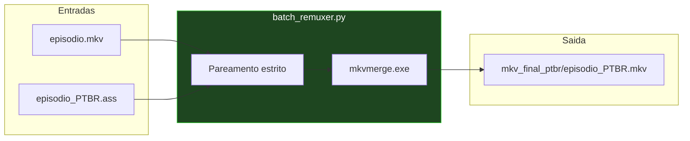

# 📐 Módulo — Fase 5 (Remuxer / Multiplexação)

[← Índice](README.md) · [`5_juntar_legendas_filmes/batch_remuxer.py`](../5_juntar_legendas_filmes/batch_remuxer.py)

**Fases:** [1](modulo-fase-1.md) · [2](modulo-fase-2.md) · [3](modulo-fase-3.md) · [4](modulo-fase-4.md) · **5** · [6](modulo-fase-6.md) · [7](modulo-fase-7.md) · [8](modulo-fase-8.md) · [9](modulo-fase-9.md) · [10](modulo-fase-10.md) · [11](modulo-fase-11.md) · [12](modulo-fase-12.md)

Etapa final, comum a **todas as esteiras**: junta o vídeo original com a legenda traduzida em um novo `.mkv`, sem re-encode.

---

## Recursos

| Recurso | Detalhe |
|:---|:---|
| **Pareamento estrito** | `{base}.mkv` ↔ `traducao/{base}_PTBR.ass` |
| **Sem re-encode** | Apenas remux — I/O intensivo em NVMe (~1,5 s/ep.) |
| **Metadados** | `--language 0:por`, `--track-name "0:Português (Gemma 4B)"`, `--default-track 0:yes` |
| **Resiliência** | `Ctrl+C` salva estatísticas parciais em JSON |
| **Saída** | `{pasta}/mkv_final_ptbr/{base}_PTBR.mkv` |

---

## Diagrama de fluxo



---

## Entrada / saída (remux)



---

## Comando

```powershell
python ".\5_juntar_legendas_filmes\batch_remuxer.py"
```

| Prompt | Exemplo |
|:---|:---|
| Pasta `.mkv` | `C:\TRACKER-ANIMES\animes\Macross Delta` |
| Pasta `.ass` | `...\Macross Delta\traducao` |

---

## Entradas e saídas

| Entrada | Saída | Dependências |
|:---|:---|:---|
| Pasta `.mkv` + pasta `traducao/*.ass` | `mkv_final_ptbr/*_PTBR.mkv` | `mkvmerge.exe`, `colorama`, `tqdm` |

Logs: [Logs e auditoria](logs-e-auditoria.md)

---

[← Fase 4](modulo-fase-4.md) · [← Fase 3](modulo-fase-3.md) · [Guia de execução](guia-de-execucao.md)

> Etapa final de **todas as esteiras** — veja [Arquitetura](arquitetura.md) e [Pipeline SRT](pipeline-srt.md).
