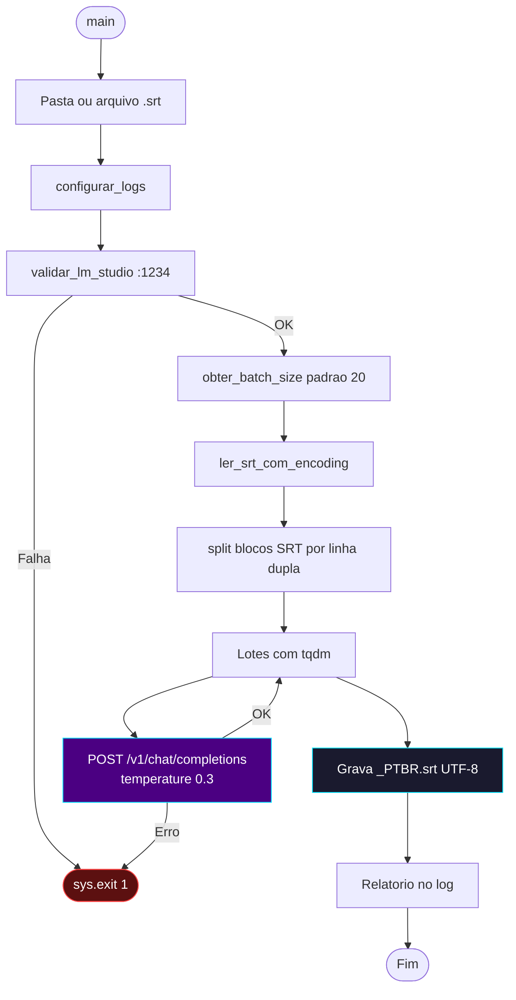
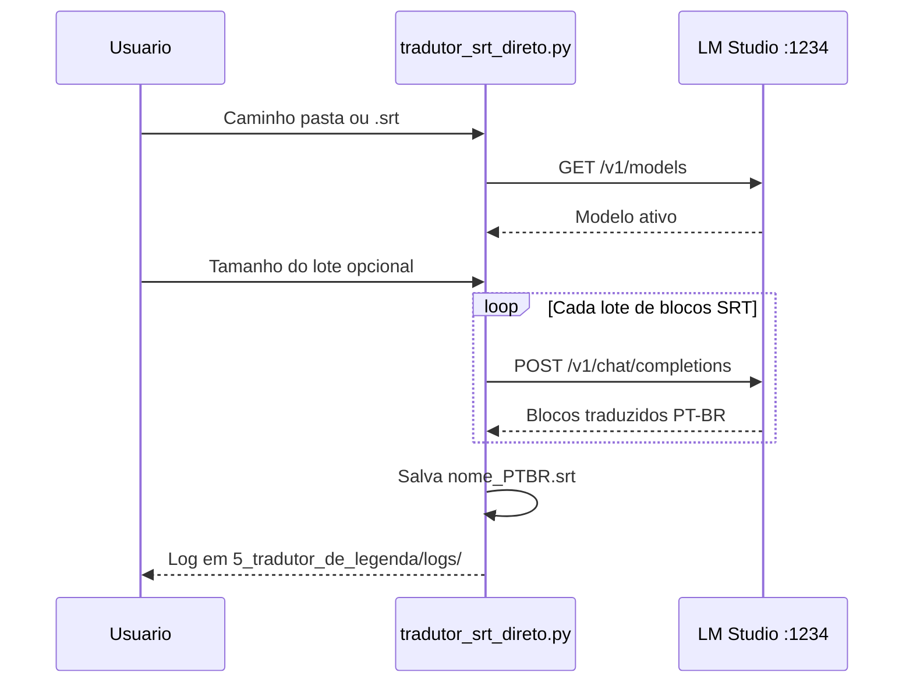

# 📐 Módulo — Fase 5 (Tradutor SRT direto)

[← Índice](README.md) · [`5_tradutor_de_legenda/tradutor_srt_direto.py`](../5_tradutor_de_legenda/tradutor_srt_direto.py)

**Esteira alternativa** para legendas **SRT externas** (não embutidas no `.mkv`). Ideal para filmes, releases com legenda separada ou quando a Fase 1 não se aplica.

---

## Função

| Entrada | Processamento | Saída |
|:---|:---|:---|
| Arquivo ou pasta com `.srt` em inglês | Tradução em lote via **LM Studio** (Gemma 4B) | `*_PTBR.srt` na mesma pasta |

**Não usa MKVToolNix** — apenas leitura de texto, HTTP local e gravação UTF-8.

---

## Recursos

| Recurso | Detalhe |
|:---|:---|
| **Auto-detecção** | 1 `.srt` na pasta → seleciona automaticamente; vários → menu numérico |
| **Encoding resiliente** | `utf-8` → `utf-8-sig` → `cp1252` → `latin-1` → `iso-8859-1` |
| **Lotes configuráveis** | Padrão 20 blocos SRT por requisição (ENTER mantém; ou digite outro valor) |
| **Prompt especializado** | Termos Macross (Fold, Valkyrie, etc.) + letras com `♪` |
| **Nome de saída** | Substitui sufixos `-en`, `english` por `_PTBR.srt` |
| **Logs** | `5_tradutor_de_legenda/logs/pipeline_direct_srt_*.txt` |

---

## Diagrama de fluxo



---

## Sequência (API)



---

## Comando

```powershell
python .\5_tradutor_de_legenda\tradutor_srt_direto.py
```

| Prompt interativo | Exemplo |
|:---|:---|
| Caminho da pasta ou arquivo | `C:\TRACKER-ANIMES\animes\md-2\legenda` |
| Tamanho do lote | ENTER = 20 |

---

## Próximo passo

Após gerar o `*_PTBR.srt`, use a **[Fase 6](modulo-fase-6.md)** para converter em ASS com correção de FPS, e depois a **[Fase 2](modulo-fase-2.md)** para remuxar no `.mkv`.

---

[← Pipeline SRT](pipeline-srt.md) · [Fase 6 →](modulo-fase-6.md)
