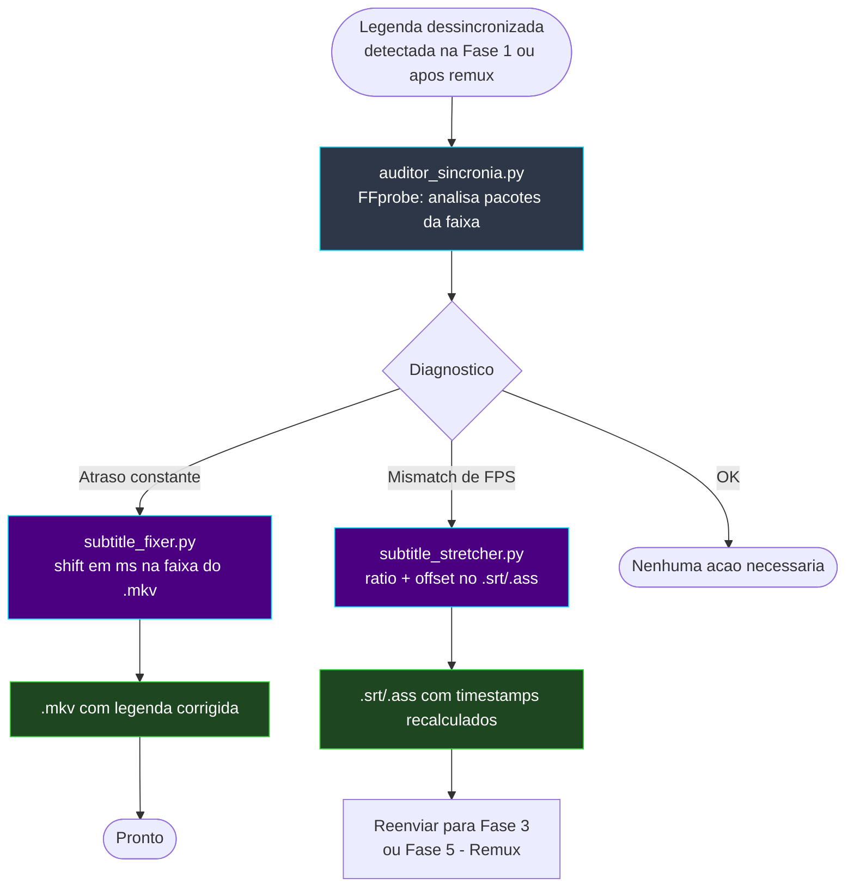

# 📐 Módulo — Fase 6 (Sincronização de Legendas)

[← Índice](README.md) · [`6_sincronizacao_legenda/`](../6_sincronizacao_legenda/)

**Fases:** [1](modulo-fase-1.md) · [2](modulo-fase-2.md) · [3](modulo-fase-3.md) · [4](modulo-fase-4.md) · [4-B](modulo-fase-4b.md) · [5](modulo-fase-5.md) · **6** · [7](modulo-fase-7.md) · [8](modulo-fase-8.md) · [9](modulo-fase-9.md) · [10](modulo-fase-10.md) · [11](modulo-fase-11.md) · [12](modulo-fase-12.md)

Conjunto de **utilitários auxiliares** para diagnosticar e corrigir dessincronia entre vídeo e legenda. Pode ser usado **antes** (auditoria) ou **depois** (correção fina) de qualquer esteira, normalmente quando a **Fase 1** reporta um veredito diferente de "Sincronizada".

---

## Scripts

| Script | Função | Ferramentas |
|:---|:---|:---|
| [`auditor_sicronia/auditor_sincronia.py`](../6_sincronizacao_legenda/auditor_sicronia/auditor_sincronia.py) | Audita o drift entre o vídeo e a legenda embutida, sugerindo a correção | FFprobe |
| [`subtitle_fixer.py`](../6_sincronizacao_legenda/subtitle_fixer.py) | Aplica deslocamento/ressincronia diretamente na faixa de legenda de um `.mkv` | FFprobe, `tkinter` |
| [`subtitle_stretcher.py`](../6_sincronizacao_legenda/subtitle_stretcher.py) | Aplica *time-stretch* (razão) + offset em arquivos `.srt`/`.ass`, sem dependências externas | Python puro |

---

## Diagrama de fluxo



---

## `auditor_sicronia/auditor_sincronia.py`

| Item | Detalhe |
|:---|:---|
| Entrada | Arquivo ou pasta de vídeo (seletor interativo) |
| Processo | `ffprobe` extrai os timestamps de pacotes da faixa de legenda; calcula a duração real e compara com o vídeo |
| Saída | Relatório no console: drift em ms, mismatch de FPS, sugestão de correção |
| Dependências | FFprobe, `tkinter`, `colorama` |

```powershell
python ".\6_sincronizacao_legenda\auditor_sicronia\auditor_sincronia.py"
```

---

## `subtitle_fixer.py`

| Item | Detalhe |
|:---|:---|
| Entrada | `.mkv` (caminho manual, seletor de arquivo ou de pasta — `tkinter`) |
| Processo | `ffprobe` identifica a faixa de legenda; aplica deslocamento (ms) configurado pelo usuário |
| Saída | `.mkv` com a faixa de legenda ressincronizada |
| Log | `processamento_log.txt` (timestamp, delay aplicado, status, detalhes) |
| Dependências | FFprobe, `tkinter`, `colorama` |

```powershell
python ".\6_sincronizacao_legenda\subtitle_fixer.py"
```

---

## `subtitle_stretcher.py`

| Item | Detalhe |
|:---|:---|
| Entrada | Arquivo `.srt` ou `.ass`, fator de *ratio* (ex.: `1.05` = +5%) e offset opcional |
| Processo | Recalcula cada timestamp: `novo = original × ratio + offset`. Suporta formatos `HH:MM:SS,mmm` (SRT) e `H:MM:SS.cc` (ASS) |
| Saída | Arquivo `.srt`/`.ass` com timestamps ajustados |
| Dependências | Nenhuma (Python puro) |

```powershell
python ".\6_sincronizacao_legenda\subtitle_stretcher.py"
```

---

## Quando usar

| Situação | Ferramenta |
|:---|:---|
| Quer apenas **diagnosticar** o desvio | `auditor_sincronia.py` |
| Legenda **embutida no `.mkv` final** está atrasada/adiantada de forma constante | `subtitle_fixer.py` |
| Legenda **externa** (`.srt`/`.ass`) precisa de correção de FPS antes da Fase 3/5 | `subtitle_stretcher.py` (ou ajuste `FATOR_SINCRO` na [Fase 3](modulo-fase-3.md)) |

---

[← Fase 5](modulo-fase-5.md) · [Próximo: Fase 7 →](modulo-fase-7.md)
