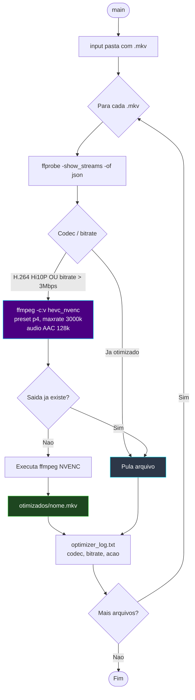

# 📐 Módulo — Fase 7 (Otimização de Vídeo GPU)

[← Índice](README.md) · [`7_decodificador/gpu_video_optimizer.py`](../7_decodificador/gpu_video_optimizer.py)

**Fases:** [1](modulo-fase-1.md) · [2](modulo-fase-2.md) · [3](modulo-fase-3.md) · [4](modulo-fase-4.md) · [4-B](modulo-fase-4b.md) · [5](modulo-fase-5.md) · [6](modulo-fase-6.md) · **7** · [8](modulo-fase-8.md) · [9](modulo-fase-9.md) · [10](modulo-fase-10.md) · [11](modulo-fase-11.md) · [12](modulo-fase-12.md)

**Opcional / pós-processamento.** Reduz o tamanho de arquivos `.mkv` finais recomprimindo o vídeo em **HEVC (H.265)** via aceleração de GPU (NVENC), sem afetar as legendas já remuxadas.

---

## Função

| Critério de recompressão | Ação |
|:---|:---|
| Vídeo em **H.264 Hi10P** (10-bit, baixa compatibilidade) | Recomprime para HEVC |
| Bitrate de vídeo **> 3 Mbps** | Recomprime para HEVC |
| Caso contrário | Pula o arquivo (já otimizado) |

| Parâmetro FFmpeg | Valor |
|:---|:---|
| Codec de vídeo | `hevc_nvenc`, preset `p4` |
| Bitrate alvo | `maxrate 3000k` |
| Áudio | AAC 128k |
| Saída | `otimizados/{nome}.mkv` |

---

## Diagrama de fluxo



---

## Comando

```powershell
python ".\7_decodificador\gpu_video_optimizer.py"
```

| Entrada | Saída | Log | Dependências |
|:---|:---|:---|:---|
| Pasta com `.mkv` (geralmente `mkv_final_ptbr/`, saída da Fase 5) | `otimizados/*.mkv` | `optimizer_log.txt` | FFmpeg/FFprobe com suporte **NVENC** (GPU NVIDIA), `colorama`, `tqdm` |

---

## Quando usar

- Após a **[Fase 5 — Remux](modulo-fase-5.md)**, se o `.mkv` final estiver muito grande (ex.: releases Hi10P de Blu-ray).
- **Não** é necessário se o objetivo é apenas trocar a legenda — esta fase **recodifica o vídeo** (não é remux sem perdas).
- Requer GPU NVIDIA com suporte a `hevc_nvenc`. Sem GPU compatível, o FFmpeg falha.

---

[← Fase 6](modulo-fase-6.md) · [Próximo: Fase 8 →](modulo-fase-8.md)
