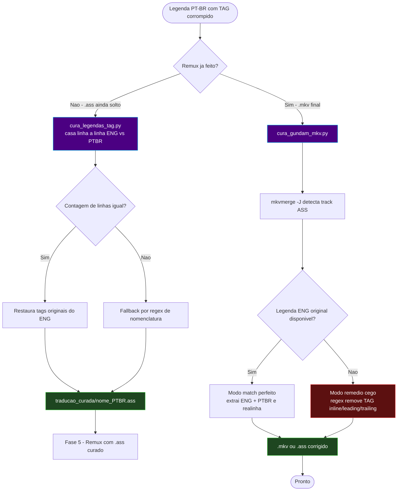

# 📐 Módulo — Fase 8 (Cura de Legendas)

[← Índice](README.md) · [`8_cura_legendas/`](../8_cura_legendas/)

**Reparo pontual.** Corrige o defeito conhecido de corrupção de tags (texto literal `TAG` aparecendo nas falas) que pode ocorrer nas traduções em lote da **[Fase 4](modulo-fase-4.md)** (`tradutor_ass`, `tradutor_gundam_unicornio`), especialmente em séries Gundam.

---

## Scripts

| Script | Atua sobre | Estratégia |
|:---|:---|:---|
| [`cura_gundam_mkv.py`](../8_cura_legendas/cura_gundam_mkv.py) | `.mkv` já remuxado (Fase 5) | Modo "match perfeito" (usa legenda ENG original como referência) ou "remédio cego" (remove `TAG` diretamente do PT-BR) |
| [`cura_legendas_tag.py`](../8_cura_legendas/cura_legendas_tag.py) | Arquivos `.ass` PT-BR + ENG (offline, antes do remux) | Casamento linha a linha entre ENG e PT-BR para restaurar as tags originais |

---

## Diagrama de fluxo



---

## `cura_legendas_tag.py`

| Item | Detalhe |
|:---|:---|
| Entrada | Pasta com `.ass` traduzidos (PT-BR) + pasta com os `.ass`/`.srt` originais (ENG) |
| Processo | Casamento **linha a linha** (requer mesma contagem de linhas); fallback por regex para variações de nomenclatura |
| Saída | `.ass` corrigido em `traducao_curada/` |
| Dependências | `colorama` (apenas cores no terminal) |

```powershell
python ".\8_cura_legendas\cura_legendas_tag.py"
```

---

## `cura_gundam_mkv.py`

| Item | Detalhe |
|:---|:---|
| Entrada | Pasta com `.mkv` (e opcionalmente pasta com legendas ENG originais) |
| Detecção | `mkvmerge -J` identifica a track ASS |
| Modo 1 — *match perfeito* | Extrai ENG e PT-BR, realinha por correspondência de linhas |
| Modo 2 — *remédio cego* | Remove a string `TAG` via regex (início, fim, meio da linha) sem referência externa |
| Saída | `.mkv`/`.ass` corrigido |
| Dependências | MKVToolNix (`mkvmerge`, `mkvextract`), `colorama` |

```powershell
python ".\8_cura_legendas\cura_gundam_mkv.py"
```

---

## Quando usar

- A legenda PT-BR final exibe a palavra `TAG` no meio do texto (efeito colateral de máscaras de tag não restauradas pela Fase 4).
- Prefira `cura_legendas_tag.py` **antes** do remux (Fase 5) sempre que a legenda ENG original ainda estiver disponível — produz o resultado mais preciso.
- Use `cura_gundam_mkv.py` quando o defeito só foi percebido **depois** do remux.

---

[← Fase 7](modulo-fase-7.md) · [Arquitetura](arquitetura.md)
