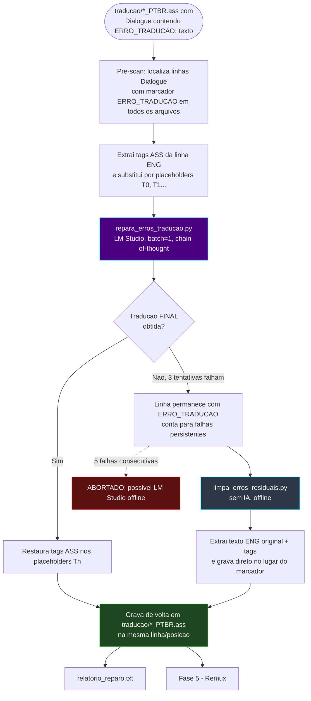

# 🩹 Módulo — Fase 9 (Reparo de Tradução)

[← Índice](README.md) · [`9_reparo_de_traducao/`](../9_reparo_de_traducao/)

<p>
  
  
  
  
</p>

**Fases:** [1](modulo-fase-1.md) · [2](modulo-fase-2.md) · [3](modulo-fase-3.md) · [4](modulo-fase-4.md) · [5](modulo-fase-5.md) · [6](modulo-fase-6.md) · [7](modulo-fase-7.md) · [8](modulo-fase-8.md) · **9** · [10](modulo-fase-10.md)

**Reparo pontual.** Corrige falhas do tipo `[ERRO_TRADUCAO: <texto original>]` deixadas pelos tradutores em lote da **[Fase 4](modulo-fase-4.md)** (`batch_translator_ass.py`, `batch_translator_unicorn.py`, `script_tradutor_fr.py`) quando o modelo não conseguiu traduzir uma linha específica dentro do lote.

---

## Scripts

| Script | Estratégia | Usa IA? |
|:---|:---|:---:|
| [`repara_erros_traducao.py`](../9_reparo_de_traducao/repara_erros_traducao.py) | Retraduz cada linha com falha **individualmente** (batch = 1) via LM Studio, com raciocínio em cadeia (chain-of-thought) | ✅ Sim |
| [`limpa_erros_residuais.py`](../9_reparo_de_traducao/limpa_erros_residuais.py) | Substitui falhas persistentes diretamente pelo texto original em **inglês** (com tags ASS restauradas), sem chamar IA | ❌ Não |

---

## Diagrama de fluxo



---

## `repara_erros_traducao.py`

| Item | Detalhe |
|:---|:---|
| Entrada | Pasta `legendas_eng\*_ENG.ass` (original) + pasta `legendas_ptbr\*_PTBR.ass` (traduzido, com falhas) |
| Pré-scan | Localiza todas as linhas `Dialogue:` com `[ERRO_TRADUCAO:` em todos os arquivos antes de iniciar |
| Mascaramento | Tags ASS (`{\an8}`, `{\i1}`...) da linha ENG correspondente são extraídas e trocadas por placeholders `[T0]`, `[T1]`... |
| Tradução | Reenvia a linha mascarada ao LM Studio (modelo detectado em `/v1/models`), **batch = 1**, `temperature=0.2`, com raciocínio livre seguido de `FINAL: <tradução>` |
| Pós-processo | `extrair_traducao_final()` remove blocos `<think>`/`<thinking>`, markdown, numeração residual e aspas; `restaurar_tags()` recoloca as tags originais nos placeholders |
| Critério de aceite | Aceita qualquer texto não vazio extraído; se idêntico ao inglês, só é aceito quando a linha original tem ≤ 15 caracteres (nomes próprios/interjeições curtas) |
| Retry | Até 3 tentativas por linha (2-3 s entre tentativas) |
| Abort | Interrompe toda a execução após **5 falhas consecutivas** (provável queda do LM Studio) |
| Saída | Sobrescreve `legendas_ptbr\*_PTBR.ass` linha a linha + `relatorio_reparo.txt` |
| Dependências | `requests`, `tqdm`, `colorama`; importa `SYSTEM_PROMPT` de `4_tradutor_ia_gemma4/tradutor_gundam_unicornio/batch_translator_unicorn.py` (com fallback embutido) |

```powershell
# Pré-requisito: LM Studio na porta 1234
python ".\9_reparo_de_traducao\repara_erros_traducao.py" "<pasta_legendas_eng>" "<pasta_legendas_ptbr>"
# Sem argumentos: usa os caminhos padrão do Gundam Unicorn Season 1
python ".\9_reparo_de_traducao\repara_erros_traducao.py"
```

---

## `limpa_erros_residuais.py`

| Item | Detalhe |
|:---|:---|
| Entrada | Mesma estrutura de pastas ENG/PT-BR do script anterior |
| Premissa | Falhas que **sobrevivem** ao reparo via IA geralmente são termos protegidos, nomes próprios ou números cuja tradução correta é **idêntica ao inglês** |
| Processo | Para cada `Dialogue:` com `[ERRO_TRADUCAO:`, extrai o texto original em inglês (com tags mascaradas em `[Tn]`) e restaura as tags diretamente — sem chamar IA |
| Saída | Sobrescreve `legendas_ptbr\*_PTBR.ass` (sem gerar relatório separado) |
| Dependências | `colorama` apenas |

```powershell
python ".\9_reparo_de_traducao\limpa_erros_residuais.py" "<pasta_legendas_eng>" "<pasta_legendas_ptbr>"
# Sem argumentos: usa os caminhos padrão do Gundam Unicorn Season 1
python ".\9_reparo_de_traducao\limpa_erros_residuais.py"
```

---

## Quando usar

1. Após a **Fase 4** (qualquer tradutor em lote), se o relatório/console indicar linhas `[ERRO_TRADUCAO: ...]` na pasta `traducao\`.
2. Rode primeiro `repara_erros_traducao.py` (com LM Studio ativo) para tentar uma retradução de qualidade.
3. Se ainda restarem marcadores `[ERRO_TRADUCAO:]` (nomes próprios, números, termos protegidos), rode `limpa_erros_residuais.py` para o "pente fino" final sem IA.
4. Depois de zerar os marcadores, siga para a **[Fase 5](modulo-fase-5.md)** (remux).

> Para casos **offline** (sem LM Studio) onde basta remover o marcador e manter o texto original, veja também a **[Fase 10](modulo-fase-10.md)** (`corrigir_guilty_crown.py`), usada na Esteira G.

---

[← Fase 8](modulo-fase-8.md) · [Fase 10 →](modulo-fase-10.md) · [Arquitetura](arquitetura.md)
