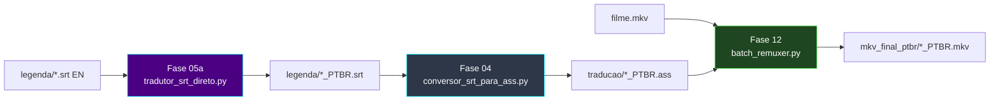

# 🎬 Pipeline SRT (Esteira B — legendas externas)

[← Índice](README.md) · [README principal](../README.md) · [Arquitetura](arquitetura.md#esteira-b--filme-com-srt-externo-inglês)

Esteira para **filmes** ou releases com legenda **SRT separada** do vídeo — sem extração do container MKV.

---

## Quando usar

| Situação | Esteira recomendada |
|:---|:---|
| Episódios `.mkv` com legenda **ASS embutida** (inglês) | [Esteira A](arquitetura.md#esteira-a--eighty-six-ass-embutido-inglês) — Fase 05a → 12 |
| Episódios `.mkv` com legenda **ASS embutida** (francês, Macross Delta) | [Esteira D](arquitetura.md#esteira-d--macross-delta-tv-tradução-francês--pt-br) — Fase 05b → [10] → 12 |
| Episódios `.mkv` com legenda **ASS embutida** (francês, Gundam Origin) | [Esteira J](arquitetura.md#esteira-j--gundam-origin-legenda-francesa-subfrench) — Fase 05b → 12 |
| Episódios `.mkv` com legenda **ASS chinesa** (Gundam The Origin, Qwen2.5) | [Esteira I](arquitetura.md#esteira-i--gundam-the-origin-legenda-chinesa-chs) — Fases 02 → 05c → [10] → 12 |
| Legenda **SRT externa** (inglês) + `.mkv` | **Esteira B** (este guia) — Fases 05a → 04 → 12 |
| Legenda **PGS** (bitmap, Blu-ray) | [Esteira C](arquitetura.md#esteira-c--legenda-pgs-bluray-bitmap) — Fases 02 → OCR → 04 → 12 |
| Só auditar o vídeo antes | [Fase 01](modulo-fase-01.md) (opcional) |

---

## Fluxo completo



---

## Ordem de execução

```powershell
# Pré-requisito: LM Studio na porta 1234 (Fase 05a)

python ".\05a_tradutor_llm_gemma4\5_tradutor_de_legenda\tradutor_srt_direto.py"
python ".\04_conversor_srt_ass\conversor_srt_para_ass.py"
python ".\12_remuxer_mkvmerge\batch_remuxer.py"
```

---

## Layout de pastas (exemplo filme)

```text
C:\TRACKER-ANIMES\animes\md-2\
├── [Anime Land] Macross Delta Movie 2....mkv
│
├── legenda\                              ← Fase 05a (entrada/saída SRT)
│   ├── filme-en.srt
│   └── filme_PTBR.srt                    ← gerado
│
├── traducao\                             ← Fase 04 (saída ASS)
│   └── [Anime Land] Macross Delta Movie 2...._PTBR.ass
│
└── mkv_final_ptbr\                       ← Fase 12
    └── [Anime Land] Macross Delta Movie 2...._PTBR.mkv
```

---

## Módulos desta esteira

| Fase | Documentação |
|:---:|:---|
| 05a | [modulo-fase-05a.md (`tradutor_srt_direto.py`)](modulo-fase-05a.md#5_tradutor_de_legendatradutor_srt_diretopy-srt-externo) |
| 04 | [modulo-fase-04.md](modulo-fase-04.md) |
| 12 | [modulo-fase-12.md](modulo-fase-12.md) |

---

[← Índice](README.md) · [Arquitetura](arquitetura.md)
