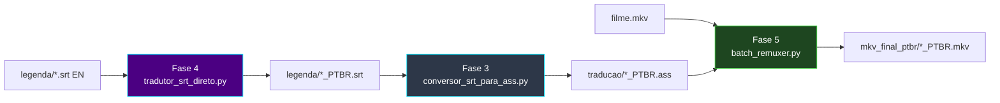

# 🎬 Pipeline SRT (Esteira B — legendas externas)

[← Índice](README.md) · [README principal](../README.md) · [Arquitetura](arquitetura.md#esteira-b--filme-com-srt-externo-inglês)

Esteira para **filmes** ou releases com legenda **SRT separada** do vídeo — sem extração do container MKV.

---

## Quando usar

| Situação | Esteira recomendada |
|:---|:---|
| Episódios `.mkv` com legenda **ASS embutida** (inglês) | [Esteira A](arquitetura.md#esteira-a--episódio-mkv-com-ass-embutido-inglês) — Fases 4 → 5 |
| Episódios `.mkv` com legenda **ASS embutida** (francês, Macross Delta) | [Esteira D](arquitetura.md#esteira-d--macross-delta-tradução-francês--pt-br-multi-thread) — Fase 4 → [12] → 5 |
| Episódios `.mkv` com legenda **ASS embutida** (francês, Gundam Origin) | [Esteira I](arquitetura.md#esteira-i--gundam-origin-legenda-francesa-subfrench) — Fase 4 → 5 |
| Episódios `.mkv` com legenda **ASS chinesa** (Gundam Origin, Qwen2.5) | [Esteira H](arquitetura.md#esteira-h--gundam-origin-legenda-chinesa-chs-qwen25) — Fases 2 → 11 → [12] → 5 |
| Legenda **SRT externa** (inglês) + `.mkv` | **Esteira B** (este guia) — Fases 4 → 3 → 5 |
| Legenda **PGS** (bitmap, Blu-ray) | [Esteira C](arquitetura.md#esteira-c--legenda-pgs-bluray-bitmap) — Fases 2 → OCR → 3 → 5 |
| Só auditar o vídeo antes | [Fase 1](modulo-fase-1.md) (opcional) |

---

## Fluxo completo



---

## Ordem de execução

```powershell
# Pré-requisito: LM Studio na porta 1234 (Fase 4)

python ".\4_tradutor_ia_gemma4\5_tradutor_de_legenda\tradutor_srt_direto.py"
python ".\3-conversor_str_ass\conversor_srt_para_ass.py"
python ".\5_juntar_legendas_filmes\batch_remuxer.py"
```

---

## Layout de pastas (exemplo filme)

```text
C:\TRACKER-ANIMES\animes\md-2\
├── [Anime Land] Macross Delta Movie 2....mkv
│
├── legenda\                              ← Fase 4 (entrada/saída SRT)
│   ├── filme-en.srt
│   └── filme_PTBR.srt                    ← gerado
│
├── traducao\                             ← Fase 3 (saída ASS)
│   └── [Anime Land] Macross Delta Movie 2...._PTBR.ass
│
└── mkv_final_ptbr\                       ← Fase 5
    └── [Anime Land] Macross Delta Movie 2...._PTBR.mkv
```

---

## Módulos desta esteira

| Fase | Documentação |
|:---:|:---|
| 4 | [modulo-fase-4.md — item 4 (`tradutor_srt_direto.py`)](modulo-fase-4.md#4--tradutor_srt_diretopy-srt-externo) |
| 3 | [modulo-fase-3.md](modulo-fase-3.md) |
| 5 | [modulo-fase-5.md](modulo-fase-5.md) |

---

[← Índice](README.md) · [Arquitetura](arquitetura.md)
