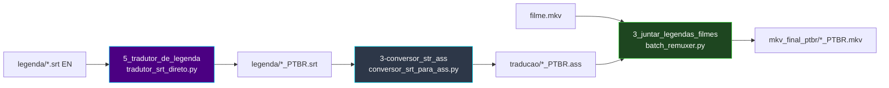

# 🎬 Pipeline SRT (legendas externas)

[← Índice](README.md) · [README principal](../README.md)

Esteira para **filmes** ou releases com legenda **SRT separada** do vídeo — sem extração do container MKV.

---

## Quando usar

| Situação | Pipeline recomendado |
|:---|:---|
| Episódios `.mkv` com legenda **ASS embutida** | [Fases 0 → 1 → 2](arquitetura.md) |
| Legenda **SRT externa** (inglês) + `.mkv` | **Fases 5 → 6 → 2** (este guia) |
| Só auditar o vídeo antes | Fase 0 (opcional) |

---

## Fluxo completo



---

## Ordem de execução

```powershell
# Pré-requisito: LM Studio na porta 1234 (Fase 5)

python .\5_tradutor_de_legenda\tradutor_srt_direto.py
python .\3-conversor_str_ass\conversor_srt_para_ass.py
python .\3_juntar_legendas_filmes\batch_remuxer.py
```

---

## Layout de pastas (exemplo filme)

```text
C:\TRACKER-ANIMES\animes\md-2\
├── [Anime Land] Macross Delta Movie 2....mkv
│
├── legenda\                              ← Fase 5 (entrada/saída SRT)
│   ├── filme-en.srt
│   └── filme_PTBR.srt                    ← gerado
│
├── traducao\                             ← Fase 6 (saída ASS)
│   └── [Anime Land] Macross Delta Movie 2...._PTBR.ass
│
└── mkv_final_ptbr\                       ← Fase 2
    └── [Anime Land] Macross Delta Movie 2...._PTBR.mkv
```

---

## Módulos desta esteira

| Fase | Documentação |
|:---:|:---|
| 5 | [modulo-fase-5.md](modulo-fase-5.md) |
| 6 | [modulo-fase-6.md](modulo-fase-6.md) |
| 2 | [modulo-fase-2.md](modulo-fase-2.md) |

---

[← Índice](README.md)
